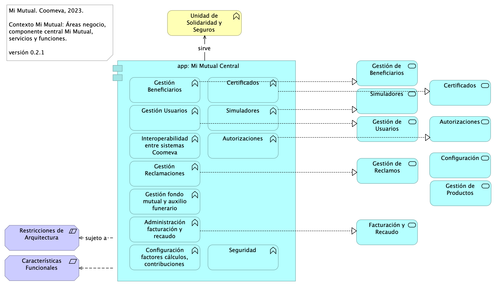
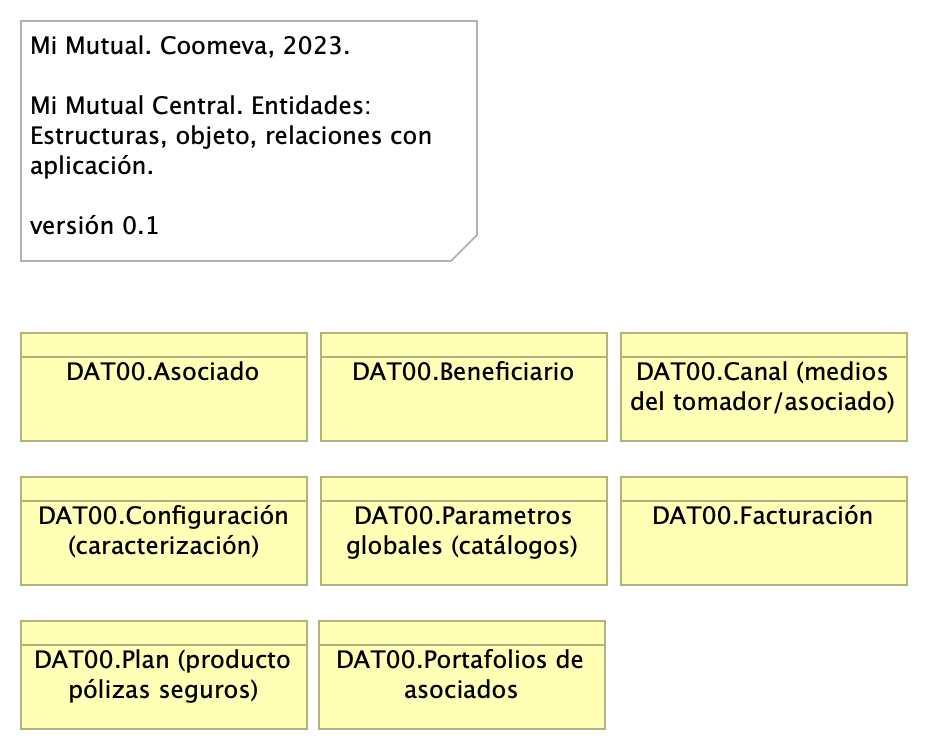

<!--
Single-page HTML Export

Created with Archi (https://www.archimatetool.com) and the following jArchi script:
https://github.com/archi-contribs/jarchi-single-page-html-export

Copyright (c) 2020 Phillip Beauvoir & Jean-Baptiste Sarrodie - MIT License
-->
STEF-CMMV

## Arq MiMutual. 1. Contexto

Mi Mutual. Coomeva, 2023.

Contexto Mi Mutual: Áreas negocio, componente central Mi Mutual, servicios y funciones.

versión 0.2.1

## Contexto Mi Mutual Central
El sistema principal de fondo Mi Mutual Central es la composición de las funciones de negocio de la Unidad de Solidaridad de Coomeva. Las funciones de negocio referidas, como Gestión Beneficiarios, Certificados, Gestión Beneficiarios, aparecen dentro del componente principal en la imagen.

Este entregable documenta los diferentes módulos y componentes que hacen parte de la estructura de una aplicación en Angular 12 y como es su interacción para conformar una arquitectura robusta y escalable para aplicaciones de gran tamaño.

Las librerías Spring Boot Security y Spring Boot Oauth2 proveen características de seguridad entre Vista (Angular 2) y Controlador. Estas son responsables de que únicamente permita el acceso si se está autenticado. Además, para realizar el proceso de autenticación se delega a la aplicación SISPRO (Coomeva) que funciona como un servidor de autenticación.

{#fig:id-id-919c1deee57b4c78a03abff98e0db161 width=}

_Fuente: Repositorio arquitectura Mi Mutual (2023)_

 

### Catálogo de Elementos

| Nombre           | Tipo | Documentación | Propiedad |
|----------------|------|------|------|
| Administración facturación y recaudo | Application Function | Administración de la facturación y recaudo diario de los productos  |  |
| Autorizaciones | Application Function | Autorizaciones: Administración de peticiones de autorización y sus correspondientes aprobaciones mediante el servicio del flujo de procesos |  |
| Autorizaciones | Application Service | Autorizaciones: Administración de peticiones de autorización y sus correspondientes aprobaciones usando el servicio del flujo de procesos. |  |
| Características Funcionales | Requirement | ## Características Funcionales $APLICATIVO  1. Gestión de productos del fondo mutual y auxilio funerario que involucran a sus coberturas 1. Administración de la facturación y recaudo diario de los productos 1. Gestión de Reclamaciones (Indemnización): Permite realizar la gestión, seguimiento y pago o negación de las diferentes reclamaciones de acuerdo a las coberturas y los productos que se encuentren dentro del portafolio del Asociado. 1. Gestión de Beneficiarios: Permite administrar la información relacionada con los beneficiarios del Asociado, permitiendo ejecutar operaciones de consulta, inserción y modificación. 1. Gestión de Usuarios: Administración de la información relacionada con los usuarios del sistema. Este componente se comunica con el servicio unificado de autenticación y autorización que devuelve los permisos que un usuario posee sobre las opciones que proporciona el sistema. 1. Integración con otros sistemas para facilitar los procesos de vinculación, retiro, reactivación o fallecimiento de asociados. 1. Configuración o parametrización de factores para realizar los cálculos de las contribuciones de los asociados a la Cooperativa para cada uno de los productos adquiridos.  |  |
| Certificados | Application Function | Certificados: Permite la generación de los certificados de valores de protección y contribuciones pagadas, de retención en la fuente, de pagos de perseverancia y de cobertura de auxilio funerario.  |  |
| Certificados | Application Service | Certificados: Permite la generación de los certificados de valores de protección y contribuciones pagadas, de retención en la fuente, de pagos de perseverancia y de cobertura de auxilio funerario. |  |
| Configuración | Application Service | Configuración o parametrización de factores para realizar los cálculos de las contribuciones de los asociados a la Cooperativa para cada uno de los productos adquiridos. |  |
| Configuración factores cálculos, contribuciones | Application Function | 1. Configuración o parametrización de factores para realizar los cálculos de las contribuciones de los asociados a la Cooperativa para cada uno de los productos adquiridos.  |  |
| Facturación y Recaudo | Application Service | Administración de la facturación y recaudo diario de los productos |  |
| Gestión Beneficiarios | Application Function | Gestión de Beneficiarios: Permite administrar la información relacionada con los beneficiarios del Asociado, permitiendo ejecutar operaciones de consulta, inserción y modificación.  |  |
| Gestión Reclamaciones | Application Function | Gestión de Reclamaciones (Indemnización): Permite realizar la gestión, seguimiento y pago o negación de las diferentes reclamaciones de acuerdo a las coberturas y los productos que se encuentren dentro del portafolio del Asociado.  |  |
| Gestión Usuarios | Application Function | Gestión de Usuarios: Administración de la información relacionada con los usuarios del sistema. Este componente se comunica con el servicio unificado de autenticación y autorización que devuelve los permisos que un usuario posee sobre las opciones que proporciona el sistema.  |  |
| Gestión de Beneficiarios | Application Service | Gestión de Beneficiarios: Permite administrar la información relacionada con los beneficiarios del Asociado, permitiendo ejecutar operaciones de consulta, inserción y modificación
  |  |
| Gestión de Productos | Application Service | Gestión de productos del fondo mutual y auxilio funerario que involucran lo relacionado a las siguientes coberturas: * Fondo de Solidaridad: Incapacidades temporales, Incapacidades Permanentes (total, parcial), Perseverancia 60, 62, 65, 70 años, Perseverancias Anticipadas, Fallecimiento Asociado (Auxilio por muerte), Desempleo, Disminución de ingresos y enfermedades graves; Rentas por hospitalización, Enfermedades de Alto Costo, Pólizas de seguros personales y patrimoniales, Planes educativos, Segunda opinión médica, Asistencias. * Auxilio Funerario: Fallecimiento de familiares directos (inscritos) del Asociado. |  |
| Gestión de Reclamos | Application Service | Gestión de Reclamaciones (Indemnización): Permite realizar la gestión, seguimiento y pago o negación de las diferentes reclamaciones de acuerdo a las coberturas y los productos que se encuentren dentro del portafolio del Asociado |  |
| Gestión de Usuarios | Application Service | Gestión de Usuarios: Administración de la información relacionada con los usuarios del sistema. Este componente se comunica con el servicio unificado de autenticación y autorización que devuelve los permisos que un usuario posee sobre las opciones que proporciona el sistema. |  |
| Gestión fondo mutual y auxilio funerario | Application Function | Gestión de productos del fondo mutual y auxilio funerario que involucran a sus coberturas  |  |
| Interoperabilidad entre sistemas Coomeva | Application Function | Integración con otros sistemas para facilitar los procesos de vinculación, retiro, reactivación o fallecimiento de asociados.  |  |
| Restricciones de Arquitectura | Constraint | ## Restricciones de Arquitectura (Atributos)  1. Disponibilidad. Se requiere que el sistema esté disponible 7 X 24, el servicio prestado al cliente no se limita a horarios de oficina pues las compras pueden darse en cualquier momento 1. Escalabilidad. Se requiere que el sistema pueda llegar a atender hasta 1.000 clientes, para esto se requiere que el sistema se pueda extender horizontalmente de tal manera que pueda tener instalado en varios servidores para atender esta cantidad de usuarios. Todas las aplicaciones desarrolladas podrán ser escaladas horizontalmente para atender la demanda relacionada con el crecimiento de la empresa. 1. Reutilización. Se requiere que el sistema permita reutilizar sus componentes para prestar el mismo servicio a otras aplicaciones de la compañía. Para esto se va a desarrollar la aplicación utilizando servicios, separados y con asignación de responsabilidades, propias, de tal manera de que, si se requiere exponer servicios web sobre estas funcionalidades, no requiere cambios en la aplicación. 1. Autenticación. Autenticación es el proceso para determinar que alguien o un sistema es quien dice ser. Uso de estándar Oauth2 y JSON Web Token – JWT, para gestión de autenticación de servicios de la aplicación. 1. Autorización. Autorización se refiere a la validación que realiza un sistema para determinar si un usuario puede usar cierta funcionalidad. Uso de API de seguridad de Spring (spring-security) + Oauth2 1. Interoperabilidad – Movilidad. Interoperabilidad se refiere a la habilidad de un sistema de interactuar y comunicarse con sistemas heterogéneos a través de interfaces completamente definidas. Uso de estándar de web services REST + JSON. 1. Facilidad de Uso. Se refiere a la facilidad con que las personas pueden utilizar el sistema porque facilitan la lectura de los textos, descargan rápidamente la información y presentan funciones y menús sencillos, por lo que el usuario encuentra satisfechas sus consultas y cómodo su uso. 1. Verificación (QA). Es la capacidad del producto software que hace posible que el software modificado sea probado.  |  |
| Seguridad | Application Function |  |  |
| Simuladores | Application Function | Simuladores: Funcionalidades que permiten generar las simulaciones de los diferentes planes o modificaciones (incrementos y disminuciones) a los productos del Asociado.  |  |
| Simuladores | Application Service | Simuladores: Funcionalidades que permiten generar las simulaciones de los diferentes planes o modificaciones (incrementos y disminuciones) a los productos del Asociado. |  |
| Unidad de Solidaridad y Seguros | Business Function | Unidad de Solidaridad y Seguros de la Cooperativa |  |
| app: Mi Mutual Central | Application Component | Antes SIPAS, Mi Mutual es una aplicación web compuesta por distintos módulos de software con arreglo a todas las actividades necesarias que soportan la operación de los productos y servicios que ofrece la Unidad de Solidaridad y Seguros de la Cooperativa. |  |

Table: Elementos de la vista. {#tbl:tblelement-ArqMiMutual.1.Contexto-id}

 

## Arq MiMutual. 2. Contenedores

Mi Mutual. Coomeva, 2023.

Organización de componentes principales, Mi Mutual Central. Roles de componentes, separación responsabilidades.

versión 0.4.1

La organización de componentes utilizada Mi Mutual, impulsada por Spring Web, antepone como interfaz de uso un API REST. La interfaz se articula con tres componentes utilitarios: Controller, Service y Repository, los cuales están mediados por el componente misional, Mi Mutual, en la imagen. 

Esta decisión de organización de los componentes de Mi Mutual, incluyendo al misional del mismo nomnbre, permite estructurar la aplicación de una manera ordenada y, en línea con las restricciones de arquitectura exigidas al sistema, facilita la efectividad de las extensiones y el mantenimiento.

{#fig:id-id-5fe59b86833c4bf8a7be4069e0b798a8 width=}

_Fuente: Repositorio arquitectura Mi Mutual (2023)_

 

### Catálogo de Elementos

| Nombre           | Tipo | Documentación | Propiedad |
|----------------|------|------|------|
| API Mi Mutual | Application Interface |  |  |
| Controlador Mi Mutual | Application Component | Los componentes de este tipo se encargan de controlar los servicios rest de la aplicación, además en estos componentes se define la forma como se reciben y envían los datos de los servicios rest y la seguridad de cada uno de los métodos. |  |
| Registro Servicios: eureka | Application Component | Eureka: Contiene todas las funcionalidades relacionadas con registrar y localizar microservicios existentes, informar de su localización, su estado y datos relevantes de cada uno de ellos.  |  |
| Repositorio Mi Mutual | Application Component | Antes SIPAS, Mi Mutual es una aplicación web compuesta por distintos módulos de software con arreglo a todas las actividades necesarias que soportan la operación de los productos y servicios que ofrece la Unidad de Solidaridad y Seguros de la Cooperativa.  Para el manejo de la persistencia de datos se utilizará Spring Data el cual se apoya en la especificación de JPA y en la implementación de HIBERNATE además de complementar esta capa de persistencia con nuevas funcionalidades que facilitan el acceso a datos.  |  |
| Ruteador (proxy): gateway | Application Component | Gateway: Contiene todas las funcionalidades relacionadas con un proxy inverso que reenvía las llamadas relevantes a otros servicios.  |  |
| app: Cotizador Web | Application Component | pkg: MiMutualWeb   |  |
| app: Implementación de Servicios | Application Component | Los componentes de este tipo se encargan de controlar y almacenar toda la lógica del negocio, validaciones y todo lo referente a procesamiento de datos.  |  |
| app: Mi Mutual Central | Application Component | Antes SIPAS, Mi Mutual es una aplicación web compuesta por distintos módulos de software con arreglo a todas las actividades necesarias que soportan la operación de los productos y servicios que ofrece la Unidad de Solidaridad y Seguros de la Cooperativa. |  |

Table: Elementos de la vista. {#tbl:tblelement-ArqMiMutual.2.Contenedores-id}

 

## Arq MiMutual. 3. Dominios

Mi Mutual. Coomeva, 2023.

Servicios trasversales Mi Mutual. Estado Actual.

versión 0.1

La división por dominios busca facilitar la administración los servicios de la plataforma Mi Mutual que son comunes entre aplicaciones de Mi Mutual, tales como Asociados, Reclamaciones, Protecciones y otros servicios trasversales como Utilidades, Reglas de negocio, Procesos de negocio (BPM), Auditoria, Flujos de trabajo:flowable.

{#fig:id-id-dec3e8d41fed4da6b7bc317e01485518 width=}

_Fuente: Repositorio arquitectura Mi Mutual (2023)_

 

### Catálogo de Elementos

| Nombre           | Tipo | Documentación | Propiedad |
|----------------|------|------|------|
| Flujo Trabajo: flowable | Application Component | Contiene todas las funcionalidades relacionadas con el motor de BPM Flowable, como gestión de tareas, instancias de nuevas procesos y asignación de tareas. |  |
| Integración | Application Component | Contiene todas las funcionalidades relacionadas con integraciones a otros servicios y otras bases de datos. |  |
| Procesos negocio | Application Component | Contiene todas las funcionalidades relacionadas con los flujos de JBPM, actualmente se hace solo para acceso a datos de la base de datos de JBPM. |  |
| Reglas negocio | Application Component | Contiene todas las funcionalidades relacionadas con la validación de reglas usadas en otros microservicios. |  |
| SISPRO | Application Component | Contiene todas las funcionalidades relacionadas con la autenticación y autorización al sistema Mi mutual (Este componente se adopta a la arquitectura de microservicios de MiMutual) |  |
| Utilidades | Application Component | Contiene todas las funcionalidades útiles y trasversales a los microservicios, como envió de correos, generación de archivos Excel, PDF desde Jasper y consulta de parámetros. |  |
| app: Asociados | Application Component | Contiene todas las funcionalidades relacionadas con consulta y creación de asociados y beneficiarios. |  |
| app: Auditoria | Application Component | Contiene todas las funcionalidades relacionadas con el almacenamiento de la auditoria de las peticiones de la aplicación. |  |
| app: Eureka admin | Application Component | Contiene todas las funcionalidades relacionadas con registrar y localizar microservicios existentes, informar de su localización, su estado y datos relevantes de cada uno de ellos. |  |
| app: Gateway | Application Component | Contiene todas las funcionalidades relacionadas con un proxy inverso que reenvía las llamadas relevantes a otros servicios. |  |
| app: Identidades | Application Component | Contiene todas las funcionalidades relacionadas con la gestión de los archivos de propiedades de los microservicios (Esta en construcción y no se ha integrado). |  |
| app: Mi Mutual Central | Application Component | Antes SIPAS, Mi Mutual es una aplicación web compuesta por distintos módulos de software con arreglo a todas las actividades necesarias que soportan la operación de los productos y servicios que ofrece la Unidad de Solidaridad y Seguros de la Cooperativa. |  |
| app: Protecciones | Application Component | Contiene todas las funcionalidades relacionadas con la gestión y configuración de productos y protecciones. |  |
| app: Reclamaciones | Application Component | Contiene todas las funcionalidades relacionadas con la gestión de reclamaciones, liquidaciones y pagos. |  |
| app: Secuencias: zipkin | Application Component | Contiene todas las funcionalidades relacionadas con la generación de IDs para la trazabilidad de los logs. |  |

Table: Elementos de la vista. {#tbl:tblelement-ArqMiMutual.3.Dominios-id}

 

## Arq MiMutual. 4. Aplicación

Mi Mutual. Coomeva, 2023.

Organización de componentes de aplicación Mi Mutual. Estado Actual. Segmentos (1) frontal, (2) servicios, (3) central/negocio Mi Mutual, (4) infraestructura.

versión 0.4.1

{#fig:id-id-27bcd4f7a1c2454295b001008ee42aaa width=}

_Fuente: Repositorio arquitectura Mi Mutual (2023)_

 

### Catálogo de Elementos

| Nombre           | Tipo | Documentación | Propiedad |
|----------------|------|------|------|
| Analistas | Business Role | Analistas y auxiliares de servicio regional y nacional, agentes del centro de contacto, auditores médicos, analistas de operaciones (aseguramiento y facturación) y jefes. |  |
| Asesores | Business Role | Asesores integrales |  |
| Autorizaciones | Application Service | Autorizaciones: Administración de peticiones de autorización y sus correspondientes aprobaciones usando el servicio del flujo de procesos. |  |
| Auxiliares servicio | Business Role | Analistas y auxiliares de servicio regional y nacional, agentes del centro de contacto, auditores médicos, analistas de operaciones (aseguramiento y facturación) y jefes. |  |
| Certificados | Application Service | Certificados: Permite la generación de los certificados de valores de protección y contribuciones pagadas, de retención en la fuente, de pagos de perseverancia y de cobertura de auxilio funerario. |  |
| Configuración | Application Service | Configuración o parametrización de factores para realizar los cálculos de las contribuciones de los asociados a la Cooperativa para cada uno de los productos adquiridos. |  |
| Controlador Mi Mutual | Application Component | Los componentes de este tipo se encargan de controlar los servicios rest de la aplicación, además en estos componentes se define la forma como se reciben y envían los datos de los servicios rest y la seguridad de cada uno de los métodos. |  |
| Facturación y Recaudo | Application Service | Administración de la facturación y recaudo diario de los productos |  |
| Fidelización | Business Role | Ejecutivos de Fidelización |  |
| Gestión de Beneficiarios | Application Service | Gestión de Beneficiarios: Permite administrar la información relacionada con los beneficiarios del Asociado, permitiendo ejecutar operaciones de consulta, inserción y modificación
  |  |
| Gestión de Productos | Application Service | Gestión de productos del fondo mutual y auxilio funerario que involucran lo relacionado a las siguientes coberturas: * Fondo de Solidaridad: Incapacidades temporales, Incapacidades Permanentes (total, parcial), Perseverancia 60, 62, 65, 70 años, Perseverancias Anticipadas, Fallecimiento Asociado (Auxilio por muerte), Desempleo, Disminución de ingresos y enfermedades graves; Rentas por hospitalización, Enfermedades de Alto Costo, Pólizas de seguros personales y patrimoniales, Planes educativos, Segunda opinión médica, Asistencias. * Auxilio Funerario: Fallecimiento de familiares directos (inscritos) del Asociado. |  |
| Gestión de Reclamos | Application Service | Gestión de Reclamaciones (Indemnización): Permite realizar la gestión, seguimiento y pago o negación de las diferentes reclamaciones de acuerdo a las coberturas y los productos que se encuentren dentro del portafolio del Asociado |  |
| Gestión de Usuarios | Application Service | Gestión de Usuarios: Administración de la información relacionada con los usuarios del sistema. Este componente se comunica con el servicio unificado de autenticación y autorización que devuelve los permisos que un usuario posee sobre las opciones que proporciona el sistema. |  |
| Interfaz transporte | Application Interface | Feign Client.  Integración con otros sistemas para facilitar los procesos de vinculación, retiro, reactivación o fallecimiento de asociados. |  |
| Mi Mutual Presentación | Application Component |  |  |
| Profundización | Business Role | Ejecutivos de Profundización |  |
| Repositorio Mi Mutual | Application Component | Antes SIPAS, Mi Mutual es una aplicación web compuesta por distintos módulos de software con arreglo a todas las actividades necesarias que soportan la operación de los productos y servicios que ofrece la Unidad de Solidaridad y Seguros de la Cooperativa.  Para el manejo de la persistencia de datos se utilizará Spring Data el cual se apoya en la especificación de JPA y en la implementación de HIBERNATE además de complementar esta capa de persistencia con nuevas funcionalidades que facilitan el acceso a datos.  |  |
| SS02.acumulados - portafolio | Application Service |  |  |
| SS02.aportes - estatutarios | Application Service |  |  |
| SS02.distribuciones | Application Service |  |  |
| SS02.notas - aclaratorias | Application Service |  |  |
| SS02.porcentaje - cuota | Application Service |  |  |
| SS02.protecciones - mim - actuaria | Application Service |  |  |
| SS02.protecciones- desmemebracion - accidente | Application Service |  |  |
| SS02.proveedor | Application Service |  |  |
| SS02.proyeccion | Application Service |  |  |
| SS02.proyecto - vida | Application Service |  |  |
| SS02.relacion - planes | Application Service |  |  |
| SS02.reporte - cotizacion | Application Service |  |  |
| SS02.reporte - estado - cotizacion | Application Service |  |  |
| SS02.tipo - plan | Application Service |  |  |
| SS02.util - archivos | Application Service |  |  |
| SS02.util - municipios | Application Service |  |  |
| Servicio de Almacenamiento de Datos | Technology Service |  |  |
| Servicio de Red | Technology Service |  |  |
| Servicio de archivos | Technology Service |  |  |
| Simulador | Application Component |  |  |
| Simuladores | Application Service | Simuladores: Funcionalidades que permiten generar las simulaciones de los diferentes planes o modificaciones (incrementos y disminuciones) a los productos del Asociado. |  |
| Unidad de Solidaridad y Seguros | Grouping | La Unidad de Solidaridad y Seguros cuenta con un software integrado para su core de negocio denominado SIPAS (Sistema de Previsión, Asistencia y Solidaridad) |  |
| Vinculación | Application Component |  |  |
| app: Cotización y Ventas | Application Component |  |  |
| app: Cotizador Web | Application Component | pkg: MiMutualWeb   |  |
| app: Implementación de Servicios | Application Component | Los componentes de este tipo se encargan de controlar y almacenar toda la lógica del negocio, validaciones y todo lo referente a procesamiento de datos.  |  |
| app: Mi Mutual Central | Application Component | Antes SIPAS, Mi Mutual es una aplicación web compuesta por distintos módulos de software con arreglo a todas las actividades necesarias que soportan la operación de los productos y servicios que ofrece la Unidad de Solidaridad y Seguros de la Cooperativa. |  |

Table: Elementos de la vista. {#tbl:tblelement-ArqMiMutual.4.Aplicación-id}

 

## Arq MiMutual. 4a1. Referencia

Mi Mutual. Coomeva, 2023.

Esquema de componentes Spring Boot

versión 0.1

{#fig:id-id-ecda07ca4d5a48479f53c13bf96290c7 width=}

_Fuente: Repositorio arquitectura Mi Mutual (2023)_

 

### Catálogo de Elementos

| Nombre           | Tipo | Documentación | Propiedad |
|----------------|------|------|------|
| Almacenamiento y Repositorio | Application Service |  |  |
| Api Rest | Application Function |  |  |
| Autenticación (filtro) | Application Function |  |  |
| BPMS | Application Service |  |  |
| BUC | Application Service |  |  |
| Cofiguración | Application Process |  |  |
| Componentes Spring Boot | Application Component |  |  |
| DDSEGUROS | Application Service |  |  |
| ESB/WS | Application Service |  |  |
| Nivel de Integración | Application Function |  |  |
| Nivel de Negocio | Application Service |  |  |
| Nivel de datos | Application Function |  |  |
| RULES | Application Service |  |  |
| Repositorio | Application Service |  |  |
| SIPASDB | Application Service |  |  |
| SISPRO | Application Service |  |  |
| Seguridad | Application Function |  |  |
| Service Agents | Application Function |  |  |
| Servicios | Application Process |  |  |
| Servicios Backend | Application Service |  |  |

Table: Elementos de la vista. {#tbl:tblelement-ArqMiMutual.4a1.Referencia-id}

 

## Arq MiMutual. 4a3. Dependencias

Mi Mutual. Coomeva, 2023.

Mi Mutual Central. Paquetes: dependencias, roles, implementación funciones de aplicación.

versión 0.1

### Paquetes y Dependencias Mi Mutual
La estructura está basada en spring boot y lenguaje de programación JAVA 8, conformada por componentes de aplicación y administración del ciclo de vida de los objetos.

Nombrado de paquetes para los servicios

* MiMutualWeb
* MiMutualProtecciones
* MiMutualReclamaciones 
* MiMutualAsociados
* MiMutualUtilidades
* MiMutualBPM
* MiMutualReglas
* MiMutualIntegraciones
* MiMutualAuditoria
* Mi&lt;utualFLowable
* MiMutualSpringCloud

&lt;br&gt;

### Entorno de Desarrollo
Para la etapa de desarrollo la aplicación estará configurada para levantar un servidor Tomcat embebido el cual se encuentra configurado el pom.xml y el cual permite trabajar de forma mucho más ágil.

Para el despliegue entre ambientes se manejará maven profiles con el fin de agregar las configuraciones de cada uno de estos.

El código fuente está alojado en un repositorio de Coomeva.

{#fig:id-id-cd7711359fb64153aacc8f016b0e85e8 width=}

_Fuente: Repositorio arquitectura Mi Mutual (2023)_

 

### Catálogo de Elementos

| Nombre           | Tipo | Documentación | Propiedad |
|----------------|------|------|------|
| app: Mi Mutual Central | Application Component | Antes SIPAS, Mi Mutual es una aplicación web compuesta por distintos módulos de software con arreglo a todas las actividades necesarias que soportan la operación de los productos y servicios que ofrece la Unidad de Solidaridad y Seguros de la Cooperativa. |  |
| pkg: Config | Application Component | config: Almacenan todas las clases para la configuración del proyecto Spring. |  |
| pkg: Controller | Application Component | controller: Almacenan todas las clases que constituyen los servicios rest de la aplicación. |  |
| pkg: DTO | Application Component | dto: Almacenan todas las clases (pojos) para manejo de datos. |  |
| pkg: Model | Application Component | model: Almacenan todas las clases (entities) que constituyen el modelo de datos.  |  |
| pkg: Reglas | Application Component | dto: Almacenan todas las clases (pojos) para manejo de datos. |  |
| pkg: Repository | Application Component | repository: Almacenan todas las interfaces y clases que constituyen el acceso a datos.  |  |
| pkg: Security | Application Component | security: Almacenan todas las clases que permiten la configuración de seguridad de la aplicación.  |  |
| pkg: Service | Application Component | service: Almacenan todas las interfaces que constituyen la lógica de negocio. |  |
| pkg: Service Impl | Application Component | service.impl: Almacenan todas las clases que implementan la funcionalidad de las interfaces de service que constituyen la lógica de negocio. |  |
| pkg: Spring Cloud | Application Component | dto: Almacenan todas las clases (pojos) para manejo de datos. |  |
| pkg: Util | Application Component | util: Almacenan todas las clases de utilería para la aplicación. |  |
| pkg: Web | Application Component | dto: Almacenan todas las clases (pojos) para manejo de datos. |  |

Table: Elementos de la vista. {#tbl:tblelement-ArqMiMutual.4a3.Dependencias-id}

 

## Arq MiMutual. 5. Físico (despliegue)

Mi Mutual. Coomeva, 2023.

Distribución física Mi Mutual. Estado actual, 2023.

versión 0.4.4

Especificaciones de despliegue Mi Mutual, 2023, componente central.

* Estándares para el manejo de servicios REST sobre HTTP 1.1
* Tecnologías para el backend: Java 8 con Spring Boot2.1.4
* Acceso a Datos: Spring Data 2.1.4
* Seguridad de las API: Spring Security + Oauth2.0
* Plataforma de despliegue Backend: Tomcat Spring boot
* Tecnologías para el frontend: Angular 12
* Librería de Estilos: Bootstrap 4
* Servidor web (HTTP 1.1): Apache 2.X

.png){#fig:id-id-f12ffd7585e24d0da3e26ab9b25d0b9c width=}

_Fuente: Repositorio arquitectura Mi Mutual (2023)_

 

### Catálogo de Elementos

| Nombre           | Tipo | Documentación | Propiedad |
|----------------|------|------|------|
| Directorio: eureka: tomcat | System Software |  |  |
| Entorno Java: JRE 1.8 | System Software |  |  |
| Gateway: tomcat | System Software |  |  |
| Identidad: spring cloud security | System Software |  |  |
| Secuencias: zipking: tomcat | System Software |  |  |
| Servicios: tomcat | System Software |  |  |
| app: Asociados | Application Component | Contiene todas las funcionalidades relacionadas con consulta y creación de asociados y beneficiarios. |  |
| app: Eureka admin | Application Component | Contiene todas las funcionalidades relacionadas con registrar y localizar microservicios existentes, informar de su localización, su estado y datos relevantes de cada uno de ellos. |  |
| app: Gateway | Application Component | Contiene todas las funcionalidades relacionadas con un proxy inverso que reenvía las llamadas relevantes a otros servicios. |  |
| app: Identidades | Application Component | Contiene todas las funcionalidades relacionadas con la gestión de los archivos de propiedades de los microservicios (Esta en construcción y no se ha integrado). |  |
| app: Implementación de Servicios | Application Component | Los componentes de este tipo se encargan de controlar y almacenar toda la lógica del negocio, validaciones y todo lo referente a procesamiento de datos.  |  |
| app: Mi Mutual Central | Application Component | Antes SIPAS, Mi Mutual es una aplicación web compuesta por distintos módulos de software con arreglo a todas las actividades necesarias que soportan la operación de los productos y servicios que ofrece la Unidad de Solidaridad y Seguros de la Cooperativa. |  |
| app: Protecciones | Application Component | Contiene todas las funcionalidades relacionadas con la gestión y configuración de productos y protecciones. |  |
| app: Reclamaciones | Application Component | Contiene todas las funcionalidades relacionadas con la gestión de reclamaciones, liquidaciones y pagos. |  |
| app: Secuencias: zipkin | Application Component | Contiene todas las funcionalidades relacionadas con la generación de IDs para la trazabilidad de los logs. |  |

Table: Elementos de la vista. {#tbl:tblelement-ArqMiMutual.5.Físico(despliegue)-id}

 

## Arq MiMutual. 6. Infraestructura

Mi Mutual. Coomeva, 2023.

Ambientes, Nodos (servidores), Elementos de red, Almacenamiento y equipos de hardware Mi Mutual. Estado Actual

versión 0.3

{#fig:id-id-ee8757edbccd440eb43234279e7d1ff9 width=}

_Fuente: Repositorio arquitectura Mi Mutual (2023)_

 

### Catálogo de Elementos

| Nombre           | Tipo | Documentación | Propiedad |
|----------------|------|------|------|
| DB2 AS400: SIPASDB | System Software | Las bases de datos a utilizar son: * DB2 AS400: SIPASDB, * Sql Server (...), * Oracle (...) |  |
| Oracle DB: (...) | System Software | Las bases de datos a utilizar son: * DB2 AS400: SIPASDB, * SQL Server (...), * Oracle (...) |  |
| SQL Server: (...) | System Software | Las bases de datos a utilizar son: * DB2 AS400: SIPASDB, * SQL Server (...), * Oracle (...) |  |
| Servicio de Almacenamiento de Datos | Technology Service |  |  |
| Servicio de Red | Technology Service |  |  |
| Servicio de archivos | Technology Service |  |  |
| Spring cloud security | Node | Se implementará Spring Boot Security y Spring Boot Oauth2 las cuales proveen una capa básica de seguridad entre Vista (Angular 2) y Controlador, obligando a que únicamente permita el acceso si se está autenticado si lo requiere, además para realizar el proceso de autenticación se utilizara la aplicación SISPRO (Coomeva) la cual funciona como un servidor de autenticación.
 La validación de roles se realizará a nivel de peticiones en el api rest según corresponda, siempre y cuando sea necesario, también se tendrán en cuenta otras validaciones como:
 • Las credenciales que proporcionó no son válidas.
 • El usuario esta deshabilitado.
 • Las credenciales de usuario han caducado.
 • La cuenta de usuario ha caducado.
 • La cuenta de usuario está bloqueada. |  |
| app: Mi Mutual Central | Application Component | Antes SIPAS, Mi Mutual es una aplicación web compuesta por distintos módulos de software con arreglo a todas las actividades necesarias que soportan la operación de los productos y servicios que ofrece la Unidad de Solidaridad y Seguros de la Cooperativa. |  |

Table: Elementos de la vista. {#tbl:tblelement-ArqMiMutual.6.Infraestructura-id}

 

## Arq MiMutual. 7. Datos. Negocio

Mi Mutual. Coomeva, 2023.

Mi Mutual Central. Entidades: Estructuras, objeto, relaciones con aplicación.

versión 0.1

### Entidades de Negocio Mi Mutual
Dominios de datos de negocio. Entidades independiente de la plataforma y de la tecnología.

* Configuración (caracterización de productos, plan)
* Plan (producto pólizas seguros)
* Canal (medios del tomador/asociado)
* Parametros globales (catálogos)
* Portafolio de asociado
* Asociado
* Facturación
* Beneficiario

{#fig:id-id-e4ae408c4a5b41a09e47e227c33d467d width=}

_Fuente: Repositorio arquitectura Mi Mutual (2023)_

 

### Catálogo de Elementos

| Nombre           | Tipo | Documentación | Propiedad |
|----------------|------|------|------|
| DAT00.Asociado | Business Object |  |  |
| DAT00.Beneficiario | Business Object |  |  |
| DAT00.Canal (medios del tomador/asociado) | Business Object |  |  |
| DAT00.Configuración (caracterización) | Business Object | Caracterización de productos, planes, parámetros  |  |
| DAT00.Facturación | Business Object |  |  |
| DAT00.Parametros globales (catálogos) | Business Object |  |  |
| DAT00.Plan (producto pólizas seguros) | Business Object |  |  |
| DAT00.Portafolios de asociados | Business Object |  |  |

Table: Elementos de la vista. {#tbl:tblelement-ArqMiMutual.7.Datos.Negocio-id}

 

## Arq MiMutual. 7a. Datos. Aplicación

Mi Mutual. Coomeva, 2023.

Mi Mutual Central. Físico. Entidades: Estructuras, objeto, relaciones con entidades.

versión 0.1

Estructuras de datos específicas a la plataforma. Modelo de negocio para las aplicaciones. 

Modelo físico facilitadas por Coomeva, corte del 2 de mayo de 2022. Contiene las estructuras de configuración de fondo, cliente, planes, cobertura y planes de coberturas.

{#fig:id-id-c4ed2d8934fd40eea1d71556b08da65e width=}

_Fuente: Repositorio arquitectura Mi Mutual (2023)_

 

### Catálogo de Elementos

| Nombre           | Tipo | Documentación | Propiedad |
|----------------|------|------|------|
| DAT01.ADICIONAL PLAN COBERTURA | Data Object |  |  |
| DAT01.ASISTENCIA PLAN COBERTURA | Data Object |  |  |
| DAT01.ASISTENCIA PLAN COBERTURA DETALLE | Data Object |  |  |
| DAT01.BENEFICIARIO ASISTENCIA | Data Object |  |  |
| DAT01.BENEFICIO PREEXISTENCIA | Data Object |  |  |
| DAT01.CAMPANA RELACION PLAN COBERTURA | Data Object |  |  |
| DAT01.CANAL | Data Object |  |  |
| DAT01.CANAL EVENTO | Data Object |  |  |
| DAT01.CANAL VENTA EXCLUSION | Data Object |  |  |
| DAT01.CANAL VENTA EXCLUSION COBERTURA | Data Object |  |  |
| DAT01.CICLO FACTURACION CONFIG MOV | Data Object |  |  |
| DAT01.CLIENTE | Data Object |  |  |
| DAT01.COBERTURA | Data Object |  |  |
| DAT01.COBERTURA BENEFICIARIO COBERTURA | Data Object |  |  |
| DAT01.COBERTURA BENEFICIARIO PAGO | Data Object |  |  |
| DAT01.CONDICION PAGO ANTIGUEDAD | Data Object |  |  |
| DAT01.CONDICION PAGO EVENTO | Data Object |  |  |
| DAT01.CONDICION PLAN | Data Object |  |  |
| DAT01.CONDICION VENTA | Data Object |  |  |
| DAT01.CONDICIONES | Data Object |  |  |
| DAT01.CONFIGURACION DIAGNOSTICOS | Data Object |  |  |
| DAT01.CONFIGURACION MOV DETALLE | Data Object |  |  |
| DAT01.CONFIGURACION MOVIMIENTO | Data Object |  |  |
| DAT01.CONTROL ARE TECNICA | Data Object |  |  |
| DAT01.CONTROL CUMULO | Data Object |  |  |
| DAT01.CUMULO | Data Object |  |  |
| DAT01.CUMULOS COBERTURA | Data Object |  |  |
| DAT01.CUMULOS PLAN COBERTURA | Data Object |  |  |
| DAT01.DEDUCIBLE | Data Object |  |  |
| DAT01.DESMEMBRACION ACCIDENTE | Data Object |  |  |
| DAT01.DESMEMBRACION ACCIDENTE PLAN COBERTURA | Data Object |  |  |
| DAT01.DOCUMENTO REQUISITO | Data Object |  |  |
| DAT01.DOCUMENTOS SOLICITUD EVENTO | Data Object |  |  |
| DAT01.ENFERMEDAD GRAVE | Data Object |  |  |
| DAT01.ENFERMEDAD GRAVE PLAN COBERTURA | Data Object |  |  |
| DAT01.ESTADO ASOCIADO | Data Object |  |  |
| DAT01.EVENTO COBERTURA | Data Object |  |  |
| DAT01.EXCLUSION | Data Object |  |  |
| DAT01.EXCLUSION COBERTURA | Data Object |  |  |
| DAT01.EXCLUSION PLAN COBERTURA | Data Object |  |  |
| DAT01.EXCLUSION PLAN COBERTURA DETALLE | Data Object |  |  |
| DAT01.FAC CONCEPTO PLAN | Data Object |  |  |
| DAT01.FONDO | Data Object |  |  |
| DAT01.FORMULA PLAN | Data Object |  |  |
| DAT01.GENERO REQUISITO | Data Object |  |  |
| DAT01.LIQUIDACION | Data Object |  |  |
| DAT01.LIQUIDACION DETALLE | Data Object |  |  |
| DAT01.NIVEL RIESGO COBERTURA | Data Object |  |  |
| DAT01.NIVEL RIESGO CONFIG MOV | Data Object |  |  |
| DAT01.NIVELES NOTAS PLAN COBERTURA | Data Object |  |  |
| DAT01.NOTA ACLARATORIA PLAN | Data Object |  |  |
| DAT01.NOTIFICACION EVENTO | Data Object |  |  |
| DAT01.ORIGEN COBERTURA COBERTURA | Data Object |  |  |
| DAT01.PERIODO CARENCIA | Data Object |  |  |
| DAT01.PERSONA | Data Object |  |  |
| DAT01.PLAN | Data Object |  |  |
| DAT01.PLAN CANAL VENTA | Data Object |  |  |
| DAT01.PLAN COBERTURA | Data Object |  |  |
| DAT01.PLAN COBERTURA DEPENDIENTE | Data Object |  |  |
| DAT01.PLAN COBERTURA EDAD | Data Object |  |  |
| DAT01.PLAN COBERTURA REQUISITO | Data Object |  |  |
| DAT01.PLAN FRECUENCIA FACTURACION | Data Object |  |  |
| DAT01.PLAN MEDIO FACTURACION | Data Object |  |  |
| DAT01.PLAN NIVEL RIESGO | Data Object |  |  |
| DAT01.PLAN OBLIGATORIO | Data Object |  |  |
| DAT01.PLAN PARENTESCO | Data Object |  |  |
| DAT01.PLAN PERSEVERANTE | Data Object |  |  |
| DAT01.PORCENTAJE CUOTA | Data Object |  |  |
| DAT01.PRODUCTO COBERTURA | Data Object |  |  |
| DAT01.PRODUCTO EXCLUYENTE | Data Object |  |  |
| DAT01.PROMOCION CANAL | Data Object |  |  |
| DAT01.PROMOCION CONDICION | Data Object |  |  |
| DAT01.PROMOCION PLAN COBERTURA | Data Object |  |  |
| DAT01.PROMOTOR CANAL | Data Object |  |  |
| DAT01.RECONOCIMIENTO POR PERMANENCIA | Data Object |  |  |
| DAT01.REGLAS EXCEPCIONES | Data Object |  |  |
| DAT01.REQUISITO CONTROL MEDICO | Data Object |  |  |
| DAT01.RESPONSABLE PERSONA | Data Object |  |  |
| DAT01.SOLICITUD EVENT | Data Object |  |  |
| DAT01.SOLICITUD EVENTO DETALLE | Data Object |  |  |
| DAT01.SUBLIMITE COBERTURA | Data Object |  |  |
| DAT01.SUBSISTENTE PLAN COBERTURA | Data Object |  |  |
| DAT01.SUBSISTENTE PLAN COBERTURA DETALLE | Data Object |  |  |
| DAT01.TIPO MOVIMIENTO | Data Object |  |  |
| DAT01.TIPO PROCESO CUMULO | Data Object |  |  |
| DAT01.TRANSACCION EXCLUSION | Data Object |  |  |
| DAT01.TRANSACCION EXCLUSION COBERTURA | Data Object |  |  |
| DAT01.TRANSACCION REQUISITO  | Data Object |  |  |
| DAT01.VALOR ASEGURADO | Data Object |  |  |
| DAT01.VALOR ASEGURADO PLAN COBERTURA | Data Object |  |  |
| DAT01.VALOR ASEGURADO TOPE | Data Object |  |  |
| DAT01.VALOR CUOTA PLAN COBERTURA | Data Object |  |  |
| DAT01.VALOR RESCATE | Data Object |  |  |

Table: Elementos de la vista. {#tbl:tblelement-ArqMiMutual.7a.Datos.Aplicación-id}

 

## Arq MiMutual. 7b. Datos. Relaciones

Mi Mutual. Coomeva, 2023.

Mi Mutual Central. Entidades: Estructuras, objeto, relaciones con aplicación.

versión 0.2.3

### Entidades de Negocio Mi Mutual

* Configuración (caracterización de productos, plan)
* Plan (producto pólizas seguros)
* Canal (medios del tomador/asociado)
* Parametros globales (catálogos)
* Portafolio de asociado
* Asociado
* Facturación
* Beneficiario

{#fig:id-id-4c251568d38049f89d4963e7439861ac width=}

_Fuente: Repositorio arquitectura Mi Mutual (2023)_

 

### Catálogo de Elementos

| Nombre           | Tipo | Documentación | Propiedad |
|----------------|------|------|------|
| DAT00.Asociado | Business Object |  |  |
| DAT00.Beneficiario | Business Object |  |  |
| DAT00.Canal (medios del tomador/asociado) | Business Object |  |  |
| DAT00.Configuración (caracterización) | Business Object | Caracterización de productos, planes, parámetros  |  |
| DAT00.Facturación | Business Object |  |  |
| DAT00.Parametros globales (catálogos) | Business Object |  |  |
| DAT00.Plan (producto pólizas seguros) | Business Object |  |  |
| DAT00.Portafolios de asociados | Business Object |  |  |
| DAT01.ADICIONAL PLAN COBERTURA | Data Object |  |  |
| DAT01.ASISTENCIA PLAN COBERTURA | Data Object |  |  |
| DAT01.ASISTENCIA PLAN COBERTURA DETALLE | Data Object |  |  |
| DAT01.CAMPANA RELACION PLAN COBERTURA | Data Object |  |  |
| DAT01.CANAL | Data Object |  |  |
| DAT01.CANAL EVENTO | Data Object |  |  |
| DAT01.CANAL VENTA EXCLUSION | Data Object |  |  |
| DAT01.CUMULOS PLAN COBERTURA | Data Object |  |  |
| DAT01.DEDUCIBLE | Data Object |  |  |
| DAT01.DESMEMBRACION ACCIDENTE | Data Object |  |  |
| DAT01.DESMEMBRACION ACCIDENTE PLAN COBERTURA | Data Object |  |  |
| DAT01.DOCUMENTO REQUISITO | Data Object |  |  |
| DAT01.ENFERMEDAD GRAVE | Data Object |  |  |
| DAT01.ENFERMEDAD GRAVE PLAN COBERTURA | Data Object |  |  |
| DAT01.ESTADO ASOCIADO | Data Object |  |  |
| DAT01.PERSONA | Data Object |  |  |
| DAT01.SUBLIMITE COBERTURA | Data Object |  |  |
| DAT01.TIPO MOVIMIENTO | Data Object |  |  |
| DAT01.TIPO PROCESO CUMULO | Data Object |  |  |

Table: Elementos de la vista. {#tbl:tblelement-ArqMiMutual.7b.Datos.Relaciones-id}

 

## ArqCotizador. 1. Contexto

Mi Mutual. Coomeva, 2023.

Cotizador Web Mi Mutual. Contexto Mi Mutual: Áreas negocio, componente central Mi Mutual, servicios y funciones.

versión 0.1

### Contexto Mi Mutual Web
La aplicación Cotizador Web hace parte de los módulos de interfaz web de Mi Mutual Central, representado por API Mi Mutual en el diagrama. Realizar cotizaciones de los planes de protección luego de la vinculación del asociado.

La estructura por módulos permite realizar aplicaciones escalables y robustas ya que permite organizar las partes de la aplicación, la organización en bloques, extender la aplicación con funcionalidades de libreras externas, proporcionar un entorno de resolución de plantillas y además permite especificar la forma de la carga de cada uno de los componentes y servicios que conforman un módulo.

### Módulos Externos
Los módulos externos son todas y cada uno de las herramientas que se utilizan para complementar con funcionalidades ya desarrolladas y tomadas desde un repositorio externo (NPM).

* TranslateModule: Manejo de internacionalización. Documentación: https://github.com/ngx-translate/core
* NgxMaskModule: Manejo de máscaras de input text. Documentación: https://github.com/JsDaddy/ngx-mask
* JwtModule: Manejo de token. Documentación: https://github.com/auth0/angular2-jwt
* sweetalert2: Manejo de alertas de mensajes. Documentación: https://sweetalert2.github.io/
* ngx-ui-loader: Manejo de Spinner para control de peticiones asíncronas. Documentación: https://github.com/t-ho/ngx-ui-loader
* Ngprime: Manejo de componentes visuales Documentación: https://www.primefaces.org/primeng/#/
* chart.js: componente utilizado para el manejo de graficas Documentación: https://www.chartjs.org/docs/latest/
* classlist.js: componete para el manejo de listas de datos en las gráficas Documentación: https://www.chartjs.org/docs/latest/
* cronstrue: componente para traducir una expresión cron a palabras Documentación: https://github.com/bradymholt/cronstrue
* file-saver: componente para descargar un archivo desde los bytes Documentación: https://github.com/eligrey/FileSaver.js#readme
* ngx-tinymce: Editor html para generación de plantillas para cartas Documentación: https://cipchk.github.io/ngx-tinymce/#/
* quill: componente para editor html Documentación: https://quilljs.com/

&lt;br&gt;

### Servicios Transversales 

* AuthGuard: Validación de existencia de autenticación
* DeaciveGuard: Validación de salida de un componente
* ErrorInterceptor: Interceptor de Errores del back
* JwtInterceptor: Interceptor para inyectar el token
* AutenticationService: Métodos para completar la autenticación
* TypesService: Consumo de servicios de parametrización
* IdleTimeoutService: Verificación de timeout del token

&lt;br&gt;

{#fig:id-id-6c23b3a1025841cc9dc9c8385dd94f67 width=}

_Fuente: Repositorio arquitectura Mi Mutual (2023)_

 

### Catálogo de Elementos

| Nombre           | Tipo | Documentación | Propiedad |
|----------------|------|------|------|
| API Mi Mutual | Application Interface |  |  |
| Aplicativo | Application Function |  |  |
| Autenticación: authgard | Application Service |  |  |
| Compartido | Application Function |  |  |
| Controlador Mi Mutual | Application Component | Los componentes de este tipo se encargan de controlar los servicios rest de la aplicación, además en estos componentes se define la forma como se reciben y envían los datos de los servicios rest y la seguridad de cada uno de los métodos. |  |
| Cotizador | Application Function |  |  |
| Interceptor: errorinterceptor | Application Service |  |  |
| Interfaz gráfica | Application Function |  |  |
| Parametrización: typeservice | Application Service |  |  |
| Sesión admin: idletimeout | Application Service |  |  |
| Util | Application Function | En la Utilidades se especifican las clases que complementan una funcionalidad de un componente o servicio.  * FormValidate: Clase que implementa un disparador de validación de todos los campos de un formulario. * CustomValidators: Creación de validaciones de campos.     |  |
| admin Páginas | Application Function |  |  |
| admin Servicios | Application Function |  |  |
| app: Cotizador Web | Application Component | pkg: MiMutualWeb   |  |

Table: Elementos de la vista. {#tbl:tblelement-ArqCotizador.1.Contexto-id}

 

## ArqCotizador. 2. Contenedores

Mi Mutual. Coomeva, 2023.

Estructura de componentes principales, Cotizador Web, Mi Mutual. Roles de componentes, separación responsabilidades.

versión 0.2

{#fig:id-id-f2a4384798e643c1a7b24456c69f7a6d width=}

_Fuente: Repositorio arquitectura Mi Mutual (2023)_

 

### Catálogo de Elementos

| Nombre           | Tipo | Documentación | Propiedad |
|----------------|------|------|------|
| API Mi Mutual | Application Interface |  |  |
| Cliente HTTP / HTTPS | Application Interface |  |  |
| Control | Application Function |  |  |
| Repositorio Mi Mutual | Application Component | Antes SIPAS, Mi Mutual es una aplicación web compuesta por distintos módulos de software con arreglo a todas las actividades necesarias que soportan la operación de los productos y servicios que ofrece la Unidad de Solidaridad y Seguros de la Cooperativa.  Para el manejo de la persistencia de datos se utilizará Spring Data el cual se apoya en la especificación de JPA y en la implementación de HIBERNATE además de complementar esta capa de persistencia con nuevas funcionalidades que facilitan el acceso a datos.  |  |
| Ruteos | Application Function |  |  |
| Servicios | Application Function |  |  |
| app: Cotizador Web | Application Component | pkg: MiMutualWeb   |  |

Table: Elementos de la vista. {#tbl:tblelement-ArqCotizador.2.Contenedores-id}

 

## ArqCotizador. 4. Aplicación

Mi Mutual. Coomeva, 2023.

Organización de aplicación Cotizador Web, Mi Mutual. Estado Actual. Segmentos (1) frontal, (2) servicios, (3) central/negocio Mi Mutual, (4) infraestructura.

versión 0.4.1

La organización de la aplicación Cotizador Web Mi Mutual, como capa de presentación y servicios, plantea una estructura basada en la referencia de aplicaciones Angular 12. Las características de esta estructura (referida por Angular) está orientada al crecimiento (tamaño) de la aplicación, la escalabilidad y al rendimiento. La aplicación web Cotizador está diseñada (modulos) para manejar la carga por demanda del contenido.

{#fig:id-id-64b018b5f3ca41688deb2b02f70ded86 width=}

_Fuente: Repositorio arquitectura Mi Mutual (2023)_

 

### Catálogo de Elementos

| Nombre           | Tipo | Documentación | Propiedad |
|----------------|------|------|------|
| Analistas | Business Role | Analistas y auxiliares de servicio regional y nacional, agentes del centro de contacto, auditores médicos, analistas de operaciones (aseguramiento y facturación) y jefes. |  |
| Application Service | Application Service | Otros servicios del contexto de Mi Mutual Central.  |  |
| Asesores | Business Role | Asesores integrales |  |
| Autorizaciones | Application Service | Autorizaciones: Administración de peticiones de autorización y sus correspondientes aprobaciones usando el servicio del flujo de procesos. |  |
| Auxiliares servicio | Business Role | Analistas y auxiliares de servicio regional y nacional, agentes del centro de contacto, auditores médicos, analistas de operaciones (aseguramiento y facturación) y jefes. |  |
| Certificados | Application Service | Certificados: Permite la generación de los certificados de valores de protección y contribuciones pagadas, de retención en la fuente, de pagos de perseverancia y de cobertura de auxilio funerario. |  |
| Configuración | Application Service | Configuración o parametrización de factores para realizar los cálculos de las contribuciones de los asociados a la Cooperativa para cada uno de los productos adquiridos. |  |
| Controlador Mi Mutual | Application Component | Los componentes de este tipo se encargan de controlar los servicios rest de la aplicación, además en estos componentes se define la forma como se reciben y envían los datos de los servicios rest y la seguridad de cada uno de los métodos. |  |
| Facturación y Recaudo | Application Service | Administración de la facturación y recaudo diario de los productos |  |
| Gestión de Beneficiarios | Application Service | Gestión de Beneficiarios: Permite administrar la información relacionada con los beneficiarios del Asociado, permitiendo ejecutar operaciones de consulta, inserción y modificación
  |  |
| Gestión de Productos | Application Service | Gestión de productos del fondo mutual y auxilio funerario que involucran lo relacionado a las siguientes coberturas: * Fondo de Solidaridad: Incapacidades temporales, Incapacidades Permanentes (total, parcial), Perseverancia 60, 62, 65, 70 años, Perseverancias Anticipadas, Fallecimiento Asociado (Auxilio por muerte), Desempleo, Disminución de ingresos y enfermedades graves; Rentas por hospitalización, Enfermedades de Alto Costo, Pólizas de seguros personales y patrimoniales, Planes educativos, Segunda opinión médica, Asistencias. * Auxilio Funerario: Fallecimiento de familiares directos (inscritos) del Asociado. |  |
| Gestión de Usuarios | Application Service | Gestión de Usuarios: Administración de la información relacionada con los usuarios del sistema. Este componente se comunica con el servicio unificado de autenticación y autorización que devuelve los permisos que un usuario posee sobre las opciones que proporciona el sistema. |  |
| Interfaz transporte | Application Interface | Feign Client.  Integración con otros sistemas para facilitar los procesos de vinculación, retiro, reactivación o fallecimiento de asociados. |  |
| MOD0.JwtModule | Application Component |  Manejo de token. Documentación: https://github.com/auth0/angular2-jwt |  |
| MOD0.Ngprime | Application Component |  Manejo de componentes visuales Documentación: https://www.primefaces.org/primeng/#/ |  |
| MOD0.NgxMaskModule | Application Component |  Manejo de máscaras de input text. Documentación: https://github.com/JsDaddy/ngx-mask |  |
| MOD0.TranslateModule | Application Component |  Manejo de internacionalización. Documentación: https://github.com/ngx-translate/core |  |
| MOD0.chart.js | Application Component |  Componente utilizado para el manejo de graficas Documentación: https://www.chartjs.org/docs/latest/ |  |
| MOD0.classlist.js | Application Component | Componete para el manejo de listas de datos en las gráficas Documentación: https://www.chartjs.org/docs/latest/ |  |
| MOD0.cronstrue | Application Component |  Componente para traducir una expresión cron a palabras Documentación: https://github.com/bradymholt/cronstrue |  |
| MOD0.file-saver | Application Component |  Componente para descargar un archivo desde los bytes Documentación: https://github.com/eligrey/FileSaver.js#readme |  |
| MOD0.ngx-tinymce | Application Component | Editor html para generación de plantillas para cartas Documentación: https://cipchk.github.io/ngx-tinymce/#/ |  |
| MOD0.ngx-ui-loader | Application Component | Manejo de Spinner para control de peticiones asíncronas. Documentación: https://github.com/t-ho/ngx-ui-loader |  |
| MOD0.quill | Application Component | Ccomponente para editor html Documentación: https://quilljs.com/ |  |
| MOD0.sweetalert2 | Application Component | Manejo de alertas de mensajes. Documentación: https://sweetalert2.github.io/ |  |
| Módulos Externos | Grouping |  |  |
| Repositorio Mi Mutual | Application Component | Antes SIPAS, Mi Mutual es una aplicación web compuesta por distintos módulos de software con arreglo a todas las actividades necesarias que soportan la operación de los productos y servicios que ofrece la Unidad de Solidaridad y Seguros de la Cooperativa.  Para el manejo de la persistencia de datos se utilizará Spring Data el cual se apoya en la especificación de JPA y en la implementación de HIBERNATE además de complementar esta capa de persistencia con nuevas funcionalidades que facilitan el acceso a datos.  |  |
| SS02.reporte - cotizacion | Application Service |  |  |
| SS02.reporte - estado - cotizacion | Application Service |  |  |
| Servicio de Almacenamiento de Datos | Technology Service |  |  |
| Servicio de Red | Technology Service |  |  |
| Servicio de archivos | Technology Service |  |  |
| Simuladores | Application Service | Simuladores: Funcionalidades que permiten generar las simulaciones de los diferentes planes o modificaciones (incrementos y disminuciones) a los productos del Asociado. |  |
| Unidad de Solidaridad y Seguros | Grouping | La Unidad de Solidaridad y Seguros cuenta con un software integrado para su core de negocio denominado SIPAS (Sistema de Previsión, Asistencia y Solidaridad) |  |
| app: Cotizador Web | Application Component | pkg: MiMutualWeb   |  |
| app: Implementación de Servicios | Application Component | Los componentes de este tipo se encargan de controlar y almacenar toda la lógica del negocio, validaciones y todo lo referente a procesamiento de datos.  |  |
| app: Mi Mutual Central | Application Component | Antes SIPAS, Mi Mutual es una aplicación web compuesta por distintos módulos de software con arreglo a todas las actividades necesarias que soportan la operación de los productos y servicios que ofrece la Unidad de Solidaridad y Seguros de la Cooperativa. |  |

Table: Elementos de la vista. {#tbl:tblelement-ArqCotizador.4.Aplicación-id}

 

## ArqCotizador. 4a. Aplicación. Servicios

Mi Mutual. Coomeva, 2023.

Especificaciones de Servicios. Aplicación Cotizador Web, Mi Mutual. Estado Actual. Estructura interna, comunicación e interfaces.

versión 0.1

Composición interna de los servivios de Mi Mutual Central, Mi Mutual Web, Cotizador Web. 

{#fig:id-id-3a9f664ae1d44c2fa789e33d6a6cc4b1 width=}

_Fuente: Repositorio arquitectura Mi Mutual (2023)_

 

### Catálogo de Elementos

| Nombre           | Tipo | Documentación | Propiedad |
|----------------|------|------|------|
| Application Service | Application Service | Otros servicios del contexto de Mi Mutual Central.  |  |
| Controlador | Application Component | Controlador interno del servicio. Punto de entrada a la lógica de expuesta. |  |
| Gestión de Productos | Application Service | Gestión de productos del fondo mutual y auxilio funerario que involucran lo relacionado a las siguientes coberturas: * Fondo de Solidaridad: Incapacidades temporales, Incapacidades Permanentes (total, parcial), Perseverancia 60, 62, 65, 70 años, Perseverancias Anticipadas, Fallecimiento Asociado (Auxilio por muerte), Desempleo, Disminución de ingresos y enfermedades graves; Rentas por hospitalización, Enfermedades de Alto Costo, Pólizas de seguros personales y patrimoniales, Planes educativos, Segunda opinión médica, Asistencias. * Auxilio Funerario: Fallecimiento de familiares directos (inscritos) del Asociado. |  |
| Integración | Application Service |  |  |
| Interfaz | Application Component | Interfaz de inversión de dependencia a las clases del servicio.  |  |
| Interfaz datos | Application Component | Acceso a datos del modelo del contexto de Mi Mutual Central.  |  |
| Interfaz transporte | Application Interface | Feign Client.  Integración con otros sistemas para facilitar los procesos de vinculación, retiro, reactivación o fallecimiento de asociados. |  |
| Operación | Application Component |  |  |
| Servicio | Application Component | Exposición de componentes de negocio.  |  |

Table: Elementos de la vista. {#tbl:tblelement-ArqCotizador.4a.Aplicación.Servicios-id}

 

## ArqCotizador. 4a. Dependencias

Mi Mutual. Coomeva, 2023.

Mi Mutual Web. Paquetes: dependencias, roles, implementación funciones de aplicación.

versión 0.1

### Paquetes y Dependencias Cotizador Web
Módulos y componentes que hacen parte de la estructura de la aplicación Cotizador Web (basado en Angular 12 [^1]).

[^1]: Angular 2 tiene una arquitectura Modelo Vista Controlador (MVC) con el fin de hacer el desarrollo gestionado.

### Módulos Cotizador Web
La estructura por módulos actual apunta a la escalabilidad y mantenimiento del Cotizador en términos de: organizar las partes de la aplicación, organización los bloques, extender la aplicación con libreras externas, proporcionar un entorno de resolución de plantillas y además, distribuir las cargas de los componentes y servicios que usa la aplicación.

{#fig:id-id-3bc899b013be4bb0818e8856b07c2b50 width=}

_Fuente: Repositorio arquitectura Mi Mutual (2023)_

 

### Catálogo de Elementos

| Nombre           | Tipo | Documentación | Propiedad |
|----------------|------|------|------|
| Aplicativo | Application Function |  |  |
| Compartido | Application Function |  |  |
| Cotizador | Application Function |  |  |
| Interfaz gráfica | Application Function |  |  |
| Util | Application Function | En la Utilidades se especifican las clases que complementan una funcionalidad de un componente o servicio.  * FormValidate: Clase que implementa un disparador de validación de todos los campos de un formulario. * CustomValidators: Creación de validaciones de campos.     |  |
| admin Páginas | Application Function |  |  |
| admin Servicios | Application Function |  |  |
| app: Cotizador Web | Application Component | pkg: MiMutualWeb   |  |
| pkg: admin | Application Component | controller: Almacenan todas las clases que constituyen los servicios rest de la aplicación. |  |
| pkg: administración | Application Component | controller: Almacenan todas las clases que constituyen los servicios rest de la aplicación. |  |
| pkg: asociados | Application Component | controller: Almacenan todas las clases que constituyen los servicios rest de la aplicación. |  |
| pkg: auth | Application Component | controller: Almacenan todas las clases que constituyen los servicios rest de la aplicación. |  |
| pkg: cliente | Application Component | controller: Almacenan todas las clases que constituyen los servicios rest de la aplicación. |  |
| pkg: clientes | Application Component | controller: Almacenan todas las clases que constituyen los servicios rest de la aplicación. |  |
| pkg: componentes | Application Component | controller: Almacenan todas las clases que constituyen los servicios rest de la aplicación. |  |
| pkg: config | Application Component | controller: Almacenan todas las clases que constituyen los servicios rest de la aplicación. |  |
| pkg: cotizaciones | Application Component | controller: Almacenan todas las clases que constituyen los servicios rest de la aplicación. |  |
| pkg: cotización | Application Component | controller: Almacenan todas las clases que constituyen los servicios rest de la aplicación. |  |
| pkg: directivas | Application Component | controller: Almacenan todas las clases que constituyen los servicios rest de la aplicación. |  |
| pkg: home | Application Component | controller: Almacenan todas las clases que constituyen los servicios rest de la aplicación. |  |
| pkg: interfaces | Application Component | controller: Almacenan todas las clases que constituyen los servicios rest de la aplicación. |  |
| pkg: modelos | Application Component | controller: Almacenan todas las clases que constituyen los servicios rest de la aplicación. |  |
| pkg: multiactiva | Application Component | controller: Almacenan todas las clases que constituyen los servicios rest de la aplicación. |  |
| pkg: protecciones | Application Component | controller: Almacenan todas las clases que constituyen los servicios rest de la aplicación. |  |
| pkg: proveedores | Application Component | controller: Almacenan todas las clases que constituyen los servicios rest de la aplicación. |  |
| pkg: reporte | Application Component | controller: Almacenan todas las clases que constituyen los servicios rest de la aplicación. |  |
| pkg: reportes | Application Component | controller: Almacenan todas las clases que constituyen los servicios rest de la aplicación. |  |
| pkg: transporte | Application Component | controller: Almacenan todas las clases que constituyen los servicios rest de la aplicación. |  |
| pkg: util | Application Component | controller: Almacenan todas las clases que constituyen los servicios rest de la aplicación. |  |
| pkg: utilidades | Application Component | controller: Almacenan todas las clases que constituyen los servicios rest de la aplicación. |  |

Table: Elementos de la vista. {#tbl:tblelement-ArqCotizador.4a.Dependencias-id}

 

## ArqCotizador. 5. Físico (despliegue)

Mi Mutual. Coomeva, 2023.

Distribución física Cotizador Web, Mi Mutual. Estado actual, 2023.

versión 0.1.1

### Especificaciones de Despliegue Cotizador Web
Detalles de configuración del proyecto Mi Mutual en el espacio de trabajo local (2022).

#### Recursos Requeridos
* Git. Se debe instalar git para poder realizar la clonación de cada uno de los proyectos mas adelante.
* Instalación SmartGit. Se debe instalar Smartgit para poder realizar la clonación de cada uno de los proyectos mas adelante, este es opcional ya que es una interfaz gráfica de git mas amigable para el usuario en caso que no desee trabajar con la consola.
* DBeaver. Se debe instalar DBeaver para poder acceder a la base de datos. 
* Instalación Maven. Se debe instalar maven para poder compilar los proyectos, nos debemos asegurar de instalar la versión 3.6.3, en caso que no se encuentra en la página oficial copiar la carpeta que esta en el repositorio a archivo de programas. 
* Java 8. Se debe instalar Java para poder desplegar los proyectos mas adelante, nos debemos asegurar de instalar la versión 8. 
* STS. Se debe instalar el IDE para realizar modificaciones a los proyectos back mas adelante en este caso Spring Tools 4 for Eclipse. La carpeta que genera el instalador la copiamos a archivos de programa. 
* Instalación Lombok. Se debe instalar el lombok seleccionando el IDE que acabamos de instarlar en este caso el STS.
* Postman. Se debe instalar el postman para poder consumir los servicios del backend mas adelante cuando ya se hayan desplegado.
* Node Js. Se debe instalar Node Js para configurar el proyecto front mas adelante, nos debemos asegurar de instalar la versión v14.2.0.
* Visual Studio Code. Se debe instalar el IDE para realizar modificaciones al proyecto front mas adelante en este caso Visual Studio code. 
k. Angular 9.1.12 o superior.

&lt;br&gt;

.png){#fig:id-id-bc7b34fbb33241e785ae91a9d3102378 width=}

_Fuente: Repositorio arquitectura Mi Mutual (2023)_

 

### Catálogo de Elementos

| Nombre           | Tipo | Documentación | Propiedad |
|----------------|------|------|------|
| Conexión: jdbc | Artifact |  |  |
| Entorno Angular: ng12 | System Software |  |  |
| Entorno JS: node 14.2.0 | System Software |  |  |
| Repositorio: db2 iSerie | System Software |  |  |
| Servicios: tomcat | System Software |  |  |
| app: Asociados | Application Component | Contiene todas las funcionalidades relacionadas con consulta y creación de asociados y beneficiarios. |  |
| app: Cotizador Web | Application Component | pkg: MiMutualWeb   |  |
| app: Implementación de Servicios | Application Component | Los componentes de este tipo se encargan de controlar y almacenar toda la lógica del negocio, validaciones y todo lo referente a procesamiento de datos.  |  |
| app: Protecciones | Application Component | Contiene todas las funcionalidades relacionadas con la gestión y configuración de productos y protecciones. |  |
| app: Reclamaciones | Application Component | Contiene todas las funcionalidades relacionadas con la gestión de reclamaciones, liquidaciones y pagos. |  |
| pkg: admin | Application Component | controller: Almacenan todas las clases que constituyen los servicios rest de la aplicación. |  |
| pkg: administración | Application Component | controller: Almacenan todas las clases que constituyen los servicios rest de la aplicación. |  |
| pkg: asociados | Application Component | controller: Almacenan todas las clases que constituyen los servicios rest de la aplicación. |  |
| pkg: auth | Application Component | controller: Almacenan todas las clases que constituyen los servicios rest de la aplicación. |  |
| pkg: cliente | Application Component | controller: Almacenan todas las clases que constituyen los servicios rest de la aplicación. |  |
| pkg: clientes | Application Component | controller: Almacenan todas las clases que constituyen los servicios rest de la aplicación. |  |
| pkg: config | Application Component | controller: Almacenan todas las clases que constituyen los servicios rest de la aplicación. |  |
| pkg: cotizaciones | Application Component | controller: Almacenan todas las clases que constituyen los servicios rest de la aplicación. |  |
| pkg: cotización | Application Component | controller: Almacenan todas las clases que constituyen los servicios rest de la aplicación. |  |
| pkg: home | Application Component | controller: Almacenan todas las clases que constituyen los servicios rest de la aplicación. |  |
| pkg: modelos | Application Component | controller: Almacenan todas las clases que constituyen los servicios rest de la aplicación. |  |
| pkg: multiactiva | Application Component | controller: Almacenan todas las clases que constituyen los servicios rest de la aplicación. |  |
| pkg: protecciones | Application Component | controller: Almacenan todas las clases que constituyen los servicios rest de la aplicación. |  |
| pkg: proveedores | Application Component | controller: Almacenan todas las clases que constituyen los servicios rest de la aplicación. |  |
| pkg: reporte | Application Component | controller: Almacenan todas las clases que constituyen los servicios rest de la aplicación. |  |
| pkg: reportes | Application Component | controller: Almacenan todas las clases que constituyen los servicios rest de la aplicación. |  |
| pkg: utilidades | Application Component | controller: Almacenan todas las clases que constituyen los servicios rest de la aplicación. |  |

Table: Elementos de la vista. {#tbl:tblelement-ArqCotizador.5.Físico(despliegue)-id}

 

## ArqCotizador. 7. Datos. Negocio

Mi Mutual. Coomeva, 2023.

Mi Mutual Web. Entidades: Estructuras, objeto, relaciones con aplicación.

versión 0.1

### Entidades de Negocio Mi Mutual
Dominios de datos de negocio. Entidades independiente de la plataforma y de la tecnología.

* Configuración (caracterización de productos, plan)
* Plan (producto pólizas seguros)
* Canal (medios del tomador/asociado)
* Parametros globales (catálogos)
* Portafolio de asociado
* Asociado
* Facturación
* Beneficiario

{#fig:id-id-59beffe958dd4af68af3a4d2251241ec width=}

_Fuente: Repositorio arquitectura Mi Mutual (2023)_

 

### Catálogo de Elementos

| Nombre           | Tipo | Documentación | Propiedad |
|----------------|------|------|------|
| DAT00.Asegurado | Business Object |  |  |
| DAT00.Asociado | Business Object |  |  |
| DAT00.Beneficiario | Business Object |  |  |
| DAT00.Canal (medios del tomador/asociado) | Business Object |  |  |
| DAT00.Configuración (caracterización) | Business Object | Caracterización de productos, planes, parámetros  |  |
| DAT00.Plan (producto pólizas seguros) | Business Object |  |  |
| DAT01.Cotización | Business Object |  |  |
| DAT01.PERSONA | Data Object |  |  |
| DAT01.Vinculación | Business Object |  |  |

Table: Elementos de la vista. {#tbl:tblelement-ArqCotizador.7.Datos.Negocio-id}

 

## Vistas de Arquitectura Mi Mutual

undefined

{#fig:id-id-7ce9f9bf90d343c48ed121b2fa175972 width=}

_Fuente: Repositorio arquitectura Mi Mutual (2023)_

 

### Catálogo de Elementos

| Nombre           | Tipo | Documentación | Propiedad |
|----------------|------|------|------|
| Cotizador Web | Grouping |  |  |
| Mi Mutual Central | Grouping |  |  |

Table: Elementos de la vista. {#tbl:tblelement-VistasdeArquitecturaMiMutual-id}

 

