<!--
Single-page HTML Export

Created with Archi (https://www.archimatetool.com) and the following jArchi script:
https://github.com/archi-contribs/jarchi-single-page-html-export

Copyright (c) 2020 Phillip Beauvoir & Jean-Baptiste Sarrodie - MIT License
-->
PGN-078

## Doc.1.Datos SUI

undefined

{#fig:id-id-da6ff55a01c445e5b57abe5bba908702 width=}

_Fuente: Repositorio arquitectura Mi Mutual (2023)_

 

### Catálogo de Elementos

| Nombre           | Tipo | Documentación | Propiedad |
|----------------|------|------|------|
| Descripción de Entidades de Datos Migración SUI PGN | Grouping |  |  |

Table: Elementos de la vista. {#tbl:tblelement-Doc.1.DatosSUI-id}

 

## Doc.2.Infraestructura SUI

undefined

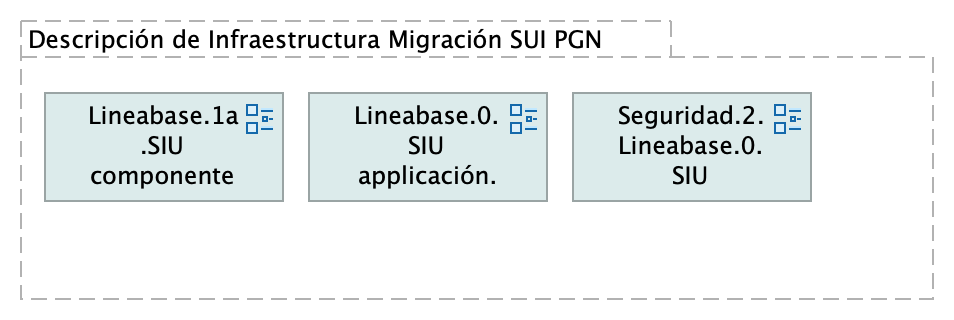{#fig:id-id-d20f6681ac6249bf88591c49616de26a width=}

_Fuente: Repositorio arquitectura Mi Mutual (2023)_

 

### Catálogo de Elementos

| Nombre           | Tipo | Documentación | Propiedad |
|----------------|------|------|------|
| Descripción de Infraestructura Migración SUI PGN | Grouping |  |  |

Table: Elementos de la vista. {#tbl:tblelement-Doc.2.InfraestructuraSUI-id}

 

## Doc.3.Migración Funcional SUI

undefined

{#fig:id-id-feee5640a7664190836510f20d08a457 width=}

_Fuente: Repositorio arquitectura Mi Mutual (2023)_

 

### Catálogo de Elementos

| Nombre           | Tipo | Documentación | Propiedad |
|----------------|------|------|------|
| Análisis de Productos | Grouping |  |  |
| Arquitectura de Seguridad, SUI Migración | Grouping |  |  |
| Organización cambios arquitectura | Grouping |  |  |
| Patrón de Diseño Línea Base SUI PGN | Grouping |  |  |
| Patrón de Diseño Migración SUI PGN | Grouping |  |  |
| Riesgos Técnicos | Grouping |  |  |

Table: Elementos de la vista. {#tbl:tblelement-Doc.3.MigraciónFuncionalSUI-id}

 

## Doc.4.PGN Contractual

undefined

{#fig:id-id-e7f7d2ccbf294528b5d78a0bd1efe1fe width=}

_Fuente: Repositorio arquitectura Mi Mutual (2023)_

 

### Catálogo de Elementos

| Nombre           | Tipo | Documentación | Propiedad |
|----------------|------|------|------|
| CI | Grouping |  |  |
| Componentes | Grouping |  |  |
| Contexto | Grouping |  |  |
| Física | Grouping |  |  |
| Interoperabilidad | Grouping |  |  |
| Motivadores | Grouping |  |  |
| Seguridad | Grouping |  |  |
| Tecnología | Grouping |  |  |

Table: Elementos de la vista. {#tbl:tblelement-Doc.4.PGNContractual-id}

 

## Lineabase.0.SIU applicación

Procuraduría General de la Nación
Proyecto Migración SIU, 2023. Fase II

Línea base sistema único de información. PGN. Componentes originales Fase I. Organización de la Aplicación.

versión 0.11

Procuraduría General de la Nación, proyecto Migración SIU, 2023, Fase II. Línea base del sistema único de información (SUI en adelante) de la PGN. Presentación de componentes de software  originales implementados en la Fase I del presente proyecto.

## Representación Arquitectónica
Con una arquitectura orientada a servicios SUI recopila:

1. Runtime: Es el servicio que interactúa con el usuario final (GUI) elaborado en Angular 11
1. API Tx: Servicio api rest base node encargado de realizar las transacciones básicas CRUD
1. API Config / Seguridad. Servicio Web API .Net Framework encargado de gestionar características con la autenticación y configuración

&lt;br&gt;

{#fig:id-id-d1c66332737c4f8294474c4bbd0ebd52 width=}

_Fuente: Repositorio arquitectura Mi Mutual (2023)_

 

### Catálogo de Elementos

| Nombre           | Tipo | Documentación | Propiedad |
|----------------|------|------|------|
| App | Application Component |  |  |
| App PGN Móvil | Application Component | A partir de los lineamientos de desarrollo seguro establecidos en The OWASP Foundation recomendados en la “Guía de desarrollo OWASP” y “OWAS Cheat Sheet, se realizaran pruebas de seguridad a partir del analisis de vulnerabilidades, y pruebas de Ethikal Hacking. 
 
 Protección de datos personales, 
 Los sistemas de información que recogen, procesan y almacenan información de los derechos de las personas se deben almacenar de forma adecuada, la información que pueda ser vulnerada puede generar obliaciones legales y éticas con respecto a la perdida de informacion confidencial por parte de ciudadanos del pais. 
 
 La informacion contenida en las bases de datos debe tener los mecanismos de cifrado que en otros apartados se han mencionado. 
 La legislación que hay que tener como referencia, ley 1581 de 2012. Decreto 1377 de 2013
 
 La metodologia empleada tendrá las siguientes fases: 
 
 •	FASE DE RECONOCIMIENTO: 
 Se recolectará toda la información posible, usando diferentes técnicas como:
 o	Recopilación de dominios/IPs/puertos/servicios
 o	Recopilación de metadatos
 o	Uso de Google Dorks.
 
 •	ANÁLSIS DE VULNERABILIDADES: 
 Se analizará la información recopilada en la fase anterior y se realizará el descubrimiento de las vulnerabilidades. 
 
 •	EXPLOTACIÓN: 
 •	Se realizarán todas aquellas acciones que puedan comprometer al sistema auditado, las pruebas a implementar pueden ser de ataques tipo: 
 o	Inyección de código
 o	Inclusión de ficheros locales o remotos
 o	Evasión de autenticación
 o	Carencia de controles de autorización
 o	Ejecución de comandos en el lado del servidor
 o	Ataques tipo Cross Site Request Forgery
 o	Control de errores
 o	Gestión de sesiones
 o	Fugas de información
 o	Secuestros de sesión
 o	Comprobación de las condiciones para realizar una denegación de servicio.
 	
 •	POST EXPLOTACIÓN:
 En caso de encontrarse una vulnerabilidad que permita realizar otras acciones en el sistema auditado o en su entorno, se realizarán controles adiciones con el objetivo de comprobar la criticidad de esta.
 
 No	URL	IP
 1.	https://runtimetest.lappiz.io/#/auth/login/PGN_Lappiz
 135.181.185.207
 
 
  |  |
| App PGN Web | Application Component | A partir de los lineamientos de desarrollo seguro establecidos en The OWASP Foundation recomendados en la “Guía de desarrollo OWASP” y “OWAS Cheat Sheet, se realizaran pruebas de seguridad a partir del analisis de vulnerabilidades, y pruebas de Ethical Hacking. 
 Los resultados permitirán identificar los requisitos de seguridad que los sistemas de informacion o servicios web deberán cumplir.
 La metodologia empleada tendrá las siguientes fases: 
 
 •	FASE DE RECONOCIMIENTO: 
 Se recolectará toda la información posible, usando diferentes técnicas como:
 o	Recopilación de dominios/IPs/puertos/servicios
 o	Recopilación de metadatos
 o	Uso de Google Dorks.
 
 •	ANÁLSIS DE VULNERABILIDADES: 
 Se analizará la información recopilada en la fase anterior y se realizará el descubrimiento de las vulnerabilidades. 
 
 •	EXPLOTACIÓN: 
 •	Se realizarán todas aquellas acciones que puedan comprometer al sistema auditado, las pruebas a implementar pueden ser de ataques tipo: 
 o	Inyección de código
 o	Inclusión de ficheros locales o remotos
 o	Evasión de autenticación
 o	Carencia de controles de autorización
 o	Ejecución de comandos en el lado del servidor
 o	Ataques tipo Cross Site Request Forgery
 o	Control de errores
 o	Gestión de sesiones
 o	Fugas de información
 o	Secuestros de sesión
 o	Comprobación de las condiciones para realizar una denegación de servicio.
 	
 •	POST EXPLOTACIÓN:
 En caso de encontrarse una vulnerabilidad que permita realizar otras acciones en el sistema auditado o en su entorno, se realizarán controles adiciones con el objetivo de comprobar la criticidad de esta.
 
 No	URL	IP
 1.	https://runtimetest.lappiz.io/#/auth/login/PGN_Lappiz
 135.181.185.207
 
 
 El Login deberá evidenciar el control de errores, al momento de realizar la validación deberá mensaje de error para el caso que se autentique con credenciales erradas.  |  |
| Application Collaboration | Application Collaboration |  |  |
| Application Collaboration | Application Collaboration |  |  |
| Application Service (NLB) | Application Service |  |  |
| Config | Application Component |  |  |
| Interfaz de datos 1 | Application Service |  |  |
| Interfaz de datos 2 | Application Service |  |  |
| Punto acceso público | Application Interface | URL tipo C HTTP |  |

Table: Elementos de la vista. {#tbl:tblelement-Lineabase.0.SIUapplicación-id}

 

## Lineabase.0.SIU applicación. física

Procuraduría General de la Nación
Proyecto Migración SIU, 2023. Fase II

Línea base sistema único de información. PGN. Componentes originales Fase I.

versión 0.11.1

Procuraduría General de la Nación (PGN), módulo SIU migrado, 2023. Elementos físicos que soportan a la aplicación Sistema de Información Único (SIU en adelante) de la PGN, actual Fase I y existente en Fase II. Presentación de componentes de software y tecnologeia física (hardware) implementados en la Fase I y requeridos por Fase II (presente proyecto).

## Representación Arquitectónica
Con una arquitectura orientada a servicios SUI recopila:

1. Runtime: Es el servicio que interactúa con el usuario final (GUI) elaborado en Angular 11
1. API Tx: Servicio api rest base node encargado de realizar las transacciones básicas CRUD
1. API Config / Seguridad. Servicio Web API .Net Framework encargado de gestionar características con la autenticación y configuración

&lt;br&gt;

{#fig:id-id-f3eee2e860604899903c6b48c2f76335 width=}

_Fuente: Repositorio arquitectura Mi Mutual (2023)_

 

### Catálogo de Elementos

| Nombre           | Tipo | Documentación | Propiedad |
|----------------|------|------|------|
| App | Application Component |  |  |
| App PGN Móvil | Application Component | A partir de los lineamientos de desarrollo seguro establecidos en The OWASP Foundation recomendados en la “Guía de desarrollo OWASP” y “OWAS Cheat Sheet, se realizaran pruebas de seguridad a partir del analisis de vulnerabilidades, y pruebas de Ethikal Hacking. 
 
 Protección de datos personales, 
 Los sistemas de información que recogen, procesan y almacenan información de los derechos de las personas se deben almacenar de forma adecuada, la información que pueda ser vulnerada puede generar obliaciones legales y éticas con respecto a la perdida de informacion confidencial por parte de ciudadanos del pais. 
 
 La informacion contenida en las bases de datos debe tener los mecanismos de cifrado que en otros apartados se han mencionado. 
 La legislación que hay que tener como referencia, ley 1581 de 2012. Decreto 1377 de 2013
 
 La metodologia empleada tendrá las siguientes fases: 
 
 •	FASE DE RECONOCIMIENTO: 
 Se recolectará toda la información posible, usando diferentes técnicas como:
 o	Recopilación de dominios/IPs/puertos/servicios
 o	Recopilación de metadatos
 o	Uso de Google Dorks.
 
 •	ANÁLSIS DE VULNERABILIDADES: 
 Se analizará la información recopilada en la fase anterior y se realizará el descubrimiento de las vulnerabilidades. 
 
 •	EXPLOTACIÓN: 
 •	Se realizarán todas aquellas acciones que puedan comprometer al sistema auditado, las pruebas a implementar pueden ser de ataques tipo: 
 o	Inyección de código
 o	Inclusión de ficheros locales o remotos
 o	Evasión de autenticación
 o	Carencia de controles de autorización
 o	Ejecución de comandos en el lado del servidor
 o	Ataques tipo Cross Site Request Forgery
 o	Control de errores
 o	Gestión de sesiones
 o	Fugas de información
 o	Secuestros de sesión
 o	Comprobación de las condiciones para realizar una denegación de servicio.
 	
 •	POST EXPLOTACIÓN:
 En caso de encontrarse una vulnerabilidad que permita realizar otras acciones en el sistema auditado o en su entorno, se realizarán controles adiciones con el objetivo de comprobar la criticidad de esta.
 
 No	URL	IP
 1.	https://runtimetest.lappiz.io/#/auth/login/PGN_Lappiz
 135.181.185.207
 
 
  |  |
| App PGN Web | Application Component | A partir de los lineamientos de desarrollo seguro establecidos en The OWASP Foundation recomendados en la “Guía de desarrollo OWASP” y “OWAS Cheat Sheet, se realizaran pruebas de seguridad a partir del analisis de vulnerabilidades, y pruebas de Ethical Hacking. 
 Los resultados permitirán identificar los requisitos de seguridad que los sistemas de informacion o servicios web deberán cumplir.
 La metodologia empleada tendrá las siguientes fases: 
 
 •	FASE DE RECONOCIMIENTO: 
 Se recolectará toda la información posible, usando diferentes técnicas como:
 o	Recopilación de dominios/IPs/puertos/servicios
 o	Recopilación de metadatos
 o	Uso de Google Dorks.
 
 •	ANÁLSIS DE VULNERABILIDADES: 
 Se analizará la información recopilada en la fase anterior y se realizará el descubrimiento de las vulnerabilidades. 
 
 •	EXPLOTACIÓN: 
 •	Se realizarán todas aquellas acciones que puedan comprometer al sistema auditado, las pruebas a implementar pueden ser de ataques tipo: 
 o	Inyección de código
 o	Inclusión de ficheros locales o remotos
 o	Evasión de autenticación
 o	Carencia de controles de autorización
 o	Ejecución de comandos en el lado del servidor
 o	Ataques tipo Cross Site Request Forgery
 o	Control de errores
 o	Gestión de sesiones
 o	Fugas de información
 o	Secuestros de sesión
 o	Comprobación de las condiciones para realizar una denegación de servicio.
 	
 •	POST EXPLOTACIÓN:
 En caso de encontrarse una vulnerabilidad que permita realizar otras acciones en el sistema auditado o en su entorno, se realizarán controles adiciones con el objetivo de comprobar la criticidad de esta.
 
 No	URL	IP
 1.	https://runtimetest.lappiz.io/#/auth/login/PGN_Lappiz
 135.181.185.207
 
 
 El Login deberá evidenciar el control de errores, al momento de realizar la validación deberá mensaje de error para el caso que se autentique con credenciales erradas.  |  |
| Application Collaboration | Application Collaboration |  |  |
| Application Collaboration | Application Collaboration |  |  |
| Application Service (NLB) | Application Service |  |  |
| Balanceador | Node |  |  |
| Communication Network (DMZ) | Communication Network |  |  |
| Communication Network (LAN) | Communication Network |  |  |
| Communication Network (internet) | Communication Network |  |  |
| Config | Application Component |  |  |
| Interfaz de datos 1 | Application Service |  |  |
| Interfaz de datos 2 | Application Service |  |  |
| Punto acceso público | Application Interface | URL tipo C HTTP |  |
| Servidor BDD App | Node | Sistema Operativo Windows Server 2019 Standard o Datacenter x64. RAM	8 GB. CPU 64 Bits, 4 Cores > 2 Ghz Discos	SO C: 126 GB, Backup E: 511 GB, SQL Data F: 510 GB, SQL Log   G: 510 GB, TempDB  G: 63.6 GB.  |  |
| Servidor BDD Config | Node | Sistema Operativo Windows Server 2019 Standard o Datacenter x64. RAM	8 GB. CPU 64 Bits, 4 Cores > 2 Ghz Discos	SO C: 80 GB, Backup E: 250 GB, SQL Data F: 250 GB, SQL Log G: 250 GB, TempDB  G: 30 GB.  |  |
| Servidor Web App | Node | Windows Server 2019 Standard o Datacenter x64. Nombre físico. IP LAN. IP Pública. Windows Server 2019 Standard or Datacenter x64. RAM	8  GB. CPU	64 Bits. 4 Cores de 2 Ghz. Discos	SO C: 126 GB. SO D: 16 GB.  |  |
| Servidor Web Canales | Node | Windows Server 2019 Standard o Datacenter x64. Nombre físico. IP LAN. IP Pública. Windows Server 2019 Standard or Datacenter x64. RAM	8  GB. CPU	64 Bits. 4 Cores de 2 Ghz. Discos	SO C: 126 GB. SO D: 16 GB.  |  |
| www pgn com | Technology Interface |  |  |

Table: Elementos de la vista. {#tbl:tblelement-Lineabase.0.SIUapplicación.física-id}

 

## Lineabase.1.SIU componente

Distribución de los servicios y paquetes que integran la aplicación de SUI. 

Cuatro paquetes con tecnologías respectivas

1. Angular 11 (Web)
1. API Transaccional (Node Js)
1. API Config (C#)
1. Persistencia (SQL)

Asuntos de la Migración:

* Estrategia CMS central
* Motor de búsqueda
* Estatego como BI
* Conciliación y Doku
* Gestión de sesiones / caducidad

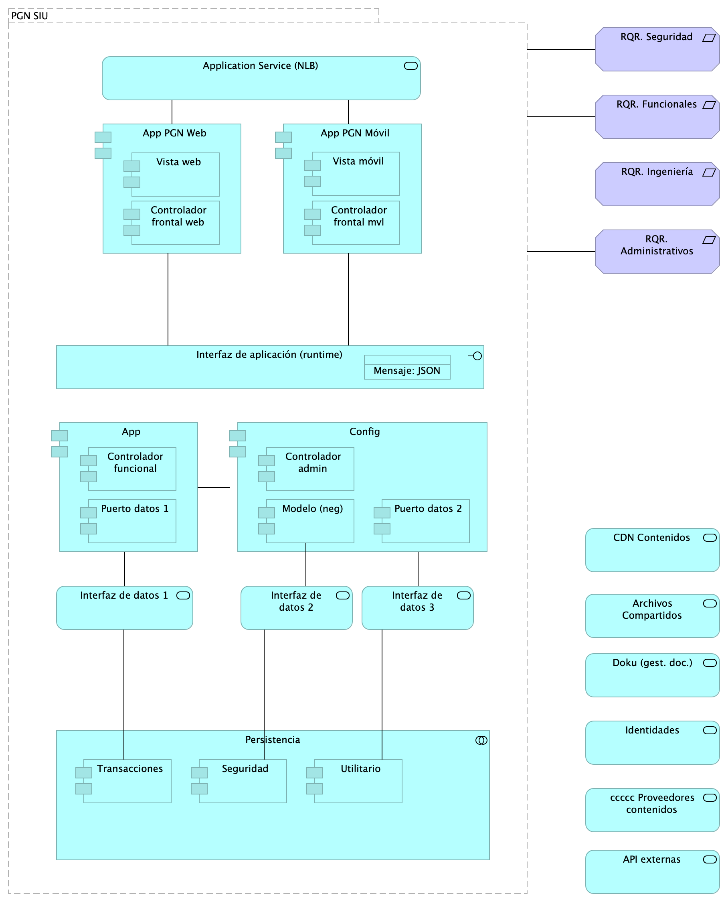{#fig:id-id-4f2604a6793e41ce9eb978dca0209b03 width=}

_Fuente: Repositorio arquitectura Mi Mutual (2023)_

 

### Catálogo de Elementos

| Nombre           | Tipo | Documentación | Propiedad |
|----------------|------|------|------|
| API externas | Application Service |  |  |
| App | Application Component |  |  |
| App PGN Móvil | Application Component | A partir de los lineamientos de desarrollo seguro establecidos en The OWASP Foundation recomendados en la “Guía de desarrollo OWASP” y “OWAS Cheat Sheet, se realizaran pruebas de seguridad a partir del analisis de vulnerabilidades, y pruebas de Ethikal Hacking. 
 
 Protección de datos personales, 
 Los sistemas de información que recogen, procesan y almacenan información de los derechos de las personas se deben almacenar de forma adecuada, la información que pueda ser vulnerada puede generar obliaciones legales y éticas con respecto a la perdida de informacion confidencial por parte de ciudadanos del pais. 
 
 La informacion contenida en las bases de datos debe tener los mecanismos de cifrado que en otros apartados se han mencionado. 
 La legislación que hay que tener como referencia, ley 1581 de 2012. Decreto 1377 de 2013
 
 La metodologia empleada tendrá las siguientes fases: 
 
 •	FASE DE RECONOCIMIENTO: 
 Se recolectará toda la información posible, usando diferentes técnicas como:
 o	Recopilación de dominios/IPs/puertos/servicios
 o	Recopilación de metadatos
 o	Uso de Google Dorks.
 
 •	ANÁLSIS DE VULNERABILIDADES: 
 Se analizará la información recopilada en la fase anterior y se realizará el descubrimiento de las vulnerabilidades. 
 
 •	EXPLOTACIÓN: 
 •	Se realizarán todas aquellas acciones que puedan comprometer al sistema auditado, las pruebas a implementar pueden ser de ataques tipo: 
 o	Inyección de código
 o	Inclusión de ficheros locales o remotos
 o	Evasión de autenticación
 o	Carencia de controles de autorización
 o	Ejecución de comandos en el lado del servidor
 o	Ataques tipo Cross Site Request Forgery
 o	Control de errores
 o	Gestión de sesiones
 o	Fugas de información
 o	Secuestros de sesión
 o	Comprobación de las condiciones para realizar una denegación de servicio.
 	
 •	POST EXPLOTACIÓN:
 En caso de encontrarse una vulnerabilidad que permita realizar otras acciones en el sistema auditado o en su entorno, se realizarán controles adiciones con el objetivo de comprobar la criticidad de esta.
 
 No	URL	IP
 1.	https://runtimetest.lappiz.io/#/auth/login/PGN_Lappiz
 135.181.185.207
 
 
  |  |
| App PGN Web | Application Component | A partir de los lineamientos de desarrollo seguro establecidos en The OWASP Foundation recomendados en la “Guía de desarrollo OWASP” y “OWAS Cheat Sheet, se realizaran pruebas de seguridad a partir del analisis de vulnerabilidades, y pruebas de Ethical Hacking. 
 Los resultados permitirán identificar los requisitos de seguridad que los sistemas de informacion o servicios web deberán cumplir.
 La metodologia empleada tendrá las siguientes fases: 
 
 •	FASE DE RECONOCIMIENTO: 
 Se recolectará toda la información posible, usando diferentes técnicas como:
 o	Recopilación de dominios/IPs/puertos/servicios
 o	Recopilación de metadatos
 o	Uso de Google Dorks.
 
 •	ANÁLSIS DE VULNERABILIDADES: 
 Se analizará la información recopilada en la fase anterior y se realizará el descubrimiento de las vulnerabilidades. 
 
 •	EXPLOTACIÓN: 
 •	Se realizarán todas aquellas acciones que puedan comprometer al sistema auditado, las pruebas a implementar pueden ser de ataques tipo: 
 o	Inyección de código
 o	Inclusión de ficheros locales o remotos
 o	Evasión de autenticación
 o	Carencia de controles de autorización
 o	Ejecución de comandos en el lado del servidor
 o	Ataques tipo Cross Site Request Forgery
 o	Control de errores
 o	Gestión de sesiones
 o	Fugas de información
 o	Secuestros de sesión
 o	Comprobación de las condiciones para realizar una denegación de servicio.
 	
 •	POST EXPLOTACIÓN:
 En caso de encontrarse una vulnerabilidad que permita realizar otras acciones en el sistema auditado o en su entorno, se realizarán controles adiciones con el objetivo de comprobar la criticidad de esta.
 
 No	URL	IP
 1.	https://runtimetest.lappiz.io/#/auth/login/PGN_Lappiz
 135.181.185.207
 
 
 El Login deberá evidenciar el control de errores, al momento de realizar la validación deberá mensaje de error para el caso que se autentique con credenciales erradas.  |  |
| Application Service (NLB) | Application Service |  |  |
| Archivos Compartidos | Application Service |  |  |
| CDN Contenidos | Application Service |  |  |
| Config | Application Component |  |  |
| Controlador admin | Application Component |  |  |
| Controlador frontal mvl | Application Component |  |  |
| Controlador frontal web | Application Component | -	Verificados los SSL, se recomienda adquirir SSL seguros, con entidades certificadoras. 
 Si se desea continuar con SSL de Let's Encrypt, se recomienda automatizar el proceso de actualización dado que al dejar estos en modo actualización manual es probable el olvido de esta actualización (Estos certificados se deben actualizar trimestralmente y no cuentan con las características de seguridad necesarias. 
  |  |
| Controlador funcional | Application Component |  |  |
| Doku (gest. doc.) | Application Service |  |  |
| Identidades | Application Service |  |  |
| Interfaz de aplicación (runtime) | Application Interface | Servidor web:  Microsoft-IIS/10.0 
 Marco de Programación: ASP.NET
 Huellas digitales identificadas:  
 Huella digital SHA-256 “FC:79:06:7E:F5:24:20:50:F1:C0:74:F7:85:56:B9:05:B7:33:A3:2D:44:A0:48”
 Huella digital SHA1 “8C:48:BD:E2:F5:18:18:C3:85:96:68:44:2E:28:A0:68:08:2F:0A:BE”
  |  |
| Interfaz de datos 1 | Application Service |  |  |
| Interfaz de datos 2 | Application Service |  |  |
| Interfaz de datos 3 | Application Service |  |  |
| Mensaje: JSON | Data Object |  |  |
| Modelo (neg) | Application Component |  |  |
| PGN SIU | Grouping | El objetivo principal de la arquitectura del SUI de la migración es la centralización de los conceptos misionales: concentrar los conceptos misionales en componentes aislados; dejar por fuera de estos componentes misionales todo lo distintos a la misionalidad de la PGN.  Los objetivos secundarios de esta arquitectura SUI de la migración son flexibilidad y extensibilidad. Dichos objetivos son independientes. Es decir, estos pueden ser maximizados sin conclifcto entre ellos.   |  |
| Persistencia | Application Collaboration |  |  |
| Puerto datos 1 | Application Component |  |  |
| Puerto datos 2 | Application Component |  |  |
| RQR. Administrativos | Requirement |  |  |
| RQR. Funcionales | Requirement |  |  |
| RQR. Ingeniería | Requirement |  |  |
| RQR. Seguridad | Requirement | Requerimientos de seguridad, SUI, Migración, en aspectos de comunicación, autenticación, autorización y (manejo de) sesiones.  |  |
| Seguridad | Application Component |  |  |
| Transacciones | Application Component |  |  |
| Utilitario | Application Component |  |  |
| Vista móvil | Application Component |  |  |
| Vista web | Application Component | -	Verificados los SSL, se recomienda adquirir SSL seguros, con entidades certificadoras. 
 Si se desea continuar con SSL de Let's Encrypt, se recomienda automatizar el proceso de actualización dado que al dejar estos en modo actualización manual es probable el olvido de esta actualización (Estos certificados se deben actualizar trimestralmente y no cuentan con las características de seguridad necesarias. 
 4.	SERVICIOS IDENTIFICADOS:
 
 Servidor web:  Microsoft-IIS/10.0 
 Marco de Programación: ASP.NET
 Huellas digitales identificadas:  
 Huella digital SHA-256 “FC:79:06:7E:F5:24:20:50:F1:C0:74:F7:85:56:B9:05:B7:33:A3:2D:44:A0:48”
 Huella digital SHA1 “8C:48:BD:E2:F5:18:18:C3:85:96:68:44:2E:28:A0:68:08:2F:0A:BE”
  |  |
| ccccc Proveedores contenidos | Application Service |  |  |

Table: Elementos de la vista. {#tbl:tblelement-Lineabase.1.SIUcomponente-id}

 

## Lineabase.1a.SIU componentes. infraestrcutura

Dependencias de infraestructura entre los servicios que integran el modelo de aplicación de SUI, Migración. 

* Servidor de Canales (App PGN web y móvil)
* Servidor Web App (App SUI)
* Servidor Lappiz (Config SUI)
* Servidor BDD App (Transaccional)
* Servidor BDD Config (Configuración)

{#fig:id-id-ae9dc2de036e435fbcba8497224653a7 width=}

_Fuente: Repositorio arquitectura Mi Mutual (2023)_

 

### Catálogo de Elementos

| Nombre           | Tipo | Documentación | Propiedad |
|----------------|------|------|------|
| API externas | Application Service |  |  |
| App | Application Component |  |  |
| App PGN Móvil | Application Component | A partir de los lineamientos de desarrollo seguro establecidos en The OWASP Foundation recomendados en la “Guía de desarrollo OWASP” y “OWAS Cheat Sheet, se realizaran pruebas de seguridad a partir del analisis de vulnerabilidades, y pruebas de Ethikal Hacking. 
 
 Protección de datos personales, 
 Los sistemas de información que recogen, procesan y almacenan información de los derechos de las personas se deben almacenar de forma adecuada, la información que pueda ser vulnerada puede generar obliaciones legales y éticas con respecto a la perdida de informacion confidencial por parte de ciudadanos del pais. 
 
 La informacion contenida en las bases de datos debe tener los mecanismos de cifrado que en otros apartados se han mencionado. 
 La legislación que hay que tener como referencia, ley 1581 de 2012. Decreto 1377 de 2013
 
 La metodologia empleada tendrá las siguientes fases: 
 
 •	FASE DE RECONOCIMIENTO: 
 Se recolectará toda la información posible, usando diferentes técnicas como:
 o	Recopilación de dominios/IPs/puertos/servicios
 o	Recopilación de metadatos
 o	Uso de Google Dorks.
 
 •	ANÁLSIS DE VULNERABILIDADES: 
 Se analizará la información recopilada en la fase anterior y se realizará el descubrimiento de las vulnerabilidades. 
 
 •	EXPLOTACIÓN: 
 •	Se realizarán todas aquellas acciones que puedan comprometer al sistema auditado, las pruebas a implementar pueden ser de ataques tipo: 
 o	Inyección de código
 o	Inclusión de ficheros locales o remotos
 o	Evasión de autenticación
 o	Carencia de controles de autorización
 o	Ejecución de comandos en el lado del servidor
 o	Ataques tipo Cross Site Request Forgery
 o	Control de errores
 o	Gestión de sesiones
 o	Fugas de información
 o	Secuestros de sesión
 o	Comprobación de las condiciones para realizar una denegación de servicio.
 	
 •	POST EXPLOTACIÓN:
 En caso de encontrarse una vulnerabilidad que permita realizar otras acciones en el sistema auditado o en su entorno, se realizarán controles adiciones con el objetivo de comprobar la criticidad de esta.
 
 No	URL	IP
 1.	https://runtimetest.lappiz.io/#/auth/login/PGN_Lappiz
 135.181.185.207
 
 
  |  |
| App PGN Web | Application Component | A partir de los lineamientos de desarrollo seguro establecidos en The OWASP Foundation recomendados en la “Guía de desarrollo OWASP” y “OWAS Cheat Sheet, se realizaran pruebas de seguridad a partir del analisis de vulnerabilidades, y pruebas de Ethical Hacking. 
 Los resultados permitirán identificar los requisitos de seguridad que los sistemas de informacion o servicios web deberán cumplir.
 La metodologia empleada tendrá las siguientes fases: 
 
 •	FASE DE RECONOCIMIENTO: 
 Se recolectará toda la información posible, usando diferentes técnicas como:
 o	Recopilación de dominios/IPs/puertos/servicios
 o	Recopilación de metadatos
 o	Uso de Google Dorks.
 
 •	ANÁLSIS DE VULNERABILIDADES: 
 Se analizará la información recopilada en la fase anterior y se realizará el descubrimiento de las vulnerabilidades. 
 
 •	EXPLOTACIÓN: 
 •	Se realizarán todas aquellas acciones que puedan comprometer al sistema auditado, las pruebas a implementar pueden ser de ataques tipo: 
 o	Inyección de código
 o	Inclusión de ficheros locales o remotos
 o	Evasión de autenticación
 o	Carencia de controles de autorización
 o	Ejecución de comandos en el lado del servidor
 o	Ataques tipo Cross Site Request Forgery
 o	Control de errores
 o	Gestión de sesiones
 o	Fugas de información
 o	Secuestros de sesión
 o	Comprobación de las condiciones para realizar una denegación de servicio.
 	
 •	POST EXPLOTACIÓN:
 En caso de encontrarse una vulnerabilidad que permita realizar otras acciones en el sistema auditado o en su entorno, se realizarán controles adiciones con el objetivo de comprobar la criticidad de esta.
 
 No	URL	IP
 1.	https://runtimetest.lappiz.io/#/auth/login/PGN_Lappiz
 135.181.185.207
 
 
 El Login deberá evidenciar el control de errores, al momento de realizar la validación deberá mensaje de error para el caso que se autentique con credenciales erradas.  |  |
| Application Service (NLB) | Application Service |  |  |
| Archivos Compartidos | Application Service |  |  |
| CDN Contenidos | Application Service |  |  |
| Config | Application Component |  |  |
| Controlador admin | Application Component |  |  |
| Controlador frontal mvl | Application Component |  |  |
| Controlador frontal web | Application Component | -	Verificados los SSL, se recomienda adquirir SSL seguros, con entidades certificadoras. 
 Si se desea continuar con SSL de Let's Encrypt, se recomienda automatizar el proceso de actualización dado que al dejar estos en modo actualización manual es probable el olvido de esta actualización (Estos certificados se deben actualizar trimestralmente y no cuentan con las características de seguridad necesarias. 
  |  |
| Controlador funcional | Application Component |  |  |
| Doku (gest. doc.) | Application Service |  |  |
| Identidades | Application Service |  |  |
| Infraestructura SUI | Grouping | Soporte de infraestructura a los componentes del SUI Migración. Servidores y ambientes de cómputo para la ejecución del software base de los componentes misionales del SUI de PGN.  |  |
| Interfaz de aplicación (runtime) | Application Interface | Servidor web:  Microsoft-IIS/10.0 
 Marco de Programación: ASP.NET
 Huellas digitales identificadas:  
 Huella digital SHA-256 “FC:79:06:7E:F5:24:20:50:F1:C0:74:F7:85:56:B9:05:B7:33:A3:2D:44:A0:48”
 Huella digital SHA1 “8C:48:BD:E2:F5:18:18:C3:85:96:68:44:2E:28:A0:68:08:2F:0A:BE”
  |  |
| Interfaz de datos 1 | Application Service |  |  |
| Interfaz de datos 2 | Application Service |  |  |
| Interfaz de datos 3 | Application Service |  |  |
| Mensaje: JSON | Data Object |  |  |
| Modelo (neg) | Application Component |  |  |
| PGN SIU | Grouping | El objetivo principal de la arquitectura del SUI de la migración es la centralización de los conceptos misionales: concentrar los conceptos misionales en componentes aislados; dejar por fuera de estos componentes misionales todo lo distintos a la misionalidad de la PGN.  Los objetivos secundarios de esta arquitectura SUI de la migración son flexibilidad y extensibilidad. Dichos objetivos son independientes. Es decir, estos pueden ser maximizados sin conclifcto entre ellos.   |  |
| Persistencia | Application Collaboration |  |  |
| Puerto datos 1 | Application Component |  |  |
| Puerto datos 2 | Application Component |  |  |
| Seguridad | Application Component |  |  |
| Servidor BDD App | Node | Sistema Operativo Windows Server 2019 Standard o Datacenter x64. RAM	8 GB. CPU 64 Bits, 4 Cores > 2 Ghz Discos	SO C: 126 GB, Backup E: 511 GB, SQL Data F: 510 GB, SQL Log   G: 510 GB, TempDB  G: 63.6 GB.  |  |
| Servidor BDD Config | Node | Sistema Operativo Windows Server 2019 Standard o Datacenter x64. RAM	8 GB. CPU 64 Bits, 4 Cores > 2 Ghz Discos	SO C: 80 GB, Backup E: 250 GB, SQL Data F: 250 GB, SQL Log G: 250 GB, TempDB  G: 30 GB.  |  |
| Servidor Web App | Node | Windows Server 2019 Standard o Datacenter x64. Nombre físico. IP LAN. IP Pública. Windows Server 2019 Standard or Datacenter x64. RAM	8  GB. CPU	64 Bits. 4 Cores de 2 Ghz. Discos	SO C: 126 GB. SO D: 16 GB.  |  |
| Servidor Web Canales | Node | Windows Server 2019 Standard o Datacenter x64. Nombre físico. IP LAN. IP Pública. Windows Server 2019 Standard or Datacenter x64. RAM	8  GB. CPU	64 Bits. 4 Cores de 2 Ghz. Discos	SO C: 126 GB. SO D: 16 GB.  |  |
| Transacciones | Application Component |  |  |
| Utilitario | Application Component |  |  |
| Vista móvil | Application Component |  |  |
| Vista web | Application Component | -	Verificados los SSL, se recomienda adquirir SSL seguros, con entidades certificadoras. 
 Si se desea continuar con SSL de Let's Encrypt, se recomienda automatizar el proceso de actualización dado que al dejar estos en modo actualización manual es probable el olvido de esta actualización (Estos certificados se deben actualizar trimestralmente y no cuentan con las características de seguridad necesarias. 
 4.	SERVICIOS IDENTIFICADOS:
 
 Servidor web:  Microsoft-IIS/10.0 
 Marco de Programación: ASP.NET
 Huellas digitales identificadas:  
 Huella digital SHA-256 “FC:79:06:7E:F5:24:20:50:F1:C0:74:F7:85:56:B9:05:B7:33:A3:2D:44:A0:48”
 Huella digital SHA1 “8C:48:BD:E2:F5:18:18:C3:85:96:68:44:2E:28:A0:68:08:2F:0A:BE”
  |  |
| ccccc Proveedores contenidos | Application Service |  |  |

Table: Elementos de la vista. {#tbl:tblelement-Lineabase.1a.SIUcomponentes.infraestrcutura-id}

 

## Linebase.2.Portal

El portal es el conjunto de los elementos físicos y lógicos necesarios para la implementación de la granja de servidores de SharePoint Server 2019 para el portal de la PROCURADURIA.

* Servidores Web Front End
* Servidores de Aplicaciones
* Servidores de SQL Server

{#fig:id-id-64947c69f63c422e9f18c81763910332 width=}

_Fuente: Repositorio arquitectura Mi Mutual (2023)_

 

### Catálogo de Elementos

| Nombre           | Tipo | Documentación | Propiedad |
|----------------|------|------|------|
| Application Collaboration Sharepoint | Application Collaboration |  |  |
| Application Interface | Application Interface |  |  |
| Servidor aplicaciones Sharepoint | Application Component |  |  |
| Servidor datos Sharepoint | Application Component |  |  |
| Servidor web Sharepoint | Application Component |  |  |

Table: Elementos de la vista. {#tbl:tblelement-Linebase.2.Portal-id}

 

## Migracion.1a.a.SIU Contexto

PGN. Migración Sistemas Misionales. Fase 2.

Submódulos Sistema Único de Información. Requerimientos asociados a submódulos.

versión 0.4

La vista presenta en contexto a los módulos SUI migrados y el estilo de comunicación vía API sincreonica/asincrónica.

Cada módulo migrado atiende al funcionario que le corresponde, p. ejemplo, Relatoría atiende a la depedencia Jurídica de la PGN. Los módulos comparten su información mediante el API local presente dentro de cada uno. Esto es, la información se mantiene protegida en dominios pero coordinada (se comparte con otros dominios).

El arreglo de datos de registros operativos y transaccionales es como sigue: cada módulo individual mantiene su registro de datos, estado y transacciones minimizado y protegido (individual y aislado). Salvo excepciones no consentidas por el diseño original, un módulo puede compartir el mismo almacen de datos con otro.

{#fig:id-id-e1668a92e195406086fc440010fe73a5 width=}

_Fuente: Repositorio arquitectura Mi Mutual (2023)_

 

### Catálogo de Elementos

| Nombre           | Tipo | Documentación | Propiedad |
|----------------|------|------|------|
| API SUI | Application Interface | API de representación del módulo. Centrlalización de la comunicación con otros módulos del SUI migrado.  |  |
| API SUI 2 | Application Interface | API de representación del módulo. Centrlalización de la comunicación con otros módulos del SUI migrado.  |  |
| API SUI 3 | Application Interface | API de representación del módulo. Centrlalización de la comunicación con otros módulos del SUI migrado.  |  |
| API SUI N | Application Interface | API de representación del módulo. Centrlalización de la comunicación con otros módulos del SUI migrado.  |  |
| Cliente PGN | Business Actor |  |  |
| Funcionario PGN | Business Actor |  |  |
| cc:Administración | Application Collaboration |  |  |
| cc:Almacenamient 2 | Application Collaboration | Espacio de almancenamiento operativo y transaccional de un módulo central del SUI migrado. |  |
| cc:Almacenamiento | Application Collaboration | Espacio de almancenamiento operativo y transaccional de un módulo central del SUI migrado. |  |
| cc:Almacenamiento 3 | Application Collaboration | Espacio de almancenamiento operativo y transaccional de un módulo central del SUI migrado. |  |
| cc:Almacenamiento N | Application Collaboration | Espacio de almancenamiento operativo y transaccional de un módulo central del SUI migrado. |  |
| cc:PGN SUI (módulo central) | Application Collaboration | Módulo central SUI migrado. Módulo independiente y asignado a un dominio partigular de la PGN.  |  |
| cc:PGN SUI (módulo central) 2 | Application Collaboration | Módulo central SUI migrado. Módulo independiente y asignado a un dominio partigular de la PGN.  |  |
| cc:PGN SUI (módulo central) 3 | Application Collaboration | Módulo central SUI migrado. Módulo independiente y asignado a un dominio partigular de la PGN.  |  |
| cc:PGN SUI (módulo central) N | Application Collaboration | Módulo central SUI migrado. Módulo independiente y asignado a un dominio partigular de la PGN.  |  |
| cc:Portales y canales | Application Collaboration | Submódulo de portales internos de la PGN a donde llega el SUI. Interfaz web que usa al SUI para llegar a direcciones y subdirecciones de la PGN. La plataforma principal de portales en este contexto es Sharepoint de Microsoft.  |  |
| cc:Presentación | Application Collaboration | Submódulo de presentación del SUI. interfaz gráfica, interfaz web visible a los usuarios clientes y funcionarios de la PGN.  |  |
| cc:Servicios de aplicación | Application Collaboration | Submódulo de servicios utilitarios que sirven al SUI. Servicios variados que cumplen roles facilitadores de las actividades misionales del SUI. Ejemplos de estos servicios son los de gestión documental, implementado por Doku en el contexto de PGN.   |  |

Table: Elementos de la vista. {#tbl:tblelement-Migracion.1a.a.SIUContexto-id}

 

## Migracion.1a.b.SIU Módulos

PGN. Migración Sistemas Misionales. Fase 2.

Submódulos Sistema Único de Información. Requerimientos asociados a submódulos.

versión 0.4

Identificación de submódulos del Sistema Único de Información (SUI) de la PGN. 

Todos los sistemas de información del SUI deben seguir la directiva de separar a los componentes misionales de los utilitarios: el SUI de PGN estará constituidos por submódulos dispuestos en relación de utilitarios (que sirven) a los componentes misionales del SUI, ubicados en el centro en la diagrama.

Los submódulos del SUI, tal como están presentados, reúnen a las partes por el mismo rol en favor de la coherencia. Por ejemplo, los servicios de aplicación, en la imagen, contiene a todos aquellos utilitarios que prestan alguna utilidad momentánea al SUI migrado. Organizados así, estos submódulos utilitarios pueden ser intercambiados o ampliados sin perjuicio de los componentes misionales dell SUI (centro del diagrama) gracias a las _interfaces de unión_ en favor de la extensibilidad.

Las interfaces de unión indicadas arriba obligan a los submódulos a cumplir las exigencias de los componentes misionales del SUI.

Los submódulos identificados tienen los siguientes roles para el SUI migrado:

1. cc:Presentación
1. cc:Servicios de aplicación
1. cc:Portales y canales
1. cc:Administración y configuración
1. cc:Almacenamiento

### Requerimientos Asociados a los Submódulos
La disposición de los módulos y submódulos presentada, denominada SUI Migración en adelante, facilita la focalización de los requerimientos encontrados en el levantamiento realizado en el actual proyecto. Así, por ejemplo, los requerimientos funcionales se encuentran concentrados en el submódulo de presentación (ver imagen).

{#fig:id-id-f3f3865c516245bfb2d777de5b23efb6 width=}

_Fuente: Repositorio arquitectura Mi Mutual (2023)_

 

### Catálogo de Elementos

| Nombre           | Tipo | Documentación | Propiedad |
|----------------|------|------|------|
| ARQ01. Consistencia SUI | Constraint | Unifica las entidades de negocio PGN, entre las que se incluyen a conciliaciones, publicaciones de relatoría, resoluciones, en artefactos reutilizables. Distinto de que estas entidades (y su lógica de negocio) estén dispersos entre los sistemas del SUI, estarán concentradas en un único artefacto correspondiente. Calidad sistémica: la consistencia persigue que el resultado de la lógica de negocio sea la misma entre los módulos del SUI migrado. Esto redunda a mantenibilidad y gestión: tiende a tener un solo punto de cambio y dificulta la transferencia de dependencias implícitas a otros procesos. |  |
| ARQ02. Mantenibilidad SUI | Constraint | Evitar las dependencia transitivas de los módulos misionales del SUI a componentes y sistemas de terceros o submódulos no misionales.  Calidad sistémica: la mantenibilidad por control de dependencias que optimiza el diseño Migración SUI está dada por el control de cambios no programados sobre los componentes misionales del SUI (corrupción de componentes). Ver Patrón de Diseño Migración SUI, más adelante en el documento. |  |
| ARQ03. Extensibilidad SUI | Constraint | Concentración de los componentes de negocio, misionales, del SUI protegidos de cambios provenientes de otros sistemas. Ver Patrón de Diseño Migración SUI, más adelante en el documento. Calidad sistémica: la extensibilidad que optimiza el diseño Migración SUI está dada por el intercambio de submódulos no misionales, como el gestor documental, sin afectación de los componentes misionales que este diseño protege. |  |
| Cliente PGN | Business Actor |  |  |
| Funcionario PGN | Business Actor |  |  |
| RQR. Administrativos | Requirement |  |  |
| RQR. Funcionales | Requirement |  |  |
| RQR. Ingeniería | Requirement |  |  |
| RQR. Negocio | Requirement |  |  |
| RQR. Seguridad | Requirement | Requerimientos de seguridad, SUI, Migración, en aspectos de comunicación, autenticación, autorización y (manejo de) sesiones.  |  |
| cc:Administración | Application Collaboration |  |  |
| cc:Almacenamiento | Application Collaboration | Espacio de almancenamiento operativo y transaccional de un módulo central del SUI migrado. |  |
| cc:PGN SUI (módulo central) | Application Collaboration | Módulo central SUI migrado. Módulo independiente y asignado a un dominio partigular de la PGN.  |  |
| cc:Portales y canales | Application Collaboration | Submódulo de portales internos de la PGN a donde llega el SUI. Interfaz web que usa al SUI para llegar a direcciones y subdirecciones de la PGN. La plataforma principal de portales en este contexto es Sharepoint de Microsoft.  |  |
| cc:Presentación | Application Collaboration | Submódulo de presentación del SUI. interfaz gráfica, interfaz web visible a los usuarios clientes y funcionarios de la PGN.  |  |
| cc:Servicios de aplicación | Application Collaboration | Submódulo de servicios utilitarios que sirven al SUI. Servicios variados que cumplen roles facilitadores de las actividades misionales del SUI. Ejemplos de estos servicios son los de gestión documental, implementado por Doku en el contexto de PGN.   |  |
| interfaz | Application Interface |  |  |
| interfaz | Application Interface |  |  |
| interfaz | Application Interface |  |  |
| interfaz | Application Interface |  |  |
| interfaz | Application Interface |  |  |

Table: Elementos de la vista. {#tbl:tblelement-Migracion.1a.b.SIUMódulos-id}

 

## Migracion.1b.1. SIU Módulos Componentes

PGN. Migración Sistemas Misionales. Fase 2.

Componentes internos de los submódulos Sistema Único de Información. 

versión 0.45

Presentación de los componentes internos de los submódulos del sistema único de información migrado, SUI de PGN. Organización intena de los servicios y paquetes que integran cada submódulo del SUI. Todos los sistemas de información del SUI siguen esta directiva: estarán constituídos por submódulos dispuestos en relación de utilitarios (que sirven) a los componentes misionales del SUI, ubicados en el centro en la diagrama. 

La organización de componentes de migración SUI facilita focalizar la selección de tecnologeias. Los componentes internos y tecnologías elegidas son las siguientes

1. Presentación: Angular 11 (Web)
1. PGN SUI: API Transaccional (Node Js)
1. Administración: API Config (C#)
1. Persistencia: (SQL)

Los submódulos del SUI, tal como están presentados, reúnen a las partes que tienen el mismo rol en favor de la coherencia. Así mismo, estos pueden ser intercambiados o ampliados sin perjuicio del SUI gracias a las interfaces de unión (en favor de la extensibilidad).

Las interfaces de unión indicadas arriba obligan a los submódulos a cumplir las exigencias de los componentes misionales del SUI.

{#fig:id-id-6dcada718c1446f69884dc7418828c51 width=}

_Fuente: Repositorio arquitectura Mi Mutual (2023)_

 

### Catálogo de Elementos

| Nombre           | Tipo | Documentación | Propiedad |
|----------------|------|------|------|
| API externas | Application Service |  |  |
| ARQ01. Consistencia SUI | Constraint | Unifica las entidades de negocio PGN, entre las que se incluyen a conciliaciones, publicaciones de relatoría, resoluciones, en artefactos reutilizables. Distinto de que estas entidades (y su lógica de negocio) estén dispersos entre los sistemas del SUI, estarán concentradas en un único artefacto correspondiente. Calidad sistémica: la consistencia persigue que el resultado de la lógica de negocio sea la misma entre los módulos del SUI migrado. Esto redunda a mantenibilidad y gestión: tiende a tener un solo punto de cambio y dificulta la transferencia de dependencias implícitas a otros procesos. |  |
| ARQ02. Mantenibilidad SUI | Constraint | Evitar las dependencia transitivas de los módulos misionales del SUI a componentes y sistemas de terceros o submódulos no misionales.  Calidad sistémica: la mantenibilidad por control de dependencias que optimiza el diseño Migración SUI está dada por el control de cambios no programados sobre los componentes misionales del SUI (corrupción de componentes). Ver Patrón de Diseño Migración SUI, más adelante en el documento. |  |
| ARQ03. Extensibilidad SUI | Constraint | Concentración de los componentes de negocio, misionales, del SUI protegidos de cambios provenientes de otros sistemas. Ver Patrón de Diseño Migración SUI, más adelante en el documento. Calidad sistémica: la extensibilidad que optimiza el diseño Migración SUI está dada por el intercambio de submódulos no misionales, como el gestor documental, sin afectación de los componentes misionales que este diseño protege. |  |
| Administración | Grouping |  |  |
| Almacenamiento | Grouping |  |  |
| App | Application Component |  |  |
| App PGN Móvil | Application Component | A partir de los lineamientos de desarrollo seguro establecidos en The OWASP Foundation recomendados en la “Guía de desarrollo OWASP” y “OWAS Cheat Sheet, se realizaran pruebas de seguridad a partir del analisis de vulnerabilidades, y pruebas de Ethikal Hacking. 
 
 Protección de datos personales, 
 Los sistemas de información que recogen, procesan y almacenan información de los derechos de las personas se deben almacenar de forma adecuada, la información que pueda ser vulnerada puede generar obliaciones legales y éticas con respecto a la perdida de informacion confidencial por parte de ciudadanos del pais. 
 
 La informacion contenida en las bases de datos debe tener los mecanismos de cifrado que en otros apartados se han mencionado. 
 La legislación que hay que tener como referencia, ley 1581 de 2012. Decreto 1377 de 2013
 
 La metodologia empleada tendrá las siguientes fases: 
 
 •	FASE DE RECONOCIMIENTO: 
 Se recolectará toda la información posible, usando diferentes técnicas como:
 o	Recopilación de dominios/IPs/puertos/servicios
 o	Recopilación de metadatos
 o	Uso de Google Dorks.
 
 •	ANÁLSIS DE VULNERABILIDADES: 
 Se analizará la información recopilada en la fase anterior y se realizará el descubrimiento de las vulnerabilidades. 
 
 •	EXPLOTACIÓN: 
 •	Se realizarán todas aquellas acciones que puedan comprometer al sistema auditado, las pruebas a implementar pueden ser de ataques tipo: 
 o	Inyección de código
 o	Inclusión de ficheros locales o remotos
 o	Evasión de autenticación
 o	Carencia de controles de autorización
 o	Ejecución de comandos en el lado del servidor
 o	Ataques tipo Cross Site Request Forgery
 o	Control de errores
 o	Gestión de sesiones
 o	Fugas de información
 o	Secuestros de sesión
 o	Comprobación de las condiciones para realizar una denegación de servicio.
 	
 •	POST EXPLOTACIÓN:
 En caso de encontrarse una vulnerabilidad que permita realizar otras acciones en el sistema auditado o en su entorno, se realizarán controles adiciones con el objetivo de comprobar la criticidad de esta.
 
 No	URL	IP
 1.	https://runtimetest.lappiz.io/#/auth/login/PGN_Lappiz
 135.181.185.207
 
 
  |  |
| App PGN Web | Application Component | A partir de los lineamientos de desarrollo seguro establecidos en The OWASP Foundation recomendados en la “Guía de desarrollo OWASP” y “OWAS Cheat Sheet, se realizaran pruebas de seguridad a partir del analisis de vulnerabilidades, y pruebas de Ethical Hacking. 
 Los resultados permitirán identificar los requisitos de seguridad que los sistemas de informacion o servicios web deberán cumplir.
 La metodologia empleada tendrá las siguientes fases: 
 
 •	FASE DE RECONOCIMIENTO: 
 Se recolectará toda la información posible, usando diferentes técnicas como:
 o	Recopilación de dominios/IPs/puertos/servicios
 o	Recopilación de metadatos
 o	Uso de Google Dorks.
 
 •	ANÁLSIS DE VULNERABILIDADES: 
 Se analizará la información recopilada en la fase anterior y se realizará el descubrimiento de las vulnerabilidades. 
 
 •	EXPLOTACIÓN: 
 •	Se realizarán todas aquellas acciones que puedan comprometer al sistema auditado, las pruebas a implementar pueden ser de ataques tipo: 
 o	Inyección de código
 o	Inclusión de ficheros locales o remotos
 o	Evasión de autenticación
 o	Carencia de controles de autorización
 o	Ejecución de comandos en el lado del servidor
 o	Ataques tipo Cross Site Request Forgery
 o	Control de errores
 o	Gestión de sesiones
 o	Fugas de información
 o	Secuestros de sesión
 o	Comprobación de las condiciones para realizar una denegación de servicio.
 	
 •	POST EXPLOTACIÓN:
 En caso de encontrarse una vulnerabilidad que permita realizar otras acciones en el sistema auditado o en su entorno, se realizarán controles adiciones con el objetivo de comprobar la criticidad de esta.
 
 No	URL	IP
 1.	https://runtimetest.lappiz.io/#/auth/login/PGN_Lappiz
 135.181.185.207
 
 
 El Login deberá evidenciar el control de errores, al momento de realizar la validación deberá mensaje de error para el caso que se autentique con credenciales erradas.  |  |
| Application Interface | Application Interface |  |  |
| Application Service (NLB) | Application Service |  |  |
| Application Service (n) | Application Service | Implementación de un caso de uso de negocio, independiente y demostrable. Contiene a la unidad ejecutable del CU y a la entidad  |  |
| Application Service 1 | Application Service | Implementación de un caso de uso de negocio, independiente y demostrable. Contiene a la unidad ejecutable del CU y reutiliza (accede a) una entidad de negocio, que puede ser también una función PGN.  |  |
| Archivos Compartidos | Application Service |  |  |
| CDN Contenidos | Application Service |  |  |
| CU ejecutable | Application Component |  |  |
| CU ejecutable (n) | Application Component |  |  |
| Config | Application Component |  |  |
| Controlador admin | Application Component |  |  |
| Controlador frontal mvl | Application Component |  |  |
| Controlador frontal web | Application Component | -	Verificados los SSL, se recomienda adquirir SSL seguros, con entidades certificadoras. 
 Si se desea continuar con SSL de Let's Encrypt, se recomienda automatizar el proceso de actualización dado que al dejar estos en modo actualización manual es probable el olvido de esta actualización (Estos certificados se deben actualizar trimestralmente y no cuentan con las características de seguridad necesarias. 
  |  |
| Controlador funcional | Application Component |  |  |
| Doku (gest. doc.) | Application Service |  |  |
| Entidad negocio PGN | Business Object | Repreesnta un objeto de negocio del contexto de la entidad PGN,, por ejemplo: un decreto, una intervención, una conciliación.   |  |
| Función PGN | Application Component | La unidad de cómputo que resulta en la aplicación de una regla de negocio.  |  |
| Identidades | Application Service |  |  |
| Interfaz de aplicación (runtime) | Application Interface | Servidor web:  Microsoft-IIS/10.0 
 Marco de Programación: ASP.NET
 Huellas digitales identificadas:  
 Huella digital SHA-256 “FC:79:06:7E:F5:24:20:50:F1:C0:74:F7:85:56:B9:05:B7:33:A3:2D:44:A0:48”
 Huella digital SHA1 “8C:48:BD:E2:F5:18:18:C3:85:96:68:44:2E:28:A0:68:08:2F:0A:BE”
  |  |
| Interfaz de datos 1 | Application Service |  |  |
| Interfaz de datos 2 | Application Service |  |  |
| Interfaz de datos 3 | Application Service |  |  |
| Mensaje: JSON | Data Object |  |  |
| Modelo (neg) | Application Component |  |  |
| Office | Application Service |  |  |
| Portales | Grouping | Submódulo de portales internos de la PGN a donde llega el SUI. Interfaz web que usa al SUI para llegar a direcciones y subdirecciones de la PGN. La plataforma principal de portales en este contexto es Sharepoint de Microsoft.  |  |
| Presentación | Grouping | Submódulo de presentación del SUI. interfaz gráfica, interfaz web visible a los usuarios clientes y funcionarios de la PGN.  |  |
| Puerto datos 1 | Application Component |  |  |
| Puerto datos 2 | Application Component |  |  |
| RQR. Administrativos | Requirement |  |  |
| RQR. Funcionales | Requirement |  |  |
| RQR. Ingeniería | Requirement |  |  |
| RQR. Negocio | Requirement |  |  |
| RQR. Seguridad | Requirement | Requerimientos de seguridad, SUI, Migración, en aspectos de comunicación, autenticación, autorización y (manejo de) sesiones.  |  |
| Seguridad | Application Component |  |  |
| Servicios de aplicación | Grouping | Submódulo de servicios utilitarios que sirven al SUI. Servicios variados que cumplen roles facilitadores de las actividades misionales del SUI. Ejemplos de estos servicios son los de gestión documental, implementado por Doku en el contexto de PGN.  |  |
| Servidor aplicaciones Sharepoint | Application Component |  |  |
| Servidor datos Sharepoint | Application Component |  |  |
| Servidor web Sharepoint | Application Component |  |  |
| Transacciones | Application Component |  |  |
| Utilitario | Application Component |  |  |
| Vista móvil | Application Component |  |  |
| Vista web | Application Component | -	Verificados los SSL, se recomienda adquirir SSL seguros, con entidades certificadoras. 
 Si se desea continuar con SSL de Let's Encrypt, se recomienda automatizar el proceso de actualización dado que al dejar estos en modo actualización manual es probable el olvido de esta actualización (Estos certificados se deben actualizar trimestralmente y no cuentan con las características de seguridad necesarias. 
 4.	SERVICIOS IDENTIFICADOS:
 
 Servidor web:  Microsoft-IIS/10.0 
 Marco de Programación: ASP.NET
 Huellas digitales identificadas:  
 Huella digital SHA-256 “FC:79:06:7E:F5:24:20:50:F1:C0:74:F7:85:56:B9:05:B7:33:A3:2D:44:A0:48”
 Huella digital SHA1 “8C:48:BD:E2:F5:18:18:C3:85:96:68:44:2E:28:A0:68:08:2F:0A:BE”
  |  |
| cc:PGN SUI (módulo central) | Application Collaboration | Módulo central SUI migrado. Módulo independiente y asignado a un dominio partigular de la PGN.  |  |
| cc:Presentación | Application Collaboration | Submódulo de presentación del SUI. interfaz gráfica, interfaz web visible a los usuarios clientes y funcionarios de la PGN.  |  |
| ccccc Proveedores contenidos | Application Service |  |  |

Table: Elementos de la vista. {#tbl:tblelement-Migracion.1b.1.SIUMódulosComponentes-id}

 

## Migracion.1b.2. SIU Módulos Componentes. Brecha

PGN. Migración Sistemas Misionales. Fase 2.

Componentes internos de los submódulos Sistema Único de Información. 

versión 0.45

Los elementos resaltados indican las extensiones a la arqutecutra por concepto de Fase II del proyecto de migración SUI. 

Los componentes internos incorporados en la arquitectura tienen el propósito de implementar los casos de uso (CU) de cada módulo construído con esta organización (vista anterior). En la imagen los CU son expuestos por los servicios de aplicación, y estos a su vez, usan funciones de negocio (impulsadas por la plataforma de Lappiz). 

Todos los sistemas de información del SUI siguen esta directiva: estarán constituídos por submódulos dispuestos en relación de utilitarios (que sirven) a los componentes misionales del SUI, ubicados en el centro en la diagrama. 

{#fig:id-id-a68add993bca48cc9cbc11fb76628836 width=}

_Fuente: Repositorio arquitectura Mi Mutual (2023)_

 

### Catálogo de Elementos

| Nombre           | Tipo | Documentación | Propiedad |
|----------------|------|------|------|
| API externas | Application Service |  |  |
| ARQ01. Consistencia SUI | Constraint | Unifica las entidades de negocio PGN, entre las que se incluyen a conciliaciones, publicaciones de relatoría, resoluciones, en artefactos reutilizables. Distinto de que estas entidades (y su lógica de negocio) estén dispersos entre los sistemas del SUI, estarán concentradas en un único artefacto correspondiente. Calidad sistémica: la consistencia persigue que el resultado de la lógica de negocio sea la misma entre los módulos del SUI migrado. Esto redunda a mantenibilidad y gestión: tiende a tener un solo punto de cambio y dificulta la transferencia de dependencias implícitas a otros procesos. |  |
| ARQ02. Mantenibilidad SUI | Constraint | Evitar las dependencia transitivas de los módulos misionales del SUI a componentes y sistemas de terceros o submódulos no misionales.  Calidad sistémica: la mantenibilidad por control de dependencias que optimiza el diseño Migración SUI está dada por el control de cambios no programados sobre los componentes misionales del SUI (corrupción de componentes). Ver Patrón de Diseño Migración SUI, más adelante en el documento. |  |
| ARQ03. Extensibilidad SUI | Constraint | Concentración de los componentes de negocio, misionales, del SUI protegidos de cambios provenientes de otros sistemas. Ver Patrón de Diseño Migración SUI, más adelante en el documento. Calidad sistémica: la extensibilidad que optimiza el diseño Migración SUI está dada por el intercambio de submódulos no misionales, como el gestor documental, sin afectación de los componentes misionales que este diseño protege. |  |
| Administración | Grouping |  |  |
| Almacenamiento | Grouping |  |  |
| App | Application Component |  |  |
| App PGN Móvil | Application Component | A partir de los lineamientos de desarrollo seguro establecidos en The OWASP Foundation recomendados en la “Guía de desarrollo OWASP” y “OWAS Cheat Sheet, se realizaran pruebas de seguridad a partir del analisis de vulnerabilidades, y pruebas de Ethikal Hacking. 
 
 Protección de datos personales, 
 Los sistemas de información que recogen, procesan y almacenan información de los derechos de las personas se deben almacenar de forma adecuada, la información que pueda ser vulnerada puede generar obliaciones legales y éticas con respecto a la perdida de informacion confidencial por parte de ciudadanos del pais. 
 
 La informacion contenida en las bases de datos debe tener los mecanismos de cifrado que en otros apartados se han mencionado. 
 La legislación que hay que tener como referencia, ley 1581 de 2012. Decreto 1377 de 2013
 
 La metodologia empleada tendrá las siguientes fases: 
 
 •	FASE DE RECONOCIMIENTO: 
 Se recolectará toda la información posible, usando diferentes técnicas como:
 o	Recopilación de dominios/IPs/puertos/servicios
 o	Recopilación de metadatos
 o	Uso de Google Dorks.
 
 •	ANÁLSIS DE VULNERABILIDADES: 
 Se analizará la información recopilada en la fase anterior y se realizará el descubrimiento de las vulnerabilidades. 
 
 •	EXPLOTACIÓN: 
 •	Se realizarán todas aquellas acciones que puedan comprometer al sistema auditado, las pruebas a implementar pueden ser de ataques tipo: 
 o	Inyección de código
 o	Inclusión de ficheros locales o remotos
 o	Evasión de autenticación
 o	Carencia de controles de autorización
 o	Ejecución de comandos en el lado del servidor
 o	Ataques tipo Cross Site Request Forgery
 o	Control de errores
 o	Gestión de sesiones
 o	Fugas de información
 o	Secuestros de sesión
 o	Comprobación de las condiciones para realizar una denegación de servicio.
 	
 •	POST EXPLOTACIÓN:
 En caso de encontrarse una vulnerabilidad que permita realizar otras acciones en el sistema auditado o en su entorno, se realizarán controles adiciones con el objetivo de comprobar la criticidad de esta.
 
 No	URL	IP
 1.	https://runtimetest.lappiz.io/#/auth/login/PGN_Lappiz
 135.181.185.207
 
 
  |  |
| App PGN Web | Application Component | A partir de los lineamientos de desarrollo seguro establecidos en The OWASP Foundation recomendados en la “Guía de desarrollo OWASP” y “OWAS Cheat Sheet, se realizaran pruebas de seguridad a partir del analisis de vulnerabilidades, y pruebas de Ethical Hacking. 
 Los resultados permitirán identificar los requisitos de seguridad que los sistemas de informacion o servicios web deberán cumplir.
 La metodologia empleada tendrá las siguientes fases: 
 
 •	FASE DE RECONOCIMIENTO: 
 Se recolectará toda la información posible, usando diferentes técnicas como:
 o	Recopilación de dominios/IPs/puertos/servicios
 o	Recopilación de metadatos
 o	Uso de Google Dorks.
 
 •	ANÁLSIS DE VULNERABILIDADES: 
 Se analizará la información recopilada en la fase anterior y se realizará el descubrimiento de las vulnerabilidades. 
 
 •	EXPLOTACIÓN: 
 •	Se realizarán todas aquellas acciones que puedan comprometer al sistema auditado, las pruebas a implementar pueden ser de ataques tipo: 
 o	Inyección de código
 o	Inclusión de ficheros locales o remotos
 o	Evasión de autenticación
 o	Carencia de controles de autorización
 o	Ejecución de comandos en el lado del servidor
 o	Ataques tipo Cross Site Request Forgery
 o	Control de errores
 o	Gestión de sesiones
 o	Fugas de información
 o	Secuestros de sesión
 o	Comprobación de las condiciones para realizar una denegación de servicio.
 	
 •	POST EXPLOTACIÓN:
 En caso de encontrarse una vulnerabilidad que permita realizar otras acciones en el sistema auditado o en su entorno, se realizarán controles adiciones con el objetivo de comprobar la criticidad de esta.
 
 No	URL	IP
 1.	https://runtimetest.lappiz.io/#/auth/login/PGN_Lappiz
 135.181.185.207
 
 
 El Login deberá evidenciar el control de errores, al momento de realizar la validación deberá mensaje de error para el caso que se autentique con credenciales erradas.  |  |
| Application Interface | Application Interface |  |  |
| Application Service (NLB) | Application Service |  |  |
| Application Service (n) | Application Service | Implementación de un caso de uso de negocio, independiente y demostrable. Contiene a la unidad ejecutable del CU y a la entidad  |  |
| Application Service 1 | Application Service | Implementación de un caso de uso de negocio, independiente y demostrable. Contiene a la unidad ejecutable del CU y reutiliza (accede a) una entidad de negocio, que puede ser también una función PGN.  |  |
| Archivos Compartidos | Application Service |  |  |
| CDN Contenidos | Application Service |  |  |
| CU ejecutable | Application Component |  |  |
| CU ejecutable (n) | Application Component |  |  |
| Config | Application Component |  |  |
| Controlador admin | Application Component |  |  |
| Controlador frontal mvl | Application Component |  |  |
| Controlador frontal web | Application Component | -	Verificados los SSL, se recomienda adquirir SSL seguros, con entidades certificadoras. 
 Si se desea continuar con SSL de Let's Encrypt, se recomienda automatizar el proceso de actualización dado que al dejar estos en modo actualización manual es probable el olvido de esta actualización (Estos certificados se deben actualizar trimestralmente y no cuentan con las características de seguridad necesarias. 
  |  |
| Controlador funcional | Application Component |  |  |
| Doku (gest. doc.) | Application Service |  |  |
| Entidad negocio PGN | Business Object | Repreesnta un objeto de negocio del contexto de la entidad PGN,, por ejemplo: un decreto, una intervención, una conciliación.   |  |
| Función PGN | Application Component | La unidad de cómputo que resulta en la aplicación de una regla de negocio.  |  |
| Identidades | Application Service |  |  |
| Interfaz de aplicación (runtime) | Application Interface | Servidor web:  Microsoft-IIS/10.0 
 Marco de Programación: ASP.NET
 Huellas digitales identificadas:  
 Huella digital SHA-256 “FC:79:06:7E:F5:24:20:50:F1:C0:74:F7:85:56:B9:05:B7:33:A3:2D:44:A0:48”
 Huella digital SHA1 “8C:48:BD:E2:F5:18:18:C3:85:96:68:44:2E:28:A0:68:08:2F:0A:BE”
  |  |
| Interfaz de datos 1 | Application Service |  |  |
| Interfaz de datos 2 | Application Service |  |  |
| Interfaz de datos 3 | Application Service |  |  |
| Mensaje: JSON | Data Object |  |  |
| Modelo (neg) | Application Component |  |  |
| Office | Application Service |  |  |
| PGN SIU | Grouping | El objetivo principal de la arquitectura del SUI de la migración es la centralización de los conceptos misionales: concentrar los conceptos misionales en componentes aislados; dejar por fuera de estos componentes misionales todo lo distintos a la misionalidad de la PGN.  Los objetivos secundarios de esta arquitectura SUI de la migración son flexibilidad y extensibilidad. Dichos objetivos son independientes. Es decir, estos pueden ser maximizados sin conclifcto entre ellos.   |  |
| Portales | Grouping | Submódulo de portales internos de la PGN a donde llega el SUI. Interfaz web que usa al SUI para llegar a direcciones y subdirecciones de la PGN. La plataforma principal de portales en este contexto es Sharepoint de Microsoft.  |  |
| Presentación | Grouping | Submódulo de presentación del SUI. interfaz gráfica, interfaz web visible a los usuarios clientes y funcionarios de la PGN.  |  |
| Puerto datos 1 | Application Component |  |  |
| Puerto datos 2 | Application Component |  |  |
| RQR. Administrativos | Requirement |  |  |
| RQR. Funcionales | Requirement |  |  |
| RQR. Ingeniería | Requirement |  |  |
| RQR. Negocio | Requirement |  |  |
| RQR. Seguridad | Requirement | Requerimientos de seguridad, SUI, Migración, en aspectos de comunicación, autenticación, autorización y (manejo de) sesiones.  |  |
| Seguridad | Application Component |  |  |
| Servicios de aplicación | Grouping | Submódulo de servicios utilitarios que sirven al SUI. Servicios variados que cumplen roles facilitadores de las actividades misionales del SUI. Ejemplos de estos servicios son los de gestión documental, implementado por Doku en el contexto de PGN.  |  |
| Servidor aplicaciones Sharepoint | Application Component |  |  |
| Servidor datos Sharepoint | Application Component |  |  |
| Servidor web Sharepoint | Application Component |  |  |
| Transacciones | Application Component |  |  |
| Utilitario | Application Component |  |  |
| Vista móvil | Application Component |  |  |
| Vista web | Application Component | -	Verificados los SSL, se recomienda adquirir SSL seguros, con entidades certificadoras. 
 Si se desea continuar con SSL de Let's Encrypt, se recomienda automatizar el proceso de actualización dado que al dejar estos en modo actualización manual es probable el olvido de esta actualización (Estos certificados se deben actualizar trimestralmente y no cuentan con las características de seguridad necesarias. 
 4.	SERVICIOS IDENTIFICADOS:
 
 Servidor web:  Microsoft-IIS/10.0 
 Marco de Programación: ASP.NET
 Huellas digitales identificadas:  
 Huella digital SHA-256 “FC:79:06:7E:F5:24:20:50:F1:C0:74:F7:85:56:B9:05:B7:33:A3:2D:44:A0:48”
 Huella digital SHA1 “8C:48:BD:E2:F5:18:18:C3:85:96:68:44:2E:28:A0:68:08:2F:0A:BE”
  |  |
| ccccc Proveedores contenidos | Application Service |  |  |

Table: Elementos de la vista. {#tbl:tblelement-Migracion.1b.2.SIUMódulosComponentes.Brecha-id}

 

## Migracion.1c.SIU Modulos Colaboración

PGN. Migración Sistemas Misionales. Fase 2.

Patrones de comunicación y colaboración. a) entre módulos central SUI de PGN. b) colaoración intraproceso. Puertos, adaptadores y API.

versión 0.4.1

Patrón de Distribución y Colaboración estándar para el SUI.

La colaboración y comunicación de los componentes internos del SUI (grupo PFN SUI, en el diagrama) está mediada por interfaces. Estas son provistas por el grupo de componentes misionales, PGN SUI, hacia los submódulos externos. La intención es mantener reducido y controlado el número de interfaces.

La colaboración entre el SUI Migración con sistemas externos puede darse mediante API de comunicación (o buses de datos empresarial que ya disponga la PGN), sin perjuicio del patrón de comunicación estadar descrito en el diagrama.

Los únicos elementos para la comunicación (e integración) son los indicados en la vista actual. En este diseño no considera tipos de comunición mediante  mesajería, datos, ni 
{#fig:id-id-e5d2b80501c743edb14cecf221be73a9 width=}

_Fuente: Repositorio arquitectura Mi Mutual (2023)_

 

### Catálogo de Elementos

| Nombre           | Tipo | Documentación | Propiedad |
|----------------|------|------|------|
| API SUI | Application Interface | API de representación del módulo. Centrlalización de la comunicación con otros módulos del SUI migrado.  |  |
| API SUI 2 | Application Interface | API de representación del módulo. Centrlalización de la comunicación con otros módulos del SUI migrado.  |  |
| App | Application Component |  |  |
| cc:Almacenamiento | Application Collaboration | Espacio de almancenamiento operativo y transaccional de un módulo central del SUI migrado. |  |
| cc:PGN SUI (módulo central) | Application Collaboration | Módulo central SUI migrado. Módulo independiente y asignado a un dominio partigular de la PGN.  |  |
| cc:PGN SUI (módulo central) 2 | Application Collaboration | Módulo central SUI migrado. Módulo independiente y asignado a un dominio partigular de la PGN.  |  |
| cc:Portales y canales | Application Collaboration | Submódulo de portales internos de la PGN a donde llega el SUI. Interfaz web que usa al SUI para llegar a direcciones y subdirecciones de la PGN. La plataforma principal de portales en este contexto es Sharepoint de Microsoft.  |  |

Table: Elementos de la vista. {#tbl:tblelement-Migracion.1c.SIUModulosColaboración-id}

 

## Migracion.2. datos

PGN. Migración Sistemas Misionales. Fase 2.

Modelo de acceso y procesamiento de datos de negocio. Módulos Sistema Único de Información. 

versión 0.1

Modelo de acceso y procesamiento a datos de negocio del SUI. Presentamos la organización de los ítems de datos de negocio necesarios para que los módulos del SUI puedan recolectar, procesar, integrar y almacenarlos de forma organizada y escalable.

Mediante esta organización, los datos de negocio son transportados desde sus respectivas fuentes mediante interfaces (por principio de extensión y mantenibilidad). Los datos externos, entendidos como los de otros proveedores, son obtenidos mediante un intermediario: el bus de datos del SUI.

Consideramos tres tipos datos: datos transaccionales, históricos y externos, y presentamos una manera distinta de tratarlos y transportarlos.

{#fig:id-id-d83ebcb4235c40c4ac68b7f373d4161f width=}

_Fuente: Repositorio arquitectura Mi Mutual (2023)_

 

### Catálogo de Elementos

| Nombre           | Tipo | Documentación | Propiedad |
|----------------|------|------|------|
| APP1.Relatoría | Application Component | Módulo del SUI. Relatoría pública. Publicación de información de referencia para funcionarios y personas naturales, cientes de la PGN.   |  |
| APP2.SIRI | Application Component |  |  |
| APP3.Control interno | Application Component |  |  |
| APP4.Hominis | Application Component | Módulo del SUI. Gestión de capital humano, funcionarios y cargos de representación y libre remoción de la PGN.  |  |
| APP5.SIM | Application Component |  |  |
| APP6.Estratego | Application Component |  |  |
| Bus de datos | Application Service | El patrón de bus de datos tiene el rol de unir y referir a los datos externos al SUI de tal manera que hace transparente la localización y el formato de este tipo de datos.  |  |
| Datos externos | Data Object |  |  |
| Datos históricos | Data Object |  |  |
| Datos transaccionales | Data Object |  |  |
| Interfaz de Acceso Proveedores | Application Interface | Interfaz de acceso a los tipos de datos externos al SUI.  |  |
| Interfaz de Almacenaniento | Application Interface | Interfaz de acceso a los repositorio, base de datos relacionales y no jerárquicas. Tipos de datos transaccionales, internos, del SUI.  |  |
| Procesamiento batch PGN | Application Process | Los procesos de lotes, que requieren volumenes de datos altos, deben hacer parte de la arquitectura de datos del SUI.  |  |
| cc:PGN SUI (módulo central) | Application Collaboration | Módulo central SUI migrado. Módulo independiente y asignado a un dominio partigular de la PGN.  |  |

Table: Elementos de la vista. {#tbl:tblelement-Migracion.2.datos-id}

 

## Migracion.2a. datos Hominis

PGN. Migración Sistemas Misionales. Fase 2.

Entidades de datos de negocio. Submódulos Sistema Único de Información. Hominis

versión 0.1

Identificación de entidades de datos de negocio relacionadas al módulo de gestión de capital del SUI, Hominis.

Estas entidades de datos de negocio son los que llamamos los tipos de datos internos del SUI y deben ser consideradas para la creación de las API de manejo del ciclo de vida de los datos de este módulo.

{#fig:id-id-a0d2da66c54a40329bb8fb268e625b5f width=}

_Fuente: Repositorio arquitectura Mi Mutual (2023)_

 

### Catálogo de Elementos

| Nombre           | Tipo | Documentación | Propiedad |
|----------------|------|------|------|
| APP4.Hominis | Application Component | Módulo del SUI. Gestión de capital humano, funcionarios y cargos de representación y libre remoción de la PGN.  |  |
| DAT.Cargo | Business Object |  |  |
| DAT.Código Actuación | Business Object |  |  |
| DAT.Código Jurisdicción | Business Object |  |  |
| DAT.Código Regional | Business Object |  |  |
| DAT.Código SNIES | Business Object |  |  |
| DAT.Código dependencia superior | Business Object |  |  |
| DAT.Código regional | Business Object |  |  |
| DAT.Decreto de la creación | Business Object |  |  |
| DAT.Diciplina Area | Business Object |  |  |
| DAT.Encargo del cargo | Business Object |  |  |
| DAT.Ley vigente | Business Object |  |  |
| DAT.Materia | Business Object |  |  |
| DAT.Nivel | Business Object |  |  |
| DAT.Nombre Actuación | Business Object |  |  |
| DAT.Nombre Jurisdicción | Business Object |  |  |
| DAT.Nombre Regional | Business Object |  |  |
| DAT.Nombre dependencia superior | Business Object |  |  |
| DAT.Tipo de inscripcion | Business Object |  |  |
| DAT.Vinculación | Business Object |  |  |
| Hominis | Business Object | Entidades de datos de negocio de capital humano de la PGN. Sistema de información Homini.  |  |

Table: Elementos de la vista. {#tbl:tblelement-Migracion.2a.datosHominis-id}

 

## Migracion.2d. datos Control Interno

PGN. Migración Sistemas Misionales. Fase 2.

Entidades de datos de negocio. Submódulos Sistema Único de Información. Control Interno

versión 0.1

Identificación de entidades de datos de negocio relacionadas al módulo de seguimiento del desempeño de la PGN del SUI, Control Interno.

Estas entidades de datos de negocio son los que llamamos los tipos de datos internos del SUI y deben ser consideradas para la creación de las API de manejo del ciclo de vida de los datos de este módulo. 

{#fig:id-id-6dbb952c4479493fae6f0c7f80e180ed width=}

_Fuente: Repositorio arquitectura Mi Mutual (2023)_

 

### Catálogo de Elementos

| Nombre           | Tipo | Documentación | Propiedad |
|----------------|------|------|------|
| APP3.Control interno | Application Component |  |  |
| DAT.Dependencia | Business Object |  |  |
| DAT.Funcionario | Business Object |  |  |
| DAT.Proceso | Business Object |  |  |
| DAT.Tipo de proceso | Business Object |  |  |

Table: Elementos de la vista. {#tbl:tblelement-Migracion.2d.datosControlInterno-id}

 

## Migracion.2d. datos SIM

PGN. Migración Sistemas Misionales. Fase 2.

Entidades de datos de negocio. Submódulos Sistema Único de Información. SIM

versión 0.1

Identificación de entidades de datos de negocio relacionadas al módulo de SUI, SIM.

Estas entidades de datos de negocio son los que llamamos los tipos de datos internos del SUI y deben ser consideradas para la creación de las API de manejo del ciclo de vida de los datos de este módulo. 

{#fig:id-id-5f6183bf4bd84a1da1c33f8273c4c47b width=}

_Fuente: Repositorio arquitectura Mi Mutual (2023)_

 

### Catálogo de Elementos

| Nombre           | Tipo | Documentación | Propiedad |
|----------------|------|------|------|
| APP5.SIM | Application Component |  |  |
| DAT.Corregimiento | Business Object |  |  |
| DAT.Departamento | Business Object |  |  |
| DAT.Municipio | Business Object |  |  |
| DAT.País | Business Object |  |  |

Table: Elementos de la vista. {#tbl:tblelement-Migracion.2d.datosSIM-id}

 

## Migracion.2d. datos SIRI

PGN. Migración Sistemas Misionales. Fase 2.

Entidades de datos de negocio. Submódulos Sistema Único de Información. SIRI

versión 0.1

Identificación de entidades de datos de negocio relacionadas al módulo del SUI, SIRI.

Estas entidades de datos de negocio son los que llamamos los tipos de datos internos del SUI y deben ser consideradas para la creación de las API de manejo del ciclo de vida de los datos de este módulo. 

{#fig:id-id-1db65b37e4354099bfc2a83f74cbeb51 width=}

_Fuente: Repositorio arquitectura Mi Mutual (2023)_

 

### Catálogo de Elementos

| Nombre           | Tipo | Documentación | Propiedad |
|----------------|------|------|------|
| APP2.SIRI | Application Component |  |  |
| DAT.Entidad | Business Object |  |  |

Table: Elementos de la vista. {#tbl:tblelement-Migracion.2d.datosSIRI-id}

 

## Migracion.3. Infraestructura

PGN. Migración Sistemas Misionales. Fase 2.

Diseño de infraestructura. Módulos Central Sistema Único de Información, SIU de PGN.

versión 0.1.1

Identificación de entidades de datos de negocio relacionadas al módulo del SUI, SIRI.

Estas entidades de datos de negocio son los que llamamos los tipos de datos internos del SUI y deben ser consideradas para la creación de las API de manejo del ciclo de vida de los datos de este módulo. 

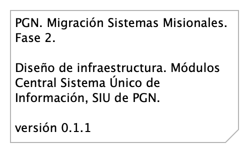{#fig:id-id-0e01371191034b69852a033633fb2c96 width=}

_Fuente: Repositorio arquitectura Mi Mutual (2023)_

 

### Catálogo de Elementos

| Nombre           | Tipo | Documentación | Propiedad |
|----------------|------|------|------|

Table: Elementos de la vista. {#tbl:tblelement-Migracion.3.Infraestructura-id}

 

## Migracion.4. CI

PGN. Migración Sistemas Misionales. Fase 2.

Patrón de integración/entrega continuo. Módulos Central Sistema Único de Información, SIU de PGN.

versión 0.1.1

Descripción de las cadenas de integración y despliegue continuo de a) submódulos (aplicaciones web, por ejemplo) del SIU Migrado, 2023; e integración y despliegue continuo de los meodulos central del SIU Migrado, 2023.

Las cadenas están separadas por tecnologeias y plataformas distintas; son independientes y no presentan interbloqueos en cuanto a su ejecución. Pero, requieren administración integral.

Los trabajo de despligue requieren las configuraciones de las cadenas y tareas de conexión tanto a los ambientes productivos y desarrollo.
 
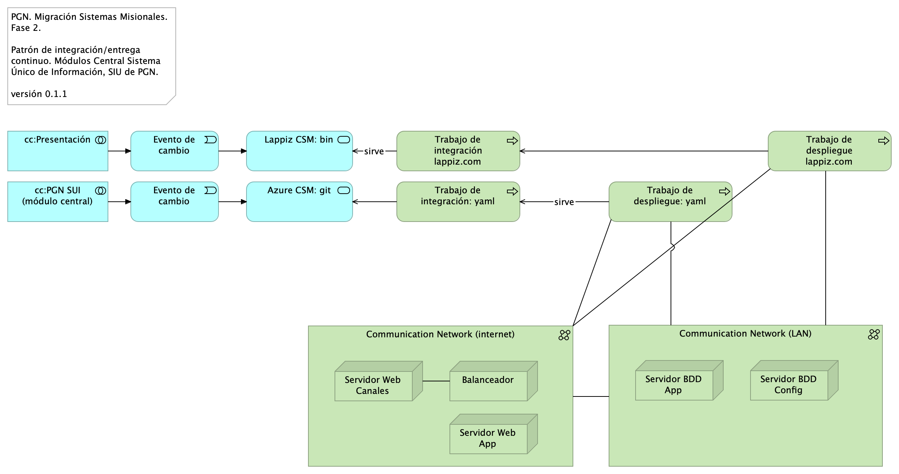{#fig:id-id-142f2fa094d542c08caf9dbffba6daa9 width=}

_Fuente: Repositorio arquitectura Mi Mutual (2023)_

 

### Catálogo de Elementos

| Nombre           | Tipo | Documentación | Propiedad |
|----------------|------|------|------|
| Azure CSM: git | Application Service |  |  |
| Balanceador | Node |  |  |
| Communication Network (LAN) | Communication Network |  |  |
| Communication Network (internet) | Communication Network |  |  |
| Evento de cambio | Application Event |  |  |
| Evento de cambio | Application Event |  |  |
| Lappiz CSM: bin | Application Service |  |  |
| Servidor BDD App | Node | Sistema Operativo Windows Server 2019 Standard o Datacenter x64. RAM	8 GB. CPU 64 Bits, 4 Cores > 2 Ghz Discos	SO C: 126 GB, Backup E: 511 GB, SQL Data F: 510 GB, SQL Log   G: 510 GB, TempDB  G: 63.6 GB.  |  |
| Servidor BDD Config | Node | Sistema Operativo Windows Server 2019 Standard o Datacenter x64. RAM	8 GB. CPU 64 Bits, 4 Cores > 2 Ghz Discos	SO C: 80 GB, Backup E: 250 GB, SQL Data F: 250 GB, SQL Log G: 250 GB, TempDB  G: 30 GB.  |  |
| Servidor Web App | Node | Windows Server 2019 Standard o Datacenter x64. Nombre físico. IP LAN. IP Pública. Windows Server 2019 Standard or Datacenter x64. RAM	8  GB. CPU	64 Bits. 4 Cores de 2 Ghz. Discos	SO C: 126 GB. SO D: 16 GB.  |  |
| Servidor Web Canales | Node | Windows Server 2019 Standard o Datacenter x64. Nombre físico. IP LAN. IP Pública. Windows Server 2019 Standard or Datacenter x64. RAM	8  GB. CPU	64 Bits. 4 Cores de 2 Ghz. Discos	SO C: 126 GB. SO D: 16 GB.  |  |
| Trabajo de despliegue lappiz.com | Technology Process |  |  |
| Trabajo de despliegue: yaml | Technology Process |  |  |
| Trabajo de integración lappiz.com | Technology Process |  |  |
| Trabajo de integración: yaml | Technology Process |  |  |
| cc:PGN SUI (módulo central) | Application Collaboration | Módulo central SUI migrado. Módulo independiente y asignado a un dominio partigular de la PGN.  |  |
| cc:Presentación | Application Collaboration | Submódulo de presentación del SUI. interfaz gráfica, interfaz web visible a los usuarios clientes y funcionarios de la PGN.  |  |

Table: Elementos de la vista. {#tbl:tblelement-Migracion.4.CI-id}

 

## Organización. 1n. Mapa producto

{#fig:id-id-26b58fc2a55d40b7a082500205f47e61 width=}

_Fuente: Repositorio arquitectura Mi Mutual (2023)_

 

### Catálogo de Elementos

| Nombre           | Tipo | Documentación | Propiedad |
|----------------|------|------|------|
| Características | Goal |  |  |
| Deliverable: (tiempo) | Deliverable |  |  |
| Hitos mercado | Value |  |  |
| Hoja ruta del producto | Grouping |  |  |
| Iteración | Work Package |  |  |
| Tiempo | Gap |  |  |
| Épicas | Capability |  |  |

Table: Elementos de la vista. {#tbl:tblelement-Organización.1n.Mapaproducto-id}

 

## Organización. 1n.1.. Mapa producto arquitectura PGN

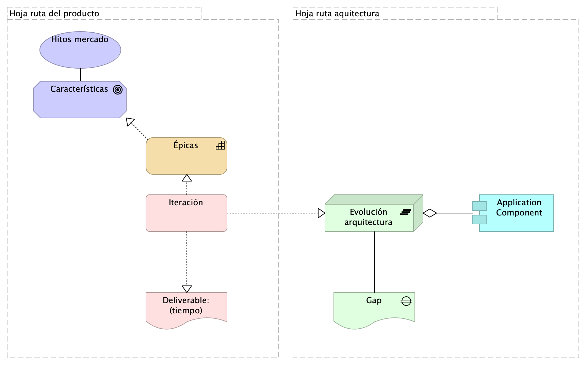{#fig:id-id-4acba5538de34883abe9b4900042f7bd width=}

_Fuente: Repositorio arquitectura Mi Mutual (2023)_

 

### Catálogo de Elementos

| Nombre           | Tipo | Documentación | Propiedad |
|----------------|------|------|------|
| Application Component | Application Component |  |  |
| Características | Goal |  |  |
| Deliverable: (tiempo) | Deliverable |  |  |
| Evolución arquitectura | Plateau |  |  |
| Gap | Gap |  |  |
| Hitos mercado | Value |  |  |
| Hoja ruta aquitectura | Grouping |  |  |
| Hoja ruta del producto | Grouping |  |  |
| Iteración | Work Package |  |  |
| Épicas | Capability |  |  |

Table: Elementos de la vista. {#tbl:tblelement-Organización.1n.1..MapaproductoarquitecturaPGN-id}

 

## Organización. 1n.1.a. Mapa producto PGN.1.Relatoría

Procuraduría General de la Nación
Proyecto Migración SIU, 2023. Fase II

SIREL (Relatoría). Organización de trabajo. 
Características funcionales, sistémicas, seguridad.

versión 0.12

Organización y distribución de las características técnicas y funcionales del módulo de Relatoría. 

Características principales:
* Utilización de metadatos
* Búsqueda de contenido (intradocumental y por metadatos)
* Procesos de recolección y sincronización de contenidos

De arriba a abajo: 
1. Fila 1, planificación de espacios de trabajo (iteraciones, para este caso) restringido al alcance del proyecto Migración PGN 2023.
1. Debajo, lo hitos importantes organizados en el tiempo.
1. Fila 3. Evolución de las características en los aspectos funcionales, técnico, hardware y software del módulo Relatoría de PGN. 
1. FInalmente, fila final del diagrama, la entrega en el tiempo de las capacidades del módulo de relatoría (épicas, para el caso de Scrum). La prioridad de liberación de estas la determina el equipo funcional de este módulo de la PGN.

&lt;br&gt;

{#fig:id-id-d455b60f8f5448b581a3eddd7364c86f width=}

_Fuente: Repositorio arquitectura Mi Mutual (2023)_

 

### Catálogo de Elementos

| Nombre           | Tipo | Documentación | Propiedad |
|----------------|------|------|------|
| Accesibilidad mínimo en el nivel AA.  | Constraint | Caracteristicas: 
 - Inclusión para los contenidos audivisuales, subtitulos incorporados o textos escondidos, (Closed Caption).
 - Inclusion de lengua de señas Colombiana para interacciones con la ciudadanía. 
 
  |  |
| Administración de contenidos | Capability |  |  |
| Adopción, v1.2 | Value |  |  |
| Autenticación | Goal |  |  |
| Autorización | Goal |  |  |
| Ayudas: Lenguajes de señas | Constraint |  |  |
| Búsqueda | Goal |  |  |
| Búsqueda de contenidos. Relatoría v0.1 | Value |  |  |
| Características | Goal |  |  |
| Componente de  comunicación segura SIU | Capability |  |  |
| Componente de autenticación SIU | Capability |  |  |
| Componente de autorización SIU | Capability |  |  |
| Componentes de usabilidad, no. 1 | Capability |  |  |
| Componentes de usabilidad, no. 2 | Capability |  |  |
| Contenidos | Goal | Se tendran que adecuar los contenidos audivisuales de los sitios web, con subtitulos o CLosed Caption y la apropiacion de lenguajes de señas.  |  |
| Deliverable: (tiempo) | Deliverable |  |  |
| Descripción (metatada) | Goal |  |  |
| Despliegue Relatoría v1.2 | Value |  |  |
| Ejemplo: Mapa del sitio | Constraint | Capa que permita reforzar las busquedas en los motores de Busquedas, y que ayude a facilitar la accesibilidad de los usuarios, de forma que pueda estar indexada de forma adecuada. 
 Caracteristicas:
 Mayor Navegacion del sitio. 
 Mejor referenciación de contenido. 
 Mayor facilidad de busqueda en los Mavegadores web. 
 
  |  |
| Enlaces adecuados | Constraint | Los enlaces deberan ser identificados de forma clara, y el indicativo del sitio o la ventana que se abrirá o la ruta al documento que llegará. 
  |  |
| Funcionalidades de búsqueda | Capability |  |  |
| Funcionalidades de descripción de contenidos | Capability |  |  |
| Gestión contenidos. Rltría v1.0 | Value |  |  |
| Hitos mercado | Value |  |  |
| Hoja ruta del producto | Grouping |  |  |
| Idiomas | Constraint | Tener en cuenta el idioma del sitio web, para que en el marco del contexto de ubicación pueda ser interpretado, de acuerdo con el país de ubicación. |  |
| Indexación | Goal |  |  |
| Integración API CMS | Capability |  |  |
| Integridad | Goal |  |  |
| Iteración | Work Package |  |  |
| Iteración 2 | Work Package |  |  |
| Iteración 3 | Work Package |  |  |
| Iteración 4 | Work Package |  |  |
| Iteración 5 | Work Package |  |  |
| Iteración 6 | Work Package |  |  |
| Iteración 7 | Work Package |  |  |
| Motor de búsqueda | Capability |  |  |
| Organización contenidos. Rltría v0.5 | Value |  |  |
| Proceso de organización de contenidos | Capability |  |  |
| Proceso de recolección de contenidos | Capability |  |  |
| Proceso de sincronización automática de contenidos | Capability |  |  |
| Publicar contenidos | Capability |  |  |
| Recolección | Goal |  |  |
| Seguridad. Rltría v0.9 | Value |  |  |
| Sincronización (actualizcn) | Goal |  |  |
| Usabilidad web | Goal |  |  |
| rel.Iteración 1 | Work Package |  |  |
| Épicas | Capability |  |  |

Table: Elementos de la vista. {#tbl:tblelement-Organización.1n.1.a.MapaproductoPGN.1.Relatoría-id}

 

## Organización. 1n.1.b. Mapa producto PGN. Relatoría

Procuraduría General de la Nación
Proyecto Migración SIU, 2023. Fase II

Relatoría. Organización de trabajo. 
Características funcionales, sistémicas, seguridad.

versión 0.7

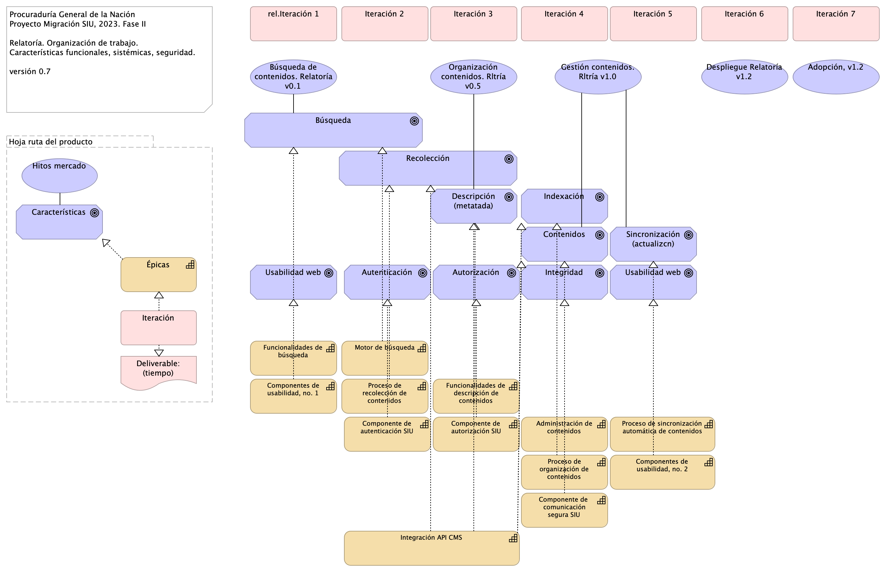{#fig:id-id-b7bbdb516c71447e866452edcce2c9e8 width=}

_Fuente: Repositorio arquitectura Mi Mutual (2023)_

 

### Catálogo de Elementos

| Nombre           | Tipo | Documentación | Propiedad |
|----------------|------|------|------|
| Administración de contenidos | Capability |  |  |
| Adopción, v1.2 | Value |  |  |
| Autenticación | Goal |  |  |
| Autorización | Goal |  |  |
| Búsqueda | Goal |  |  |
| Búsqueda de contenidos. Relatoría v0.1 | Value |  |  |
| Características | Goal |  |  |
| Componente de  comunicación segura SIU | Capability |  |  |
| Componente de autenticación SIU | Capability |  |  |
| Componente de autorización SIU | Capability |  |  |
| Componentes de usabilidad, no. 1 | Capability |  |  |
| Componentes de usabilidad, no. 2 | Capability |  |  |
| Contenidos | Goal | Se tendran que adecuar los contenidos audivisuales de los sitios web, con subtitulos o CLosed Caption y la apropiacion de lenguajes de señas.  |  |
| Deliverable: (tiempo) | Deliverable |  |  |
| Descripción (metatada) | Goal |  |  |
| Despliegue Relatoría v1.2 | Value |  |  |
| Funcionalidades de búsqueda | Capability |  |  |
| Funcionalidades de descripción de contenidos | Capability |  |  |
| Gestión contenidos. Rltría v1.0 | Value |  |  |
| Hitos mercado | Value |  |  |
| Hoja ruta del producto | Grouping |  |  |
| Indexación | Goal |  |  |
| Integración API CMS | Capability |  |  |
| Integridad | Goal |  |  |
| Iteración | Work Package |  |  |
| Iteración 2 | Work Package |  |  |
| Iteración 3 | Work Package |  |  |
| Iteración 4 | Work Package |  |  |
| Iteración 5 | Work Package |  |  |
| Iteración 6 | Work Package |  |  |
| Iteración 7 | Work Package |  |  |
| Motor de búsqueda | Capability |  |  |
| Organización contenidos. Rltría v0.5 | Value |  |  |
| Proceso de organización de contenidos | Capability |  |  |
| Proceso de recolección de contenidos | Capability |  |  |
| Proceso de sincronización automática de contenidos | Capability |  |  |
| Recolección | Goal |  |  |
| Sincronización (actualizcn) | Goal |  |  |
| Usabilidad web | Goal |  |  |
| rel.Iteración 1 | Work Package |  |  |
| Épicas | Capability |  |  |

Table: Elementos de la vista. {#tbl:tblelement-Organización.1n.1.b.MapaproductoPGN.Relatoría-id}

 

## Organización. 2n.1. Mapa producto PGN. Conciliacion

Procuraduría General de la Nación
Proyecto Migración SIU, 2023. Fase II

Conciliación Administrativa (...).  Organización de trabajo. 
Características funcionales, sistémicas, seguridad.

versión 0.1

{#fig:id-id-125d1b49b13f492ca225313c1b544613 width=}

_Fuente: Repositorio arquitectura Mi Mutual (2023)_

 

### Catálogo de Elementos

| Nombre           | Tipo | Documentación | Propiedad |
|----------------|------|------|------|
| Adopción, v1.2 | Value |  |  |
| Autenticación | Goal |  |  |
| Autorización | Goal |  |  |
| Características | Goal |  |  |
| Componente de  comunicación segura SIU | Capability |  |  |
| Componente de autenticación SIU | Capability |  |  |
| Componente de autorización SIU | Capability |  |  |
| Conciliación administrativa | Goal |  |  |
| Conciliación civil | Goal |  |  |
| Conciliación disciplinar | Goal |  |  |
| Conciliación familia | Goal |  |  |
| Conciliación preventivo | Goal |  |  |
| Deliverable: (tiempo) | Deliverable |  |  |
| Despliegue Conciliación v1.2 | Value |  |  |
| Diseño de flujos de Conciliación | Goal |  |  |
| Flujo de trabajo  Preventico | Capability |  |  |
| Flujo de trabajo Disciplinar | Capability |  |  |
| Flujo de trabajo Disciplinario. Conciliación v0.9 | Value |  |  |
| Flujo de trabajo Intervención | Capability |  |  |
| Flujo de trabajo Intervención. Conciliación v0.1 (copy) | Value |  |  |
| Flujo de trabajo Preventivo. Conciliación v0.7 | Value |  |  |
| Gestión de flujos. Conciliación 1.0 | Value |  |  |
| Gestión de instancias (flujos) | Goal |  |  |
| Gestión documental | Goal |  |  |
| Hitos mercado | Value |  |  |
| Hoja ruta del producto | Grouping |  |  |
| Informes de gestión flujos | Goal |  |  |
| Integración API Dokus | Capability |  |  |
| Integridad | Goal |  |  |
| Iteración | Work Package |  |  |
| Iteración 1 | Work Package |  |  |
| Iteración 2 | Work Package |  |  |
| Iteración 3 | Work Package |  |  |
| Iteración 4 | Work Package |  |  |
| Iteración 5 | Work Package |  |  |
| Iteración 6 | Work Package |  |  |
| Iteración 7 | Work Package |  |  |
| Motor de flujo de trabajo | Capability |  |  |
| Panel de control flujos | Capability |  |  |
| Reporte flujos de trabajo | Capability |  |  |
| Épicas | Capability |  |  |

Table: Elementos de la vista. {#tbl:tblelement-Organización.2n.1.MapaproductoPGN.Conciliacion-id}

 

## Organización. 2n.1a. Mapa producto PGN. Conciliacion

Procuraduría General de la Nación
Proyecto Migración SIU, 2023. Fase II

Conciliación. Intervención, Preventico y Disciplinario. Organización de trabajo. Características funcionales, sistémicas, seguridad.

versión 0.3

{#fig:id-id-4523fca069074c39901d92e952d21734 width=}

_Fuente: Repositorio arquitectura Mi Mutual (2023)_

 

### Catálogo de Elementos

| Nombre           | Tipo | Documentación | Propiedad |
|----------------|------|------|------|
| Adopción, v1.2 | Value |  |  |
| Autenticación | Goal |  |  |
| Autorización | Goal |  |  |
| Características | Goal |  |  |
| Componente de  comunicación segura SIU | Capability |  |  |
| Componente de autenticación SIU | Capability |  |  |
| Componente de autorización SIU | Capability |  |  |
| Conciliación administrativa | Goal |  |  |
| Conciliación civil | Goal |  |  |
| Conciliación disciplinar | Goal |  |  |
| Conciliación familia | Goal |  |  |
| Conciliación preventivo | Goal |  |  |
| Deliverable: (tiempo) | Deliverable |  |  |
| Despliegue Conciliación v1.2 | Value |  |  |
| Diseño de flujos de Conciliación | Goal |  |  |
| Flujo de trabajo  Preventico | Capability |  |  |
| Flujo de trabajo Disciplinar | Capability |  |  |
| Flujo de trabajo Disciplinario. Conciliación v0.9 | Value |  |  |
| Flujo de trabajo Intervención | Capability |  |  |
| Flujo de trabajo Intervención. Conciliación v0.1 (copy) | Value |  |  |
| Flujo de trabajo Preventivo. Conciliación v0.7 | Value |  |  |
| Gestión de flujos. Conciliación 1.0 | Value |  |  |
| Gestión de instancias (flujos) | Goal |  |  |
| Gestión documental | Goal |  |  |
| Hitos mercado | Value |  |  |
| Hoja ruta del producto | Grouping |  |  |
| Informes de gestión flujos | Goal |  |  |
| Integración API Dokus | Capability |  |  |
| Integridad | Goal |  |  |
| Iteración | Work Package |  |  |
| Iteración 1 | Work Package |  |  |
| Iteración 2 | Work Package |  |  |
| Iteración 3 | Work Package |  |  |
| Iteración 4 | Work Package |  |  |
| Iteración 5 | Work Package |  |  |
| Iteración 6 | Work Package |  |  |
| Iteración 7 | Work Package |  |  |
| Motor de flujo de trabajo | Capability |  |  |
| Panel de control flujos | Capability |  |  |
| Reporte flujos de trabajo | Capability |  |  |
| Épicas | Capability |  |  |

Table: Elementos de la vista. {#tbl:tblelement-Organización.2n.1a.MapaproductoPGN.Conciliacion-id}

 

## Organización. 3n.1. Mapa producto PGN. SIAF

Procuraduría General de la Nación
Proyecto Migración SIU, 2023. Fase II

SIAF. Inventario PGN. Organización de trabajo. Características funcionales, sistémicas, seguridad.

versión 0.2

{#fig:id-id-212758d2fc8748b7bcc05868ff393b18 width=}

_Fuente: Repositorio arquitectura Mi Mutual (2023)_

 

### Catálogo de Elementos

| Nombre           | Tipo | Documentación | Propiedad |
|----------------|------|------|------|
| Acciones de acuerdo al estado | Goal | Realización de acciones específicas según el estado de los movimientos devolutivos. |  |
| Almacén | Goal | Administración de almacenes. |  |
| Asientos | Goal | Registro de asientos. |  |
| CRUD Campos | Goal | Operaciones CRUD (Crear, Leer, Actualizar, Eliminar) en campos de los asientos. |  |
| Características | Goal |  |  |
| Creación de movimiento | Goal | Generación de movimientos de acuerdo con los asientos abiertos. |  |
| Cuenta de funcionario | Goal | Gestión de cuentas de funcionarios. |  |
| Cuenta en Microsoft (Autenticación) | Goal | Autenticación mediante cuentas de Microsoft. |  |
| Cálculo de total | Goal | Cálculo automático del total basado en la información de elementos. |  |
| Código (autoincremental) | Goal | Generación automática de códigos que se reinician cada año. |  |
| Deliverable: (tiempo) | Deliverable |  |  |
| Dependiendo del tipo de movimiento | Goal | Gestión de movimientos según su tipo, incluyendo elementos como conceptos, beneficiarios y funcionarios (maestros). |  |
| Elementos | Goal | Registro de elementos relacionados con los movimientos. |  |
| Estado | Goal | Seguimiento del estado de los asientos. |  |
| Fecha automática | Goal | Asignación automática de la fecha en los asientos. |  |
| Filtrar por campos | Goal | Capacidad para filtrar los movimientos devolutivos según campos específicos. |  |
| Funcionario Posesionado | Goal | Registro de información sobre funcionarios en posesión. |  |
| Funcionarios (Nómina) vs Funcionarios (Siaf) | Goal | Comparación y actualización de información de funcionarios almacenada en Siaf con la información de nómina. |  |
| Generar documento | Goal | Creación de documentos relacionados con los movimientos. |  |
| Generar reportes | Goal | Creación de informes y reportes para proporcionar la información solicitada. |  |
| Hitos mercado | Value |  |  |
| Hitos mercado | Value |  |  |
| Hitos mercado | Value |  |  |
| Hitos mercado | Value |  |  |
| Hitos mercado | Value |  |  |
| Hoja ruta del producto | Grouping |  |  |
| Iteración | Work Package |  |  |
| Iteración 1 | Work Package |  |  |
| Iteración 1 | Work Package |  |  |
| Iteración 1 | Work Package |  |  |
| Iteración 1 | Work Package |  |  |
| Iteración 1 | Work Package |  |  |
| Iteración 1 | Work Package |  |  |
| Iteración 1 | Work Package |  |  |
| Iteración 1 | Work Package |  |  |
| Iteración 9 | Work Package |  |  |
| Login (Doble factor) | Goal | Autenticación de usuario mediante doble factor de seguridad |  |
| Movimiento Consumible | Goal | Registro de movimientos relacionados con elementos consumibles. |  |
| Movimiento devolutivo | Goal | Registro de movimientos devolutivos. |  |
| Sincronización con Homminis | Goal | Sincronización de datos con el sistema Homminis. |  |
| Vista CRUD | Goal | Interfaz para crear, leer, actualizar y eliminar registros en el almacén. |  |
| Vista formulario personalizada | Goal | Personalización de formularios para la creación de asientos dependiendo del almacén. |  |
| Vista tipo formulario personalizada | Goal | Personalización de formularios para ingresar datos relacionados con los asientos. |  |
| Vista tipo lista personalizada | Goal | Visualización personalizada en forma de lista con filtros por campos específicos. |  |
| Épicas | Capability |  |  |
| Épicas | Capability |  |  |
| Épicas | Capability |  |  |
| Épicas | Capability |  |  |
| Épicas | Capability |  |  |
| Épicas | Capability |  |  |
| Épicas | Capability |  |  |
| Épicas | Capability |  |  |
| Épicas | Capability |  |  |
| Épicas (copy) (copy) (copy) (copy) | Capability |  |  |

Table: Elementos de la vista. {#tbl:tblelement-Organización.3n.1.MapaproductoPGN.SIAF-id}

 

## Organización. 4n.1. Mapa producto PGN. Estratego

Procuraduría General de la Nación
Proyecto Migración SIU, 2023. Fase II

Conciliación. Intervención, Preventico y Estratego. Reportes estratégicos PGN. Organización de trabajo. Características funcionales, sistémicas, seguridad.

versión 0.2

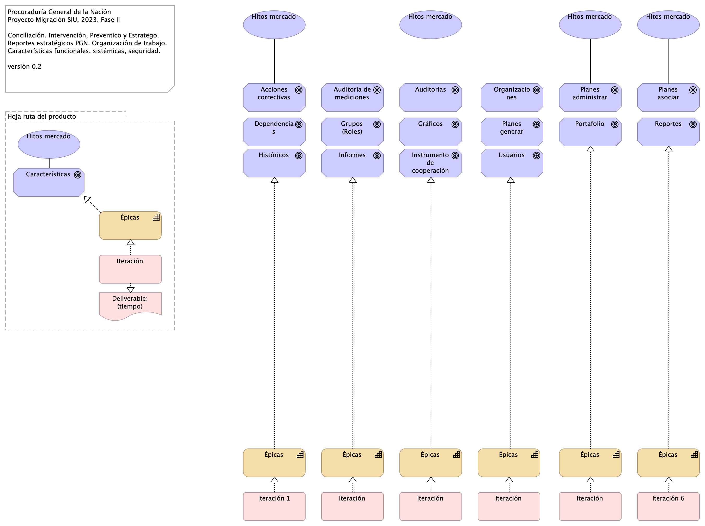{#fig:id-id-9636a665a6e945f0a5f43b53d1dd0f27 width=}

_Fuente: Repositorio arquitectura Mi Mutual (2023)_

 

### Catálogo de Elementos

| Nombre           | Tipo | Documentación | Propiedad |
|----------------|------|------|------|
| Acciones correctivas | Goal | Administrar los riesgos asociados a cada uno de los indicadores o planes. |  |
| Auditoria de mediciones | Goal | Gestionar las actividades de los usuarios, como el registro de indicadores, el tipo, etc. |  |
| Auditorias | Goal | Gestionar el control de logs de las actividades realizadas por el usuario en sesión. |  |
| Características | Goal |  |  |
| Deliverable: (tiempo) | Deliverable |  |  |
| Dependencias | Goal | Reportar al sistema, actividades, proyectos, indicadores. |  |
| Grupos (Roles) | Goal | Administrar los roles y permisos dentro del sistema |  |
| Gráficos | Goal | Generar y presentar gráficos |  |
| Históricos | Goal | Almacenar y consultar históricos dentro del sistema |  |
| Hitos mercado | Value |  |  |
| Hitos mercado | Value |  |  |
| Hitos mercado | Value |  |  |
| Hitos mercado | Value |  |  |
| Hitos mercado | Value |  |  |
| Hoja ruta del producto | Grouping |  |  |
| Informes | Goal | Generar documentos con los informes correspondientes. |  |
| Instrumento de cooperación | Goal | Administrar los proyectos de los cooperantes. |  |
| Iteración | Work Package |  |  |
| Iteración | Work Package |  |  |
| Iteración | Work Package |  |  |
| Iteración | Work Package |  |  |
| Iteración | Work Package |  |  |
| Iteración 1 | Work Package |  |  |
| Iteración 6 | Work Package |  |  |
| Organizaciones | Goal | Estructura principal. |  |
| Planes administrar | Goal | Administrar el plan estratégico institucional. |  |
| Planes asociar | Goal | Asociar recursos, presupuesto. |  |
| Planes generar | Goal | Generar planes estratégicos institucionales y asociar los planes de acción preventivos. |  |
| Portafolio | Goal | Gestionar el portafolio de todos los proyectos de la entidad. |  |
| Reportes | Goal | Generar reportes y exportarlos en diferentes tipos de archivo. |  |
| Usuarios | Goal | Administrar los usuarios del sistema |  |
| Épicas | Capability |  |  |
| Épicas | Capability |  |  |
| Épicas | Capability |  |  |
| Épicas | Capability |  |  |
| Épicas | Capability |  |  |
| Épicas | Capability |  |  |
| Épicas | Capability |  |  |

Table: Elementos de la vista. {#tbl:tblelement-Organización.4n.1.MapaproductoPGN.Estratego-id}

 

## Organización. 4n.1a. Mapa producto PGN. Comparativa

Procuraduría General de la Nación
Proyecto Migración SIU, 2023. Fase II

Mapa de Producto SIAf, Estratego. Comparativa funcional, técnica y de impacto.

versión 0.2

Mapa de productos. Comparativa funcional y técnica de módulos PGN, SIAF (izq.) y Estratego (derecha).

### Volumen Funcional
El análisis funcional de ambos módulos realizado durante el levantamiento (iteración 0) del presente proyecto arroja que SIAF tiene un 40% más de volumen que Estratego. Esto es, 16 funcionalidades de Estratego, mientras que SIAF suma 26. Ver imagen comparativa.

### Viabilidad de Alcance
Tomando en cuenta el criterio de calidad de la migración, objeto del presente contrato, 078-2023, de migrar módulos completos dentro de lo posible, y contrastando este criterio con el plazo del proyecto actual, que es de 4 meses, de los cuales ya se han ejecuta aproximadamente el 20% del mismo, es más viable la estrategia de migración de estratego sobre la de SIAF de la PGN por requerir menos iteraciones de desarrollo: seis (6) iteraciones, versus, nueve (9) de SIAF.

### Impacto / Beneficio a PGN
Los hitos de mercado del presente análisis producto, imagen arriba, dan cuenta  del beneficio e impacto de ambos proyectos de migración. Haciendo la comparación de los hitos de mercado de estos productos resalta que Estratego prima sobre SIAF en tanto que el peso cualitativo de las funciones estratégicas del primero son de mayor relevancia que las funciones operativos de inventario de SIAF. Basado en esto, Estratego reporta mayor beneficio y menos impacto en esfuerzo (por la razón anterior) que SIAF.

En conclusion, por los criterios de viabilidad y tamaño funcional y por el impacto estratégico, Estratego resulta en la migración a seleccionar sobre la del modulo SIAF. Esta estrategia satisface además la restricción de migrar moóulos completos sobre migración parcial.

{#fig:id-id-b5106e7c489b4c6f9cd32559208d8275 width=}

_Fuente: Repositorio arquitectura Mi Mutual (2023)_

 

### Catálogo de Elementos

| Nombre           | Tipo | Documentación | Propiedad |
|----------------|------|------|------|
| Acciones correctivas | Goal | Administrar los riesgos asociados a cada uno de los indicadores o planes. |  |
| Acciones de acuerdo al estado (copy) | Goal | Realización de acciones específicas según el estado de los movimientos devolutivos. |  |
| Almacén (copy) | Goal | Administración de almacenes. |  |
| Asientos (copy) | Goal | Registro de asientos. |  |
| Auditoria de mediciones | Goal | Gestionar las actividades de los usuarios, como el registro de indicadores, el tipo, etc. |  |
| Auditorias | Goal | Gestionar el control de logs de las actividades realizadas por el usuario en sesión. |  |
| CRUD Campos (copy) | Goal | Operaciones CRUD (Crear, Leer, Actualizar, Eliminar) en campos de los asientos. |  |
| Creación de movimiento (copy) | Goal | Generación de movimientos de acuerdo con los asientos abiertos. |  |
| Cuenta de funcionario (copy) | Goal | Gestión de cuentas de funcionarios. |  |
| Cuenta en Microsoft (Autenticación) (copy) | Goal | Autenticación mediante cuentas de Microsoft. |  |
| Cálculo de total (copy) | Goal | Cálculo automático del total basado en la información de elementos. |  |
| Código (autoincremental) (copy) | Goal | Generación automática de códigos que se reinician cada año. |  |
| Dependencias | Goal | Reportar al sistema, actividades, proyectos, indicadores. |  |
| Dependiendo del tipo de movimiento (copy) | Goal | Gestión de movimientos según su tipo, incluyendo elementos como conceptos, beneficiarios y funcionarios (maestros). |  |
| Elementos | Goal | Registro de elementos relacionados con los movimientos. |  |
| Estado (copy) | Goal | Seguimiento del estado de los asientos. |  |
| Fecha automática (copy) | Goal | Asignación automática de la fecha en los asientos. |  |
| Filtrar por campos (copy) | Goal | Capacidad para filtrar los movimientos devolutivos según campos específicos. |  |
| Funcionario Posesionado (copy) | Goal | Registro de información sobre funcionarios en posesión. |  |
| Funcionarios (Nómina) vs Funcionarios (Siaf) (copy) | Goal | Comparación y actualización de información de funcionarios almacenada en Siaf con la información de nómina. |  |
| Generar documento (copy) | Goal | Creación de documentos relacionados con los movimientos. |  |
| Generar reportes (copy) | Goal | Creación de informes y reportes para proporcionar la información solicitada. |  |
| Grupos (Roles) | Goal | Administrar los roles y permisos dentro del sistema |  |
| Gráficos | Goal | Generar y presentar gráficos |  |
| Históricos | Goal | Almacenar y consultar históricos dentro del sistema |  |
| Hitos mercado | Value |  |  |
| Hitos mercado | Value |  |  |
| Hitos mercado | Value |  |  |
| Hitos mercado | Value |  |  |
| Hitos mercado | Value |  |  |
| Hitos mercado | Value |  |  |
| Hitos mercado | Value |  |  |
| Hitos mercado | Value |  |  |
| Informes | Goal | Generar documentos con los informes correspondientes. |  |
| Instrumento de cooperación | Goal | Administrar los proyectos de los cooperantes. |  |
| Iteración | Work Package |  |  |
| Iteración | Work Package |  |  |
| Iteración | Work Package |  |  |
| Iteración | Work Package |  |  |
| Iteración 1 | Work Package |  |  |
| Iteración 1 (copy) | Work Package |  |  |
| Iteración 1 (copy) | Work Package |  |  |
| Iteración 1 (copy) | Work Package |  |  |
| Iteración 1 (copy) | Work Package |  |  |
| Iteración 1 (copy) | Work Package |  |  |
| Iteración 1 (copy) | Work Package |  |  |
| Iteración 1 (copy) | Work Package |  |  |
| Iteración 1 (copy) | Work Package |  |  |
| Iteración 6 | Work Package |  |  |
| Iteración 9 (copy) | Work Package |  |  |
| Login (Doble factor) (copy) | Goal | Autenticación de usuario mediante doble factor de seguridad |  |
| Movimiento Consumible (copy) | Goal | Registro de movimientos relacionados con elementos consumibles. |  |
| Movimiento devolutivo (copy) | Goal | Registro de movimientos devolutivos. |  |
| Organizaciones | Goal | Estructura principal. |  |
| Planes administrar | Goal | Administrar el plan estratégico institucional. |  |
| Planes asociar | Goal | Asociar recursos, presupuesto. |  |
| Planes generar | Goal | Generar planes estratégicos institucionales y asociar los planes de acción preventivos. |  |
| Portafolio | Goal | Gestionar el portafolio de todos los proyectos de la entidad. |  |
| Reportes | Goal | Generar reportes y exportarlos en diferentes tipos de archivo. |  |
| Sincronización con Homminis (copy) | Goal | Sincronización de datos con el sistema Homminis. |  |
| Usuarios | Goal | Administrar los usuarios del sistema |  |
| Vista CRUD (copy) | Goal | Interfaz para crear, leer, actualizar y eliminar registros en el almacén. |  |
| Vista formulario personalizada (copy) | Goal | Personalización de formularios para la creación de asientos dependiendo del almacén. |  |
| Vista tipo formulario personalizada (copy) | Goal | Personalización de formularios para ingresar datos relacionados con los asientos. |  |
| Vista tipo lista personalizada (copy) | Goal | Visualización personalizada en forma de lista con filtros por campos específicos. |  |
| Épicas | Capability |  |  |
| Épicas | Capability |  |  |
| Épicas | Capability |  |  |
| Épicas | Capability |  |  |
| Épicas | Capability |  |  |
| Épicas | Capability |  |  |
| Épicas (copy) | Capability |  |  |
| Épicas (copy) | Capability |  |  |
| Épicas (copy) | Capability |  |  |
| Épicas (copy) | Capability |  |  |
| Épicas (copy) | Capability |  |  |
| Épicas (copy) | Capability |  |  |
| Épicas (copy) | Capability |  |  |
| Épicas (copy) | Capability |  |  |
| Épicas (copy) (copy) (copy) (copy) (copy) | Capability |  |  |

Table: Elementos de la vista. {#tbl:tblelement-Organización.4n.1a.MapaproductoPGN.Comparativa-id}

 

## Riesgos.1. Migración funcional

Riesgos de la migración funcional:

* RSG1. Estrategia CMS central
* RSG2. Motor de búsqueda
* RSG3. Estatego como BI
* RSG4. Conciliación y Doku
* RSG5. Gestión de sesiones / caducidad
* RSG6. Componentes de negocio
* RSG7. Asignación de roles y permisos de Acceso 
* RSG8. Intentos de accesos no autorizados
* RSG9. Alteración de datos negocio
* RSG10. Validación decisiones de arquitectura

### Acciones de Mitigación

1. Informar a la PGN de las implicaciones junto con alternativas para la implementación de la acción de aprovechamiento: diseño del SCM central (sharepoint). La PGN debe decidir si o no a la acción propuesta.

1. Informar a la PGN de las implicaciones junto con alternativas para la implementación de la acción de aprovechamiento: diseño del motor de búsqueda compartido (sharepoint). La PGN debe decidir si o no a la acción propuesta.

1. Informar a la PGN de las implicaciones junto con alternativas para la implementación de la acción de manejo del riesgo: diseño de solución de inteligencia de negocio (Power BI). La PGN debe decidir si o no a la acción propuesta.

1. Informar a la PGN de las implicaciones junto con alternativas para la implementación de la acción de manejo del riesgo: ubicar la lógica, los flujos, y los datos misionales dentro del SIU. La PGN debe decidir si o no a la acción propuesta.

1. Informar a la PGN de las implicaciones junto con alternativas para la implementación de la acción de manejo del riesgo: facilitar la administración de seguridad en un solo lugar (distinto de localizarla en las aplicaciones web). La PGN debe decidir si o no a la acción propuesta.

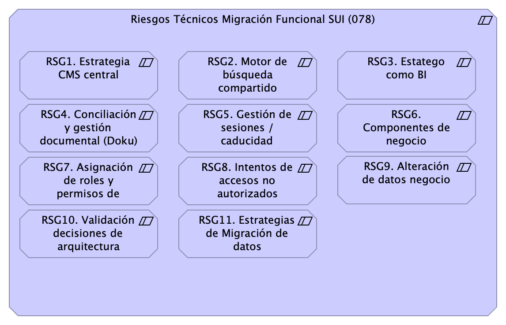{#fig:id-id-d58fdcecc4f542a39dce288e81a395ae width=}

_Fuente: Repositorio arquitectura Mi Mutual (2023)_

 

### Catálogo de Elementos

| Nombre           | Tipo | Documentación | Propiedad |
|----------------|------|------|------|
| RSG1. Estrategia CMS central | Constraint | Establecer desde el principio el gestor de contenidos compartido que los módulos del SUI migrados van a usar.  |  |
| RSG10. Validación decisiones de arquitectura | Constraint | Discutir la arquitectura de referencia de SUI Migración PGN. La arquitectura de referencia SUI informa de todas las fortalezas y consideraciones estructurales y de sistema, como extensibilidad, rendimiento y seguridad, que regirán a todos los módulos del SUI migrado.  |  |
| RSG11. Estrategias de Migración de datos | Constraint | Discutir el alcance y los recursos para la correcta migración de datos incluídas en contrato 078, Migración Funcional SIU en atención al numeral 5.6 del anexo técnico del proyecto.  | 5.6 MIGRACIÓN DE DATOS | Dentro del alcance de las actividades a desarrollar, el proveedor debe generar los mecanismos adecuados para hacer migración de la información que se encuentre en los sistemas actuales y que, por evolución de este, tenga datos relevantes que deban ser migrados a los ambientes y/o sistemas de información productos de la fábrica. | | Para este servicio el proveedor debe disponer del personal idóneo y las herramientas necesarias para hacer efectiva las actividades de migración de datos, utilizando las mejores prácticas de Extracción-Transformación-Carga (ETL) y protocolos de control de versiones robustos. Esta labor debe ser coordinada con las personas de la entidad que sean designadas por la Oficina de Tecnología, Innovación y Transformación Digital.  |  |
| RSG2. Motor de búsqueda compartido | Constraint | Establecer desde el principio el motor de búsqueda de conteidos compartido para los módulos del SUI migrados.   |  |
| RSG3. Estatego como BI | Constraint | Definir la arquitectura de Estratego migrado: puede ser una solución de BI simple, o puede ser una aplicación web tradicional.  |  |
| RSG4. Conciliación y gestión documental (Doku) | Constraint | Definir la ubicación de los componentes misionales de Conciliación Administrativa (SIU). Debe estar fuera de Doku.  |  |
| RSG5. Gestión de sesiones / caducidad | Constraint | Establecer desde el principio el motor de búsqueda de conteidos compartido para los módulos del SUI migrados.   |  |
| RSG6. Componentes de negocio | Constraint | Incluir el esfuerzo de creación de componentes estrcturales y comunes a los módulos del SUI migrado requeridos por la arquitectura de referencia SUI.   Algunos componentes requeridos son:  * Administración de autorizaciones (integrado con el directorio PGN) * Motor de flujos de trabajo para diseño y organización del trabajo (Conciliación) * Componente de ruteo de documentos (Relatoría)   |  |
| RSG7. Asignación de roles y permisos de Acceso  | Constraint | RSG7. Asignación de roles y permisos de Acceso
 Los riesgos de autenticación como el Single Sign On (SSO), permite que si las credenciales de usuario se ven comprometidas, pueden dar permiso a un atacante acceder a todos o la mayoría de recursos y aplicaciones en la red. 
 Se ha propuesto controlar los accesos a partir de la documentación que identifica la metodología de clasificación y gestión de usuarios roles y procesos de autenticación, a partir del control de acceso basado en roles RBAC (Identidades y autenticación), que permite tener una reacción más oportuna para controlar los accesos a diferentes módulos de los diferentes sistemas de Información.  Los inicios de sesión de los usuarios asociados a cuenta de dominio de Active Directory deben tener en cuenta la asignación de roles de ingreso al servidor o roles de ingreso al motor de bases de datos. Las cuentas de usuario no deben ser creadas de administrador local (administrador), es una puerta de entrada para los ataques de fuerza bruta.
  |  |
| RSG8. Intentos de accesos no autorizados | Constraint | RSG8. Intentos de accesos no autorizados
 Los intentos no autorizados son una de las técnicas más comunes utilizadas en la actualidad, los diferentes tipos de amenazas de intrusiones SQL Injections, Denegaciones de Servicios, riesgos de Ransomware, Ingeniería social, malware y otras amenazas, permite que se proponga implementación de soluciones de Seguridad perimetral a partir de la implementación de WAF para controlar las peticiones externas y evaluación de vulnerabilidades y escaneo para conocer puertos abiertos y establecer medidas.
  |  |
| RSG9. Alteración de datos negocio | Constraint | RSG9. Alteración de datos almacenados en Base de Datos.
 Se deberán asignar usuarios para la conexión de cada base de datos. 
 Se debe proporcionar seguridad a nivel de filas y columnas (ofuscamiento) para proteger los datos confidenciales en el nivel de columnas y filas RLS ((seguridad de nivel de fila).  
 Algunos de los métodos y características que se deben tener en cuenta a implementar es a partir del Alway encrypted, para cifrar los datos que se encuentran almacenados. 
 
  |  |
| Riesgos Técnicos Migración Funcional SUI (078) | Constraint | Conjunto de riesgos técnicos y arquitectura. Proyecto Migración SUI 2023, PGN.   |  |

Table: Elementos de la vista. {#tbl:tblelement-Riesgos.1.Migraciónfuncional-id}

 

## Riesgos.2. Modelo Riesgo RSG10

Procuraduría General de la Nación
Proyecto Migración SIU, 2023. Fase II

Gestión de riesgos técnicos. RSG10. Validación decisiones de arquitectura. Agentes del riesgo, valoración, plan de acción.

versión 0.5

Para mitigar el riesgo 10, RSG10. Validación decisiones de arquitectura, que tiene como agente de riesgo a los arquitectos del contratista, Softgic, y al de la entidad, PGN, es necesario iniciar un proceso de evaluación y aprobación de la arquitectura. La frecuencia de este proceso será eventual, y como mínimo una vez cada dos semanas.

### Valoración del Riesgo

| Requisito      | Extensibilidad SUI |
|:-------------|:------------------|
| Descripción | Concentración de los componentes de negocio, misionales, del SUI protegidos de cambios provenientes de otros sistemas. Ver Patrón de Diseño Migración SUI, más adelante en el documento. |
| Calidad sistémica | La extensibilidad que optimiza el diseño Migración SUI está dada por el intercambio de submódulos no misionales, como el gestor documental, sin afectación de los componentes misionales que este diseño protege. |

Table: Valoración del riesgo RSG10. Validación decisiones de arquitectura. Migración SUI. {#tbl:requisito1-id}

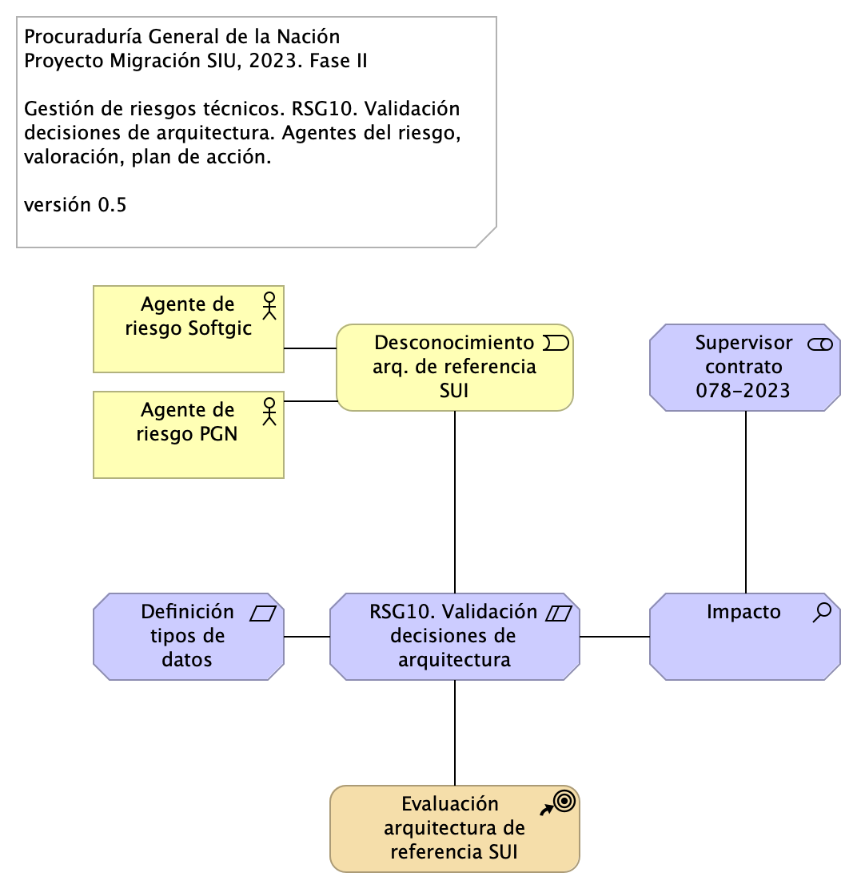{#fig:id-id-77e94c7adf4c47acac08d7fa168dccc3 width=}

_Fuente: Repositorio arquitectura Mi Mutual (2023)_

 

### Catálogo de Elementos

| Nombre           | Tipo | Documentación | Propiedad |
|----------------|------|------|------|
| Agente de riesgo PGN | Business Actor | Arquitecto PGN |  |
| Agente de riesgo Softgic | Business Actor | Arquitecto Softgic |  |
| Definición tipos de datos módulos SUI | Requirement |  |  |
| Desconocimiento arq. de referencia SUI | Business Event |  |  |
| Evaluación  arquitectura de referencia SUI | Course Of-Action | La frecuencia del proceso de evaluación de la arquitectura es eventual, mínimo una vez cada dos semanas.  |  |
| Impacto | Assessment |  |  |
| RSG10. Validación decisiones de arquitectura | Constraint | Discutir la arquitectura de referencia de SUI Migración PGN. La arquitectura de referencia SUI informa de todas las fortalezas y consideraciones estructurales y de sistema, como extensibilidad, rendimiento y seguridad, que regirán a todos los módulos del SUI migrado.  |  |
| Supervisor contrato 078-2023 | Stakeholder |  |  |

Table: Elementos de la vista. {#tbl:tblelement-Riesgos.2.ModeloRiesgoRSG10-id}

 

## Riesgos.3. Modelo Riesgo RSG11

Procuraduría General de la Nación
Proyecto Migración SIU, 2023. Fase II

Gestión de riesgos técnicos. RSG11. Estrategias de migración de datos módulos migrados. Agentes del riesgo, valoración, plan de acción.

versión 0.5

Para mitigar el riesgo 10, RSG10. Validación decisiones de arquitectura, que tiene como agente de riesgo a los arquitectos del contratista, Softgic, y al de la entidad, PGN, es necesario iniciar un proceso de evaluación y aprobación de la arquitectura. La frecuencia de este proceso será eventual, y como mínimo una vez cada dos semanas.

### Valoración del Riesgo

| Requisito      | Extensibilidad SUI |
|:-------------|:------------------|
| Descripción | Concentración de los componentes de negocio, misionales, del SUI protegidos de cambios provenientes de otros sistemas. Ver Patrón de Diseño Migración SUI, más adelante en el documento. |
| Calidad sistémica | La extensibilidad que optimiza el diseño Migración SUI está dada por el intercambio de submódulos no misionales, como el gestor documental, sin afectación de los componentes misionales que este diseño protege. |

Table: Valoración del riesgo RSG10. Validación decisiones de arquitectura. Migración SUI. {#tbl:requisito1-id}

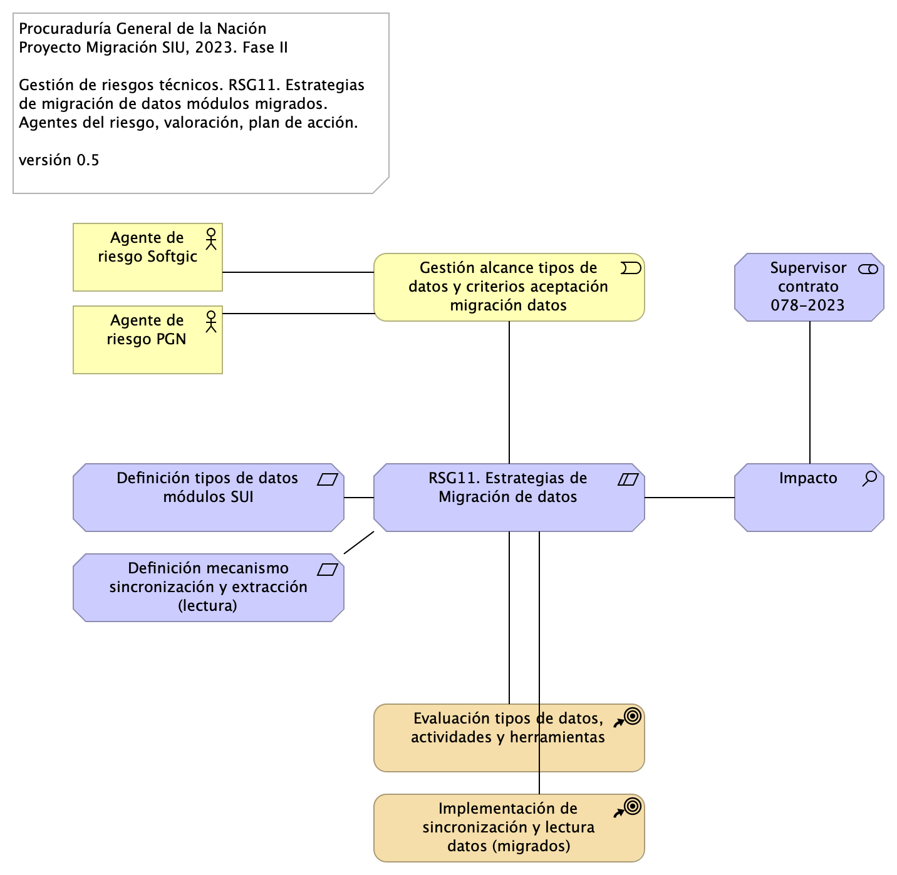{#fig:id-id-697162d0caf141e1b5ceccfc422d4bc8 width=}

_Fuente: Repositorio arquitectura Mi Mutual (2023)_

 

### Catálogo de Elementos

| Nombre           | Tipo | Documentación | Propiedad |
|----------------|------|------|------|
| Agente de riesgo PGN | Business Actor | Arquitecto PGN |  |
| Agente de riesgo Softgic | Business Actor | Arquitecto Softgic |  |
| Definición mecanismo sincronización y extracción (lectura) | Requirement |  |  |
| Definición tipos de datos módulos SUI | Requirement |  |  |
| Evaluación tipos de datos, actividades y herramientas | Course Of-Action | La frecuencia del proceso de evaluación de la arquitectura es eventual, mínimo una vez cada dos semanas.  |  |
| Gestión alcance tipos de datos y criterios aceptación migración datos | Business Event |  |  |
| Impacto | Assessment | Sobretrabajo del proyecto 078, esfuerzo y presupuesto. |  |
| Implementación de sincronización y lectura datos (migrados) | Course Of-Action | La frecuencia del proceso de evaluación de la arquitectura es eventual, mínimo una vez cada dos semanas.  |  |
| RSG11. Estrategias de Migración de datos | Constraint | Discutir el alcance y los recursos para la correcta migración de datos incluídas en contrato 078, Migración Funcional SIU en atención al numeral 5.6 del anexo técnico del proyecto.  | 5.6 MIGRACIÓN DE DATOS | Dentro del alcance de las actividades a desarrollar, el proveedor debe generar los mecanismos adecuados para hacer migración de la información que se encuentre en los sistemas actuales y que, por evolución de este, tenga datos relevantes que deban ser migrados a los ambientes y/o sistemas de información productos de la fábrica. | | Para este servicio el proveedor debe disponer del personal idóneo y las herramientas necesarias para hacer efectiva las actividades de migración de datos, utilizando las mejores prácticas de Extracción-Transformación-Carga (ETL) y protocolos de control de versiones robustos. Esta labor debe ser coordinada con las personas de la entidad que sean designadas por la Oficina de Tecnología, Innovación y Transformación Digital.  |  |
| Supervisor contrato 078-2023 | Stakeholder |  |  |

Table: Elementos de la vista. {#tbl:tblelement-Riesgos.3.ModeloRiesgoRSG11-id}

 

## Seguridad Migracion.1a.SIU submódulos

PGN. Migración Sistemas Misionales. Fase 2.

Submódulos Sistema Único de Información. Requerimientos asociados a submódulos.

versión 0.3

Identificación de submódulos del Sistema Único de Información (SUI) de la PGN. 

Todos los sistemas de información del SUI siguen esta directiva: estarán constituídos por submódulos dispuestos en relación de utilitarios (que sirven) a los componentes misionales del SUI, ubicados en el centro en la diagrama. 

Los submódulos del SUI, tal como están presentados, reúnen a las partes que tienen el mismo rol en favor de la coherencia. Así mismo, estos pueden ser intercambiados o ampliados sin perjuicio del SUI gracias a las interfaces de unión (en favor de la extensibilidad).

Las interfaces de unión indicadas arriba obligan a los submódulos a cumplir las exigencias de los componentes misionales del SUI.

Los submódulos identificados tienen los siguientes roles para el SUI migrado:

1. cc:Presentación
1. cc:Servicios de aplicación
1. cc:Portales y canales
1. cc:Administración y configuración
1. cc:Almacenamiento

### Requerimientos Asociados a los Submódulos
La disposición de los módulos y submódulos presentada, denominada SUI Migración en adelante, facilita la focalización de los requerimientos encontrados en el levantamiento realizado por el actual proyecto. Así, por ejemplo, los requerimientos funcionales se encuentran concentrados en el submódulo de presentación (ver imagen).

{#fig:id-id-550a012b7cc7456ba096cdabbe1731fb width=}

_Fuente: Repositorio arquitectura Mi Mutual (2023)_

 

### Catálogo de Elementos

| Nombre           | Tipo | Documentación | Propiedad |
|----------------|------|------|------|
| Cliente PGN | Business Actor |  |  |
| Funcionario PGN | Business Actor |  |  |
| RQR. Administrativos | Requirement |  |  |
| RQR. Funcionales | Requirement |  |  |
| RQR. Ingeniería | Requirement |  |  |
| RQR. Negocio | Requirement |  |  |
| RQR. Seguridad | Requirement | Requerimientos de seguridad, SUI, Migración, en aspectos de comunicación, autenticación, autorización y (manejo de) sesiones.  |  |
| cc:Administración | Application Collaboration |  |  |
| cc:Almacenamiento | Application Collaboration | Espacio de almancenamiento operativo y transaccional de un módulo central del SUI migrado. |  |
| cc:PGN SUI (módulo central) | Application Collaboration | Módulo central SUI migrado. Módulo independiente y asignado a un dominio partigular de la PGN.  |  |
| cc:Portales y canales | Application Collaboration | Submódulo de portales internos de la PGN a donde llega el SUI. Interfaz web que usa al SUI para llegar a direcciones y subdirecciones de la PGN. La plataforma principal de portales en este contexto es Sharepoint de Microsoft.  |  |
| cc:Presentación | Application Collaboration | Submódulo de presentación del SUI. interfaz gráfica, interfaz web visible a los usuarios clientes y funcionarios de la PGN.  |  |
| cc:Servicios de aplicación | Application Collaboration | Submódulo de servicios utilitarios que sirven al SUI. Servicios variados que cumplen roles facilitadores de las actividades misionales del SUI. Ejemplos de estos servicios son los de gestión documental, implementado por Doku en el contexto de PGN.   |  |
| interfaz | Application Interface |  |  |
| interfaz | Application Interface |  |  |
| interfaz | Application Interface |  |  |
| interfaz | Application Interface |  |  |
| interfaz | Application Interface |  |  |

Table: Elementos de la vista. {#tbl:tblelement-SeguridadMigracion.1a.SIUsubmódulos-id}

 

## Seguridad. Lineabase.1a.SIU componentes (corregida)

SSL

Dependencias de infraestructura entre los servicios que integran el modelo de aplicación de SUI, Migración. 

* Servidor de Canales (App PGN web y móvil)
* Servidor Web App (App SUI)
* Servidor Lappiz (Config SUI)
* Servidor BDD App (Transaccional)
* Servidor BDD Config (Configuración)

.png){#fig:id-id-1cf93f4f9b4e49e3af39acf22f3c2445 width=}

_Fuente: Repositorio arquitectura Mi Mutual (2023)_

 

### Catálogo de Elementos

| Nombre           | Tipo | Documentación | Propiedad |
|----------------|------|------|------|
| API externas | Application Service |  |  |
| Acceso Público | Device |  |  |
| Acceso Público | Device |  |  |
| Acceso Público | Device |  |  |
| App | Application Component |  |  |
| App PGN Móvil | Application Component | A partir de los lineamientos de desarrollo seguro establecidos en The OWASP Foundation recomendados en la “Guía de desarrollo OWASP” y “OWAS Cheat Sheet, se realizaran pruebas de seguridad a partir del analisis de vulnerabilidades, y pruebas de Ethikal Hacking. 
 
 Protección de datos personales, 
 Los sistemas de información que recogen, procesan y almacenan información de los derechos de las personas se deben almacenar de forma adecuada, la información que pueda ser vulnerada puede generar obliaciones legales y éticas con respecto a la perdida de informacion confidencial por parte de ciudadanos del pais. 
 
 La informacion contenida en las bases de datos debe tener los mecanismos de cifrado que en otros apartados se han mencionado. 
 La legislación que hay que tener como referencia, ley 1581 de 2012. Decreto 1377 de 2013
 
 La metodologia empleada tendrá las siguientes fases: 
 
 •	FASE DE RECONOCIMIENTO: 
 Se recolectará toda la información posible, usando diferentes técnicas como:
 o	Recopilación de dominios/IPs/puertos/servicios
 o	Recopilación de metadatos
 o	Uso de Google Dorks.
 
 •	ANÁLSIS DE VULNERABILIDADES: 
 Se analizará la información recopilada en la fase anterior y se realizará el descubrimiento de las vulnerabilidades. 
 
 •	EXPLOTACIÓN: 
 •	Se realizarán todas aquellas acciones que puedan comprometer al sistema auditado, las pruebas a implementar pueden ser de ataques tipo: 
 o	Inyección de código
 o	Inclusión de ficheros locales o remotos
 o	Evasión de autenticación
 o	Carencia de controles de autorización
 o	Ejecución de comandos en el lado del servidor
 o	Ataques tipo Cross Site Request Forgery
 o	Control de errores
 o	Gestión de sesiones
 o	Fugas de información
 o	Secuestros de sesión
 o	Comprobación de las condiciones para realizar una denegación de servicio.
 	
 •	POST EXPLOTACIÓN:
 En caso de encontrarse una vulnerabilidad que permita realizar otras acciones en el sistema auditado o en su entorno, se realizarán controles adiciones con el objetivo de comprobar la criticidad de esta.
 
 No	URL	IP
 1.	https://runtimetest.lappiz.io/#/auth/login/PGN_Lappiz
 135.181.185.207
 
 
  |  |
| App PGN Web | Application Component | A partir de los lineamientos de desarrollo seguro establecidos en The OWASP Foundation recomendados en la “Guía de desarrollo OWASP” y “OWAS Cheat Sheet, se realizaran pruebas de seguridad a partir del analisis de vulnerabilidades, y pruebas de Ethical Hacking. 
 Los resultados permitirán identificar los requisitos de seguridad que los sistemas de informacion o servicios web deberán cumplir.
 La metodologia empleada tendrá las siguientes fases: 
 
 •	FASE DE RECONOCIMIENTO: 
 Se recolectará toda la información posible, usando diferentes técnicas como:
 o	Recopilación de dominios/IPs/puertos/servicios
 o	Recopilación de metadatos
 o	Uso de Google Dorks.
 
 •	ANÁLSIS DE VULNERABILIDADES: 
 Se analizará la información recopilada en la fase anterior y se realizará el descubrimiento de las vulnerabilidades. 
 
 •	EXPLOTACIÓN: 
 •	Se realizarán todas aquellas acciones que puedan comprometer al sistema auditado, las pruebas a implementar pueden ser de ataques tipo: 
 o	Inyección de código
 o	Inclusión de ficheros locales o remotos
 o	Evasión de autenticación
 o	Carencia de controles de autorización
 o	Ejecución de comandos en el lado del servidor
 o	Ataques tipo Cross Site Request Forgery
 o	Control de errores
 o	Gestión de sesiones
 o	Fugas de información
 o	Secuestros de sesión
 o	Comprobación de las condiciones para realizar una denegación de servicio.
 	
 •	POST EXPLOTACIÓN:
 En caso de encontrarse una vulnerabilidad que permita realizar otras acciones en el sistema auditado o en su entorno, se realizarán controles adiciones con el objetivo de comprobar la criticidad de esta.
 
 No	URL	IP
 1.	https://runtimetest.lappiz.io/#/auth/login/PGN_Lappiz
 135.181.185.207
 
 
 El Login deberá evidenciar el control de errores, al momento de realizar la validación deberá mensaje de error para el caso que se autentique con credenciales erradas.  |  |
| Application Service (NLB) | Application Service |  |  |
| Archivos Compartidos | Application Service |  |  |
| Autorizacion de usuario. | Resource | Los usuarios que tendrán accesos a los diferentes sistemas de información deben tener en cuenta que las credenciales de acceso son de uso personal e intransferible, por lo tanto, se deberá hacer buen uso de las contraseñas asignadas para los diferentes aplicativos de la procuraduría General de la Nación (PGN).
 
 Identificación de Mecanismos
 Identificación de roles, privilegios
 Aprovisionamiento de cuentas
 Establecimeinto de de Mecanismos de control de acceso
  |  |
| CDN Contenidos | Application Service |  |  |
| Config | Application Component |  |  |
| Controlador admin | Application Component |  |  |
| Controlador frontal mvl | Application Component |  |  |
| Controlador frontal web | Application Component | -	Verificados los SSL, se recomienda adquirir SSL seguros, con entidades certificadoras. 
 Si se desea continuar con SSL de Let's Encrypt, se recomienda automatizar el proceso de actualización dado que al dejar estos en modo actualización manual es probable el olvido de esta actualización (Estos certificados se deben actualizar trimestralmente y no cuentan con las características de seguridad necesarias. 
  |  |
| Controlador funcional | Application Component |  |  |
| Doku (gest. doc.) | Application Service |  |  |
| Identidades | Application Service |  |  |
| Infraestructura SUI | Grouping | Soporte de infraestructura a los componentes del SUI Migración. Servidores y ambientes de cómputo para la ejecución del software base de los componentes misionales del SUI de PGN.  |  |
| Interfaz de aplicación (runtime) | Application Interface | Servidor web:  Microsoft-IIS/10.0 
 Marco de Programación: ASP.NET
 Huellas digitales identificadas:  
 Huella digital SHA-256 “FC:79:06:7E:F5:24:20:50:F1:C0:74:F7:85:56:B9:05:B7:33:A3:2D:44:A0:48”
 Huella digital SHA1 “8C:48:BD:E2:F5:18:18:C3:85:96:68:44:2E:28:A0:68:08:2F:0A:BE”
  |  |
| Interfaz de datos 1 | Application Service |  |  |
| Interfaz de datos 2 | Application Service |  |  |
| Interfaz de datos 3 | Application Service |  |  |
| Key public | Resource |  |  |
| Key public | Resource |  |  |
| Key public | Resource |  |  |
| Mensaje: JSON | Data Object |  |  |
| Modelo (neg) | Application Component |  |  |
| PGN SIU | Grouping | El objetivo principal de la arquitectura del SUI de la migración es la centralización de los conceptos misionales: concentrar los conceptos misionales en componentes aislados; dejar por fuera de estos componentes misionales todo lo distintos a la misionalidad de la PGN.  Los objetivos secundarios de esta arquitectura SUI de la migración son flexibilidad y extensibilidad. Dichos objetivos son independientes. Es decir, estos pueden ser maximizados sin conclifcto entre ellos.   |  |
| Persistencia | Application Collaboration |  |  |
| Puerto datos 1 | Application Component |  |  |
| Puerto datos 2 | Application Component |  |  |
| Scannig port | Resource | Se realiza verificación y comprobación de puertos y puertas traseras cerradas, por lo cual se ejecuta el protocolo telnet, que sirve verificar la entrada a los servidores por cualquier puerto que este abierto que no tenga las protecciones de seguridad adecuadas. |  |
| Seguridad | Application Component |  |  |
| Servidor BDD App | Node | Sistema Operativo Windows Server 2019 Standard o Datacenter x64. RAM	8 GB. CPU 64 Bits, 4 Cores > 2 Ghz Discos	SO C: 126 GB, Backup E: 511 GB, SQL Data F: 510 GB, SQL Log   G: 510 GB, TempDB  G: 63.6 GB.  |  |
| Servidor BDD Config | Node | Sistema Operativo Windows Server 2019 Standard o Datacenter x64. RAM	8 GB. CPU 64 Bits, 4 Cores > 2 Ghz Discos	SO C: 80 GB, Backup E: 250 GB, SQL Data F: 250 GB, SQL Log G: 250 GB, TempDB  G: 30 GB.  |  |
| Servidor Web App | Node | Windows Server 2019 Standard o Datacenter x64. Nombre físico. IP LAN. IP Pública. Windows Server 2019 Standard or Datacenter x64. RAM	8  GB. CPU	64 Bits. 4 Cores de 2 Ghz. Discos	SO C: 126 GB. SO D: 16 GB.  |  |
| Servidor Web Canales | Node | Windows Server 2019 Standard o Datacenter x64. Nombre físico. IP LAN. IP Pública. Windows Server 2019 Standard or Datacenter x64. RAM	8  GB. CPU	64 Bits. 4 Cores de 2 Ghz. Discos	SO C: 126 GB. SO D: 16 GB.  |  |
| Sistema de Seguridad (LDAP) Control de acceso. | Node | Sistema de autenticación del directorio activo. |  |
| Transacciones | Application Component |  |  |
| Utilitario | Application Component |  |  |
| Vista móvil | Application Component |  |  |
| Vista web | Application Component | -	Verificados los SSL, se recomienda adquirir SSL seguros, con entidades certificadoras. 
 Si se desea continuar con SSL de Let's Encrypt, se recomienda automatizar el proceso de actualización dado que al dejar estos en modo actualización manual es probable el olvido de esta actualización (Estos certificados se deben actualizar trimestralmente y no cuentan con las características de seguridad necesarias. 
 4.	SERVICIOS IDENTIFICADOS:
 
 Servidor web:  Microsoft-IIS/10.0 
 Marco de Programación: ASP.NET
 Huellas digitales identificadas:  
 Huella digital SHA-256 “FC:79:06:7E:F5:24:20:50:F1:C0:74:F7:85:56:B9:05:B7:33:A3:2D:44:A0:48”
 Huella digital SHA1 “8C:48:BD:E2:F5:18:18:C3:85:96:68:44:2E:28:A0:68:08:2F:0A:BE”
  |  |
| WAF Web Aplication firewall | Node |  |  |
| ccccc Proveedores contenidos | Application Service |  |  |

Table: Elementos de la vista. {#tbl:tblelement-Seguridad.Lineabase.1a.SIUcomponentes(corregida)-id}

 

## Seguridad. Linebase.2.Portal

° P2: Servicio de adinistración de identidades y acceso basado en la nube de Microsoft.

El portal es el conjunto de los elementos físicos y lógicos necesarios para la implementación de la granja de servidores de SharePoint Server 2019 para el portal de la Procuraduría.

* Servidores Web Front End
* Servidores de Aplicaciones
* Servidores de SQL Server

{#fig:id-id-5b47de95cd3f49d6b7dc05471bcc503a width=}

_Fuente: Repositorio arquitectura Mi Mutual (2023)_

 

### Catálogo de Elementos

| Nombre           | Tipo | Documentación | Propiedad |
|----------------|------|------|------|
| Application Collaboration Sharepoint | Application Collaboration |  |  |
| Application Interface | Application Interface |  |  |
| Directivas de Aplicaciones. | Application Component | Requiere Microsoft 365 E3 con el complemento de identidades, La restricciones de acceso a las cargas de trabajo de productividad es un elemento clave, en la que los recursos locales y en la nube se autentican y se autorizan. 
 La autenticación por medio del AD con agentes que permiten ampliar su funcionalidad. |  |
| Directivas de acceso. | Application Component | El control de acceso se da a partir de la autenticacion del directorio activo, y la integración del Single Sign-On (SSO), con el inicio unico de sesión fluido en todas las aplicaciones. 
 Se tendrá en cuenta la implementación con multiples capas de autenticación, autenticacion multifactor MFA
  |  |
| Directivas de proteccion de aplicaciones. | Application Component |  |  |
| Directivas de riesgos de protección. * | Application Component |  |  |
| Requiere MFA * | Application Component | Se deberá incorporar el 2FA para los accesos a la informacion que reposa en el SharePoint, que permita a los usuarios iniciar sesión de forma segura a través del uso de sus dispositivos móviles.  |  |
| Requiere inicio de sesión. | Application Component | Presenta el formulario de inicio de sesión al usuario final que enviará la solicitud por medio del método POST, que envia datos de información al servidor. para que el servidor los agregue a su base de datos.  |  |
| Servidor aplicaciones Sharepoint | Application Component |  |  |
| Servidor datos Sharepoint | Application Component |  |  |
| Servidor web Sharepoint | Application Component |  |  |

Table: Elementos de la vista. {#tbl:tblelement-Seguridad.Linebase.2.Portal-id}

 

## Seguridad. Migracion.1.SIU modulos

Distribución de los servicios y paquetes que integran la aplicación de SUI. 

Cuantro paquetes con tecnologías respectivas
1. Angular 11 (Web)
1. API Transaccional (Node Js)
1. API Config (C#)
1. Persistencia (SQL)

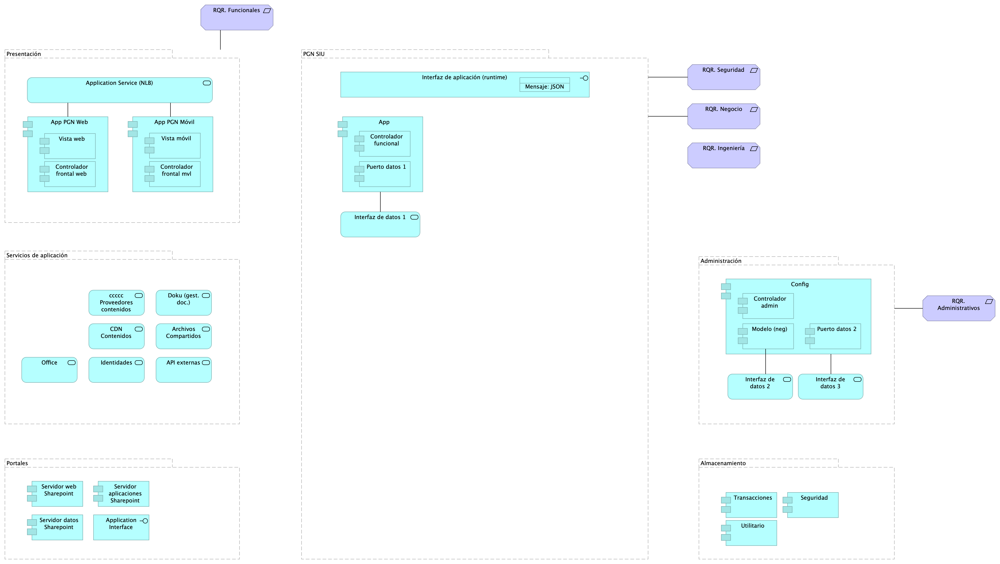{#fig:id-id-2efb9df070e94a1b8eba05a57ed55eaf width=}

_Fuente: Repositorio arquitectura Mi Mutual (2023)_

 

### Catálogo de Elementos

| Nombre           | Tipo | Documentación | Propiedad |
|----------------|------|------|------|
| API externas | Application Service |  |  |
| Administración | Grouping |  |  |
| Almacenamiento | Grouping |  |  |
| App | Application Component |  |  |
| App PGN Móvil | Application Component | A partir de los lineamientos de desarrollo seguro establecidos en The OWASP Foundation recomendados en la “Guía de desarrollo OWASP” y “OWAS Cheat Sheet, se realizaran pruebas de seguridad a partir del analisis de vulnerabilidades, y pruebas de Ethikal Hacking. 
 
 Protección de datos personales, 
 Los sistemas de información que recogen, procesan y almacenan información de los derechos de las personas se deben almacenar de forma adecuada, la información que pueda ser vulnerada puede generar obliaciones legales y éticas con respecto a la perdida de informacion confidencial por parte de ciudadanos del pais. 
 
 La informacion contenida en las bases de datos debe tener los mecanismos de cifrado que en otros apartados se han mencionado. 
 La legislación que hay que tener como referencia, ley 1581 de 2012. Decreto 1377 de 2013
 
 La metodologia empleada tendrá las siguientes fases: 
 
 •	FASE DE RECONOCIMIENTO: 
 Se recolectará toda la información posible, usando diferentes técnicas como:
 o	Recopilación de dominios/IPs/puertos/servicios
 o	Recopilación de metadatos
 o	Uso de Google Dorks.
 
 •	ANÁLSIS DE VULNERABILIDADES: 
 Se analizará la información recopilada en la fase anterior y se realizará el descubrimiento de las vulnerabilidades. 
 
 •	EXPLOTACIÓN: 
 •	Se realizarán todas aquellas acciones que puedan comprometer al sistema auditado, las pruebas a implementar pueden ser de ataques tipo: 
 o	Inyección de código
 o	Inclusión de ficheros locales o remotos
 o	Evasión de autenticación
 o	Carencia de controles de autorización
 o	Ejecución de comandos en el lado del servidor
 o	Ataques tipo Cross Site Request Forgery
 o	Control de errores
 o	Gestión de sesiones
 o	Fugas de información
 o	Secuestros de sesión
 o	Comprobación de las condiciones para realizar una denegación de servicio.
 	
 •	POST EXPLOTACIÓN:
 En caso de encontrarse una vulnerabilidad que permita realizar otras acciones en el sistema auditado o en su entorno, se realizarán controles adiciones con el objetivo de comprobar la criticidad de esta.
 
 No	URL	IP
 1.	https://runtimetest.lappiz.io/#/auth/login/PGN_Lappiz
 135.181.185.207
 
 
  |  |
| App PGN Web | Application Component | A partir de los lineamientos de desarrollo seguro establecidos en The OWASP Foundation recomendados en la “Guía de desarrollo OWASP” y “OWAS Cheat Sheet, se realizaran pruebas de seguridad a partir del analisis de vulnerabilidades, y pruebas de Ethical Hacking. 
 Los resultados permitirán identificar los requisitos de seguridad que los sistemas de informacion o servicios web deberán cumplir.
 La metodologia empleada tendrá las siguientes fases: 
 
 •	FASE DE RECONOCIMIENTO: 
 Se recolectará toda la información posible, usando diferentes técnicas como:
 o	Recopilación de dominios/IPs/puertos/servicios
 o	Recopilación de metadatos
 o	Uso de Google Dorks.
 
 •	ANÁLSIS DE VULNERABILIDADES: 
 Se analizará la información recopilada en la fase anterior y se realizará el descubrimiento de las vulnerabilidades. 
 
 •	EXPLOTACIÓN: 
 •	Se realizarán todas aquellas acciones que puedan comprometer al sistema auditado, las pruebas a implementar pueden ser de ataques tipo: 
 o	Inyección de código
 o	Inclusión de ficheros locales o remotos
 o	Evasión de autenticación
 o	Carencia de controles de autorización
 o	Ejecución de comandos en el lado del servidor
 o	Ataques tipo Cross Site Request Forgery
 o	Control de errores
 o	Gestión de sesiones
 o	Fugas de información
 o	Secuestros de sesión
 o	Comprobación de las condiciones para realizar una denegación de servicio.
 	
 •	POST EXPLOTACIÓN:
 En caso de encontrarse una vulnerabilidad que permita realizar otras acciones en el sistema auditado o en su entorno, se realizarán controles adiciones con el objetivo de comprobar la criticidad de esta.
 
 No	URL	IP
 1.	https://runtimetest.lappiz.io/#/auth/login/PGN_Lappiz
 135.181.185.207
 
 
 El Login deberá evidenciar el control de errores, al momento de realizar la validación deberá mensaje de error para el caso que se autentique con credenciales erradas.  |  |
| Application Interface | Application Interface |  |  |
| Application Service (NLB) | Application Service |  |  |
| Archivos Compartidos | Application Service |  |  |
| CDN Contenidos | Application Service |  |  |
| Config | Application Component |  |  |
| Controlador admin | Application Component |  |  |
| Controlador frontal mvl | Application Component |  |  |
| Controlador frontal web | Application Component | -	Verificados los SSL, se recomienda adquirir SSL seguros, con entidades certificadoras. 
 Si se desea continuar con SSL de Let's Encrypt, se recomienda automatizar el proceso de actualización dado que al dejar estos en modo actualización manual es probable el olvido de esta actualización (Estos certificados se deben actualizar trimestralmente y no cuentan con las características de seguridad necesarias. 
  |  |
| Controlador funcional | Application Component |  |  |
| Doku (gest. doc.) | Application Service |  |  |
| Identidades | Application Service |  |  |
| Interfaz de aplicación (runtime) | Application Interface | Servidor web:  Microsoft-IIS/10.0 
 Marco de Programación: ASP.NET
 Huellas digitales identificadas:  
 Huella digital SHA-256 “FC:79:06:7E:F5:24:20:50:F1:C0:74:F7:85:56:B9:05:B7:33:A3:2D:44:A0:48”
 Huella digital SHA1 “8C:48:BD:E2:F5:18:18:C3:85:96:68:44:2E:28:A0:68:08:2F:0A:BE”
  |  |
| Interfaz de datos 1 | Application Service |  |  |
| Interfaz de datos 2 | Application Service |  |  |
| Interfaz de datos 3 | Application Service |  |  |
| Mensaje: JSON | Data Object |  |  |
| Modelo (neg) | Application Component |  |  |
| Office | Application Service |  |  |
| PGN SIU | Grouping | El objetivo principal de la arquitectura del SUI de la migración es la centralización de los conceptos misionales: concentrar los conceptos misionales en componentes aislados; dejar por fuera de estos componentes misionales todo lo distintos a la misionalidad de la PGN.  Los objetivos secundarios de esta arquitectura SUI de la migración son flexibilidad y extensibilidad. Dichos objetivos son independientes. Es decir, estos pueden ser maximizados sin conclifcto entre ellos.   |  |
| Portales | Grouping | Submódulo de portales internos de la PGN a donde llega el SUI. Interfaz web que usa al SUI para llegar a direcciones y subdirecciones de la PGN. La plataforma principal de portales en este contexto es Sharepoint de Microsoft.  |  |
| Presentación | Grouping | Submódulo de presentación del SUI. interfaz gráfica, interfaz web visible a los usuarios clientes y funcionarios de la PGN.  |  |
| Puerto datos 1 | Application Component |  |  |
| Puerto datos 2 | Application Component |  |  |
| RQR. Administrativos | Requirement |  |  |
| RQR. Funcionales | Requirement |  |  |
| RQR. Ingeniería | Requirement |  |  |
| RQR. Negocio | Requirement |  |  |
| RQR. Seguridad | Requirement | Requerimientos de seguridad, SUI, Migración, en aspectos de comunicación, autenticación, autorización y (manejo de) sesiones.  |  |
| Seguridad | Application Component |  |  |
| Servicios de aplicación | Grouping | Submódulo de servicios utilitarios que sirven al SUI. Servicios variados que cumplen roles facilitadores de las actividades misionales del SUI. Ejemplos de estos servicios son los de gestión documental, implementado por Doku en el contexto de PGN.  |  |
| Servidor aplicaciones Sharepoint | Application Component |  |  |
| Servidor datos Sharepoint | Application Component |  |  |
| Servidor web Sharepoint | Application Component |  |  |
| Transacciones | Application Component |  |  |
| Utilitario | Application Component |  |  |
| Vista móvil | Application Component |  |  |
| Vista web | Application Component | -	Verificados los SSL, se recomienda adquirir SSL seguros, con entidades certificadoras. 
 Si se desea continuar con SSL de Let's Encrypt, se recomienda automatizar el proceso de actualización dado que al dejar estos en modo actualización manual es probable el olvido de esta actualización (Estos certificados se deben actualizar trimestralmente y no cuentan con las características de seguridad necesarias. 
 4.	SERVICIOS IDENTIFICADOS:
 
 Servidor web:  Microsoft-IIS/10.0 
 Marco de Programación: ASP.NET
 Huellas digitales identificadas:  
 Huella digital SHA-256 “FC:79:06:7E:F5:24:20:50:F1:C0:74:F7:85:56:B9:05:B7:33:A3:2D:44:A0:48”
 Huella digital SHA1 “8C:48:BD:E2:F5:18:18:C3:85:96:68:44:2E:28:A0:68:08:2F:0A:BE”
  |  |
| ccccc Proveedores contenidos | Application Service |  |  |

Table: Elementos de la vista. {#tbl:tblelement-Seguridad.Migracion.1.SIUmodulos-id}

 

## Seguridad.1. Requerimientos

PGN. Migración Sistemas Misionales. Fase 2.

Submódulos Sistema Único de Información. Requerimientos asociados a submódulos.

versión 0.1

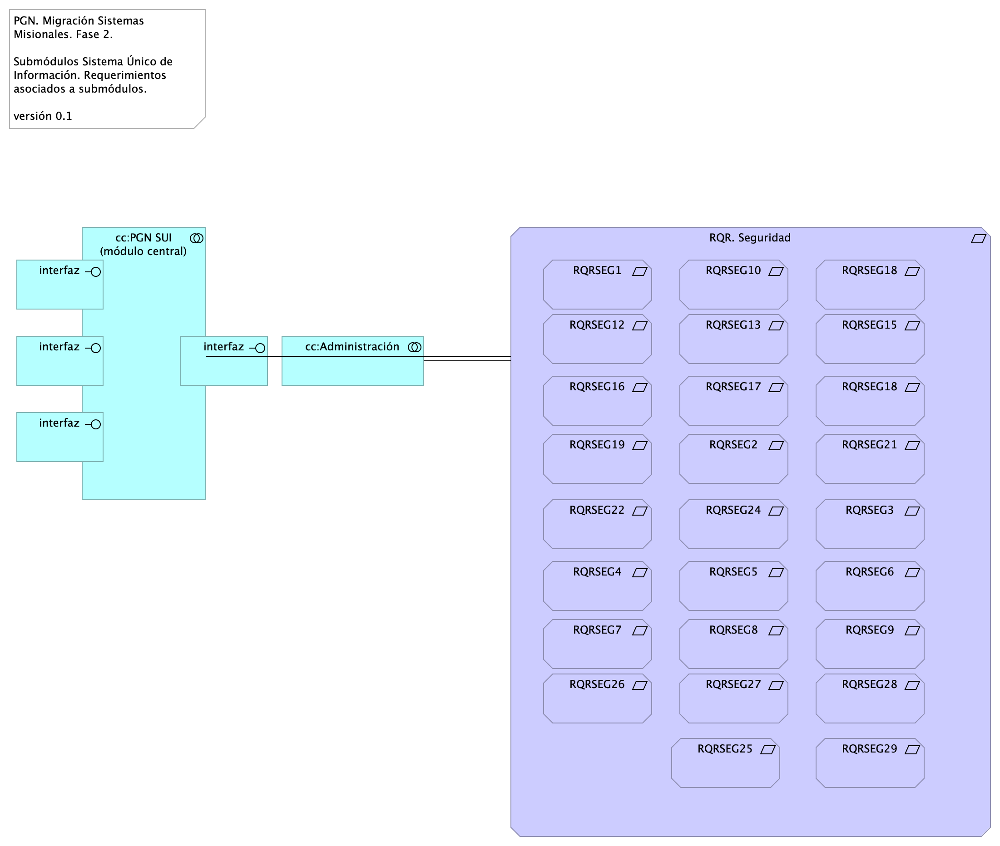{#fig:id-id-0c529bbdd5674f7b990738a9d12f0da2 width=}

_Fuente: Repositorio arquitectura Mi Mutual (2023)_

 

### Catálogo de Elementos

| Nombre           | Tipo | Documentación | Propiedad |
|----------------|------|------|------|
| RQR. Seguridad | Requirement | Requerimientos de seguridad, SUI, Migración, en aspectos de comunicación, autenticación, autorización y (manejo de) sesiones.  |  |
| RQRSEG1 | Requirement | 1. Las soluciones deben dar cumplimiento a las políticas institucionales del sistema de gestión de seguridad de la información establecidas por la entidad que busca garantizar la confidencialidad, integridad y disponibilidad de la información que se genera, procesa, almacena y/o transmite en los sistemas de Información de la Entidad. 
 
  |  |
| RQRSEG10 | Requirement | 1. Debe incluir un mecanismo de cifrado de los datos que se transportan entre los diferentes componentes tecnológicos y los datos sensibles de la base de datos que representen un alto nivel de confidencialidad. |  |
| RQRSEG12 | Requirement | 1. Debe contemplar el cumplimiento de la normatividad vigente en cuanto a protección de datos personales y debe permitir el manejo de excepciones.
 
  |  |
| RQRSEG13 | Requirement | 1. Para los casos que aplique se debe permitir el manejo de certificados y/o firmas digitales en los documentos que así se definan para efectos de aprobación y digitalización. |  |
| RQRSEG15 | Requirement | 1. Debe funcionar sobre protocolo SSL (certificados internos de la entidad cuando los sistemas de información sean internas y certificados validos públicamente cuando los sistemas de información estén expuestas a internet). |  |
| RQRSEG16 | Requirement | 1. Debe entregar un procedimiento para el respaldo de la información de acuerdo con las necesidades de la entidad. |  |
| RQRSEG17 | Requirement | 1. Debe incluir uso de criptografía para transacciones y/o campos sensibles según lo indiquen las normas vigentes y las necesidades específicas del negocio de acuerdo como lo determine la entidad. |  |
| RQRSEG18 | Requirement |  "1. Debe contemplar un modelo de datos que garantice base de datos única para evitar que se pueda presentar duplicidad de información. " |  |
| RQRSEG18 | Requirement | 1. Debe contemplar un modelo de datos que garantice base de datos única para evitar que se pueda presentar duplicidad de información.,id-d1a6b80e7a6c4538b922f333f4d7ec7a,requirement
 RQRSEG11,"1. A nivel de la base de datos debe poder definirse reglas de validación de integridad de datos (unicidad, referencial y negocio). |  |
| RQRSEG19 | Requirement | 1. En la información confidencial solo puede ser consultada por los perfiles autorizados e igualmente restringir documentos de consulta según los privilegios o permisos asociados. |  |
| RQRSEG2 | Requirement | 1. Las soluciones de automatización de procesos a implementar deben permitir la Gestión de Seguridad de Usuarios, grupos de usuarios y asignación de Roles y perfiles de usuarios, permitiendo asociar las acciones disponibles en la solución con respecto a roles de usuario, permitiendo parametrizar las funcionalidades que cada actor puede usar en la solución. |  |
| RQRSEG21 | Requirement | 1. Debe cerrar las transacciones luego de máximo 10 minutos de inactividad. """ |  |
| RQRSEG22 | Requirement | 1. Debe incluir controles de bloqueo de cuenta después de un máximo de 5 intentos erróneos a fin de evitar ataques de fuerza bruta. |  |
| RQRSEG24 | Requirement | 1. Debe cumplir con todos los lineamientos de desarrollo seguro establecidos en The OWASP Foundation recomendados en la “Guía de desarrollo OWASP” y “OWAS Cheat Sheet |  |
| RQRSEG25 | Requirement |  "1. Debe incluir un mecanismo de cifrado de los datos que se transportan entre los diferentes componentes tecnológicos y los datos sensibles de la base de datos que representen un alto nivel de confidencialidad." |  |
| RQRSEG26 | Requirement |  "1. Para los casos que aplique se debe permitir el manejo de certificados o firmas digitales en los documentos que así se definan para efectos de aprobación y digitalización. " |  |
| RQRSEG27 | Requirement |  "1. Debe contemplar las prácticas de desarrollo seguro de aplicaciones y/o implementación segura de productos, para su naturaleza Web based. " |  |
| RQRSEG28 | Requirement |  "1. A nivel de la base de datos debe poder definirse reglas de validación de integridad de datos (unicidad, referencial y negocio). " |  |
| RQRSEG29 | Requirement |  "1. Debe evidenciar el resultado positivo frente apruebas de ethical hacking, análisis de vulnerabilidades, carga, estrés y desempeño antes de la puesta en operación de acuerdo con los lineamientos de la entidad. " |  |
| RQRSEG3 | Requirement | 1. Un usuario puede estar asociado a uno o más roles, de tal manera que los menús de navegación de la solución se muestran o despliegan dependiendo de las acciones asociadas a cada rol de usuario, permitiendo así que cuando el usuario es autenticado correctamente, la solución verifica los roles que tiene activos para otorgarle únicamente las acciones autorizadas. |  |
| RQRSEG4 | Requirement | 1. El diseño de la solución debe definir los criterios necesarios para asegurar la trazabilidad y auditoría sobre las acciones de creación, actualización, modificación o borrado de los componentes de información, de tal manera que la solución debe permitirle al administrador de la solución parametrizar las tablas y eventos que pueden auditarse. |  |
| RQRSEG5 | Requirement | 1. Las soluciones deben tener en cuenta mecanismos que aseguren el registro histórico para poder mantener la trazabilidad de las acciones realizadas por los usuarios, contemplando el registro de auditoría que contiene información de fecha y hora, identificación del registro, tabla afectada, descripción del evento, tipo de evento, usuario que realiza la acción, identificación de sesión y dirección IP del usuario que efectuó la transacción. |  |
| RQRSEG6 | Requirement | 1. La solución debe proveer una consulta que permita a un usuario con los privilegios asignados, consultar los registros de auditoría, aplicando criterios de filtro (usuario, maquina, rango de fechas y tipo de operación). |  |
| RQRSEG7 | Requirement | 1. Las soluciones deben integrarse con LDAP – (Lightweight Directory Access Protocol) para los procesos de inicio de sesión y autenticación. La solución debe soportar la integración Nativa con Active Directory de Microsoft. Para usuarios externos el mecanismo de autorización, autenticación y acceso será controlado a través del modelo de seguridad de la solución (no habrá autenticación para usuarios externos). |  |
| RQRSEG8 | Requirement | 1. Las soluciones deben cumplir con los lineamientos de seguridad relacionados a su utilización a través de redes públicas y privadas, garantizando la confidencialidad e integridad de la información y acceso a ella. |  |
| RQRSEG9 | Requirement | 1. Debe evidenciar que, a través de pruebas de vulnerabilidad, garantiza la seguridad de la información. Estas pruebas deben suministrar evidencia de que se usaron umbrales de seguridad para establecer niveles mínimos aceptables de calidad de la seguridad y de la privacidad. |  |
| cc:Administración | Application Collaboration |  |  |
| cc:PGN SUI (módulo central) | Application Collaboration | Módulo central SUI migrado. Módulo independiente y asignado a un dominio partigular de la PGN.  |  |
| interfaz | Application Interface |  |  |
| interfaz | Application Interface |  |  |
| interfaz | Application Interface |  |  |
| interfaz | Application Interface |  |  |

Table: Elementos de la vista. {#tbl:tblelement-Seguridad.1.Requerimientos-id}

 

## Seguridad.2. Lineabase.0.SIU Applicación

2MFA

## Representación Arquitectónica
Con una arquitectura orientada a servicios SUI recopila:

1. Runtime: Es el servicio que interactúa con el usuario final (GUI) elaborado en Angular 11
1. API Tx: Servicio api rest base node encargado de realizar las transacciones básicas CRUD
1. API Config / Seguridad. Servicio Web API .Net Framework encargado de gestionar características con la autenticación y configuración

{#fig:id-id-280f63efee9b49e892eb38e7104d2d85 width=}

_Fuente: Repositorio arquitectura Mi Mutual (2023)_

 

### Catálogo de Elementos

| Nombre           | Tipo | Documentación | Propiedad |
|----------------|------|------|------|
| App | Application Component |  |  |
| App PGN Móvil | Application Component | A partir de los lineamientos de desarrollo seguro establecidos en The OWASP Foundation recomendados en la “Guía de desarrollo OWASP” y “OWAS Cheat Sheet, se realizaran pruebas de seguridad a partir del analisis de vulnerabilidades, y pruebas de Ethikal Hacking. 
 
 Protección de datos personales, 
 Los sistemas de información que recogen, procesan y almacenan información de los derechos de las personas se deben almacenar de forma adecuada, la información que pueda ser vulnerada puede generar obliaciones legales y éticas con respecto a la perdida de informacion confidencial por parte de ciudadanos del pais. 
 
 La informacion contenida en las bases de datos debe tener los mecanismos de cifrado que en otros apartados se han mencionado. 
 La legislación que hay que tener como referencia, ley 1581 de 2012. Decreto 1377 de 2013
 
 La metodologia empleada tendrá las siguientes fases: 
 
 •	FASE DE RECONOCIMIENTO: 
 Se recolectará toda la información posible, usando diferentes técnicas como:
 o	Recopilación de dominios/IPs/puertos/servicios
 o	Recopilación de metadatos
 o	Uso de Google Dorks.
 
 •	ANÁLSIS DE VULNERABILIDADES: 
 Se analizará la información recopilada en la fase anterior y se realizará el descubrimiento de las vulnerabilidades. 
 
 •	EXPLOTACIÓN: 
 •	Se realizarán todas aquellas acciones que puedan comprometer al sistema auditado, las pruebas a implementar pueden ser de ataques tipo: 
 o	Inyección de código
 o	Inclusión de ficheros locales o remotos
 o	Evasión de autenticación
 o	Carencia de controles de autorización
 o	Ejecución de comandos en el lado del servidor
 o	Ataques tipo Cross Site Request Forgery
 o	Control de errores
 o	Gestión de sesiones
 o	Fugas de información
 o	Secuestros de sesión
 o	Comprobación de las condiciones para realizar una denegación de servicio.
 	
 •	POST EXPLOTACIÓN:
 En caso de encontrarse una vulnerabilidad que permita realizar otras acciones en el sistema auditado o en su entorno, se realizarán controles adiciones con el objetivo de comprobar la criticidad de esta.
 
 No	URL	IP
 1.	https://runtimetest.lappiz.io/#/auth/login/PGN_Lappiz
 135.181.185.207
 
 
  |  |
| App PGN Web | Application Component | A partir de los lineamientos de desarrollo seguro establecidos en The OWASP Foundation recomendados en la “Guía de desarrollo OWASP” y “OWAS Cheat Sheet, se realizaran pruebas de seguridad a partir del analisis de vulnerabilidades, y pruebas de Ethical Hacking. 
 Los resultados permitirán identificar los requisitos de seguridad que los sistemas de informacion o servicios web deberán cumplir.
 La metodologia empleada tendrá las siguientes fases: 
 
 •	FASE DE RECONOCIMIENTO: 
 Se recolectará toda la información posible, usando diferentes técnicas como:
 o	Recopilación de dominios/IPs/puertos/servicios
 o	Recopilación de metadatos
 o	Uso de Google Dorks.
 
 •	ANÁLSIS DE VULNERABILIDADES: 
 Se analizará la información recopilada en la fase anterior y se realizará el descubrimiento de las vulnerabilidades. 
 
 •	EXPLOTACIÓN: 
 •	Se realizarán todas aquellas acciones que puedan comprometer al sistema auditado, las pruebas a implementar pueden ser de ataques tipo: 
 o	Inyección de código
 o	Inclusión de ficheros locales o remotos
 o	Evasión de autenticación
 o	Carencia de controles de autorización
 o	Ejecución de comandos en el lado del servidor
 o	Ataques tipo Cross Site Request Forgery
 o	Control de errores
 o	Gestión de sesiones
 o	Fugas de información
 o	Secuestros de sesión
 o	Comprobación de las condiciones para realizar una denegación de servicio.
 	
 •	POST EXPLOTACIÓN:
 En caso de encontrarse una vulnerabilidad que permita realizar otras acciones en el sistema auditado o en su entorno, se realizarán controles adiciones con el objetivo de comprobar la criticidad de esta.
 
 No	URL	IP
 1.	https://runtimetest.lappiz.io/#/auth/login/PGN_Lappiz
 135.181.185.207
 
 
 El Login deberá evidenciar el control de errores, al momento de realizar la validación deberá mensaje de error para el caso que se autentique con credenciales erradas.  |  |
| Application Collaboration | Application Collaboration |  |  |
| Application Collaboration | Application Collaboration |  |  |
| Application Service (NLB) | Application Service |  |  |
| Autenticación | Business Object | Con el objetivo de incrementar el nivel de seguridad, para el proceso de autenticación se tendrán en cuenta las siguientes consideraciones:  
 
 Validación del proceso de gestión de usuarios: La fortaleza de la autenticación dependerá del proceso de gestión de usuarios implementado por parte de la entidad. Se debe tener en cuenta los lineamientos definidos en la política Específica de Control de Acceso.  
 
 Autenticación con integración de Windows: La autenticación permitirá que los usuarios asignados al dominio, una vez que se ingresen las credenciales, y realizada la validación, se autorizará el acceso a los servicios y/o soluciones a partir de la integración del directorio activo con la integración del LDAP – (Lightweight Directory Access Protocol).  
 
 Los tipos de autenticación realizadas a partir de las identidades administradas de los recursos de Azure, entidades de Servicio y Certificados, podrán ser integrado con los dominios del directorio activo (DA) local. Por lo que respecta a la autenticación, será generado con la asignación de usuarios y credenciales definidas alineadas con la política Específica de Control de Acceso., a partir de la integración será validado el ingreso a las diferentes soluciones y/o sistemas de información de la PGN.  
 
 Manejo y uso de contraseñas: Los servidores públicos deberán tener en cuenta los lineamientos definidos para la creación y gestión de contraseñas del Sistema de Gestión de Seguridad de la Información SGSI de la Procuraduría General de la Nación. 
 
 Utilización de canales cifrados: El proceso de autenticación tendrá mecanismos de transmisión seguro. El uso del TLS (Transport Layer Security), será necesario para el acceso a la página de autenticación que ayude a garantizar la autenticidad de la aplicación a los funcionarios, como en la transmisión de las credenciales.  
 
 Bloqueo de cuentas: Aquellas cuentas sobre las que se han realizados múltiples intentos de conexiones fallidas, cinco (5) intentos erróneos, se tendrá implementado un bloqueo temporal o permanente como mecanismo de seguridad para evitar amenazas de ataques.   |  |
| Autorización | Business Object | Metodología 
 
 Los mecanismos de autorización para el acceso a los sistemas de información de la procuraduría general de la nación describen la forma de cómo se restringe el acceso a los diferentes módulos (Misionales (SIM), Registros de Inhabilidades (SIRI), Nómina, Control Interno y relatoría, entre otros.), y que se considera un mecanismo de protección, que ayuda a reaccionar ante cualquier operación no autorizada. El control de acceso basado en roles (RBAC), enfoca la idea de que a los funcionarios se les otorgue los permisos de acceso a los recursos, basados en los roles y/o perfiles que este posee. Este control posee dos características fundamentales: i) los accesos son controlados por medio de los roles y/o perfiles asignados, quiere decir, a los servidores públicos, contratistas, terceros y otros colaboradores autorizados para interactuar con los sistemas de información se le asignan los roles y el encargado/responsable definirá los permisos, que a su vez están relacionados con los roles, ii) Los roles pueden ser definidos a nivel jerárquico, es decir que un rol podrá ser miembro de otro rol.  
 Un proceso de autorización basado en roles, identifica tres factores importantes, i) Todos los servidores públicos, contratistas, terceros y otros 
 Colaboradores, deben tener un rol asignado, si no es asignado no podrá realizar ninguna acción relacionada con el acceso, ii) un usuario podrá hacer uso de los permisos asociados a los roles asignados, el cual deberá realizar el inicio de sesión el usuario asignado del Directorio activo (DA), iii) los servidores públicos, contratistas, terceros y otros, solo podrán realizar acciones para las cuales han sido autorizados por medio de la activación de sus roles y/o perfiles.  
 
 EL control definido para los accesos basados en roles RBAC, permitirá que solo las personas autorizadas de la PGN podrán acceder a ciertos recursos (programas, equipos, aplicaciones, bases de datos, etc.) definido por sus funciones laborales, lo que permitirá controlar los accesos desde diferentes escenarios: Sistemas de información, redes y aplicaciones. 
 
 Gestión de identidades y Control de acceso:  
 
 Gestor de identidades: En esta gestión se planifica el ciclo de vida de las identidades de usuario y se realizan los procesos de sincronización, de acuerdo a los suministros de accesos establecidos por la entidad, los cuales son integrados con el servidor que gestiona la identidad y control de acceso.  
 
 Gestor de roles: La asignación de roles es sincronizada con la identidad de usuario en el servidor de dominio. Para esta gestión se crean las reglas y condiciones que determinan si un usuario puede o no pertenecer a un rol definido por la entidad. 
 
 Para el gobierno y gestión de identidades y de acceso, se identificó como primera medida la implementación de la siguiente metodología. 
 
 REGLAS PARA LA CREACIÓN DE USUARIOS. 
 Identificación de Mecanismos: 
 
  
 
 En este ítem se deben identificar las herramientas con las que cuenta la    entidad, las cuales deberán ser registradas en el documento denominado: “Clasificación y gestión de usuarios, roles y perfiles.xlsx / Hoja_1 (Mecanismos)”. 
 
 Identificación de Roles y Privilegios 
 
 Este ítem proporciona al sistema la definición de las políticas organizacionales en cuanto a la definición de los privilegios y roles de los diferentes actores en cada uno de los aplicativos con los que estos interactúan dentro de sus funciones, registradas en el documento denominado: “Clasificación y gestión de usuarios, roles y perfiles.xlsx / Hoja_2 (Roles)”. 
 
 Aprovisionamiento de cuentas 
 
 Este ítem establece el proceso adecuado para el aprovisionamiento y des aprovisionamiento de cuentas de usuarios en las diferentes aplicaciones, permitiendo toda la gestión de ellas por medio de un sistema de directorio único y centralizado, Este aprovisionamiento se encuentra registrado en el documento denominado: “Clasificación y gestión de usuarios, roles y perfiles.xlsx / Hoja_4 y Hoja_5 (Permisos)”. 
 
 Establecimiento de mecanismos de control de acceso:  
 
 Este ítem controla que usuarios tienen permitido el acceso a los diferentes aplicativos o herramientas dentro de la organización permitiendo segregar las funciones dependiendo del rol del usuario en cada sistema, Este establecimiento se encuentra registrado en el documento denominado: “Clasificación y gestión de usuarios, roles y perfiles.xlsx / Hoja_3 (Acceso)”. 
 
 Definición de Privilegios y accesos.  
 Los accesos y privilegios serán identificados en la matriz, encargado identificar cada uno de los roles y perfiles que se tendrá cada usuario hacia los sistemas de información cumpliendo con el principio del menor privilegio, teniendo en cuenta que los usuarios deberán tener exclusivamente los permisos y privilegios que necesita para el desarrollo de sus actividades. La matriz identificará i) los roles que se deben crear para cada sistema de información, ii) los privilegios que requiere cada rol del sistema y iii) los niveles de accesos requeridos, (Consultar, Modificar, Eliminar) (CRUD) y iv) Tipos de usuarios, roles que pueden ser asignados al perfil, entre otros.  
 
 Configuración de permisos 
 La configuración con de los perfiles con sus accesos y privilegios en los sistemas de información se debe realizar empleando las herramientas propias de la procuraduría general de la nacional PGN, y serán asignados los permisos según la matriz de roles y permisos.  
 
 Identificación de Mecanismos: 
 En este ítem se deben identificar las herramientas con las que cuenta la    entidad, las cuales deberán ser registradas en el documento denominado: “Clasificación y gestión de usuarios, roles y perfiles.xlsx / Hoja_1 (Mecanismos)”. 
 
 Identificación de Roles y Privilegios 
 Este ítem proporciona al sistema la definición de las políticas organizacionales en cuanto a la definición de los privilegios y roles de los diferentes actores en cada uno de los aplicativos con los que estos interactúan dentro de sus funciones, registradas en el documento denominado: “Clasificación y gestión de usuarios, roles y perfiles.xlsx / Hoja_2 (Roles)”. 
 
 Aprovisionamiento de cuentas 
 
 Este ítem establece el proceso adecuado para el aprovisionamiento y des aprovisionamiento de cuentas de usuarios en las diferentes aplicaciones, permitiendo toda la gestión de ellas por medio de un sistema de directorio único y centralizado, Este aprovisionamiento se encuentra registrado en el documento denominado: “Clasificación y gestión de usuarios, roles y perfiles.xlsx / Hoja_4 y Hoja_5 (Permisos)”. 
 
 Establecimiento de mecanismos de control de acceso:  
 Este ítem controla que usuarios tienen permitido el acceso a los diferentes aplicativos o herramientas dentro de la organización permitiendo segregar las funciones dependiendo del rol del usuario en cada sistema, Este establecimiento se encuentra registrado en el documento denominado: “Clasificación y gestión de usuarios, roles y perfiles.xlsx / Hoja_3 (Acceso)”. 
 
 Definición de Privilegios y accesos.  
 Los accesos y privilegios serán identificados en la matriz, encargado identificar cada uno de los roles y perfiles que se tendrá cada usuario hacia los sistemas de información cumpliendo con el principio del menor privilegio, teniendo en cuenta que los usuarios deberán tener exclusivamente los permisos y privilegios que necesita para el desarrollo de sus actividades. La matriz identificará i) los roles que se deben crear para cada sistema de información, ii) los privilegios que requiere cada rol del sistema y iii) los niveles de accesos requeridos, (Consultar, Modificar, Eliminar) (CRUD) y iv) Tipos de usuarios, roles que pueden ser asignados al perfil, entre otros.  
 
 Configuración de permisos 
 La configuración con de los perfiles con sus accesos y privilegios en los sistemas de información se debe realizar empleando las herramientas propias de la procuraduría general de la nacional PGN, y serán asignados los permisos según la matriz de roles y permisos.   |  |
| Balanceador | Node |  |  |
| Cifrado de Datos en tránsito | Business Object | Proteger la información propia de la PGN utilizando mecanismos de cifrado que permita garantizar los pilares de Segurida de la Información Confidencialidad e integridad, asimismo reducir los riesgos de la información mediante la ayuda de Técnicas Criptograficas. 
 
 Como mecanismos se propone implementar estos  mecanismos de cifrado, como el protocolo TLS ( Transport Layer Security) que permite a dos partes identificarse y autenticarse entre sí y comunicarse con confidencialidad e integridad de datos a partir de la conexión del usuario y un servidor WEB.
 
 Se propone integrar certificados SSL, que permite cifrar la información confidencial a fin de que solo los autorizados puedan tener acceso a ella, y asi evitar manipulacion de información confidencial. La Seguridad  que brinda SSL, da garantía para acceder a los aplicativos de PNG. 
 
 Como implementar certificados SSL?
 Podran ser adquiridos a través del proveedor de dominios.
 
 TLS el protocolo que surge para reforzar la seguridad de los certificados SSL, que funciona como mecanismo de encriptación para que sea realmente transparente el envio de la información, proporcionando una autenticación solida, restringiendo la manipulación, interceptación y alteración de mensajes.
 La ultima versión del TLS es la 1.3
 
  |  |
| Cifrado de datos en tránsito | Business Object | Proteger la información propia de la PGN utilizando mecanismos de cifrado que permita garantizar los pilares de Segurida de la Información Confidencialidad e integridad, asimismo reducir los riesgos de la información mediante la ayuda de Técnicas Criptograficas. Como mecanismos se propone implementar estos  mecanismos de cifrado, como el protocolo TLS ( Transport Layer Security) que permite a dos partes identificarse y autenticarse entre sí y comunicarse con confidencialidad e integridad de datos a partir de la conexión del usuario y un servidor WEB.
 
 Se propone integrar certificados SSL, que permite cifrar la información confidencial a fin de que solo los autorizados puedan tener acceso a ella, y asi evitar manipulacion de información confidencial. La Seguridad  que brinda SSL, da garantía para acceder a los aplicativos de PNG. 
 
 Como implementar certificados SSL?
 Podran ser adquiridos a través del proveedor de dominios.
 
 TLS el protocolo que surge para reforzar la seguridad de los certificados SSL, que funciona como mecanismo de encriptación para que sea realmente transparente el envio de la información, proporcionando una autenticación solida, restringiendo la manipulación, interceptación y alteración de mensajes.
 La ultima versión del TLS es la 1.3 |  |
| Communication Network (DMZ) | Communication Network |  |  |
| Communication Network (LAN) | Communication Network |  |  |
| Communication Network (internet) | Communication Network |  |  |
| Config | Application Component |  |  |
| Firewall BDD | Node |  |  |
| Interfaz de datos 1 | Application Service |  |  |
| Interfaz de datos 2 | Application Service |  |  |
| Network Firewall/WAF | Node |  |  |
| Pruebas | Application Component | FASE DE RECONOCIMIENTO:  
 Se recolectará toda la información posible, usando diferentes técnicas como: 
 Recopilación de dominios/IPs/puertos/servicios 
 Recopilación de metadatos 
 Uso de Google Dorks. 
 
 ANÁLSIS DE VULNERABILIDADES:  
 Se analizará la información recopilada en la fase anterior y se realizará el descubrimiento de las vulnerabilidades.  
 
 EXPLOTACIÓN:  
 Se realizarán todas aquellas acciones que puedan comprometer al sistema auditado, las pruebas a implementar pueden ser de ataques tipo:  
 
 Inyección de código 
 Inclusión de ficheros locales o remotos 
 Evasión de autenticación 
 Carencia de controles de autorización 
 Ejecución de comandos en el lado del servidor 
 Ataques tipo Cross Site Request Forgery 
 Control de errores 
 Gestión de sesiones 
 Fugas de información 
 Secuestros de sesión 
 Comprobación de las condiciones para realizar una denegación de servicio. 
 
 POST EXPLOTACIÓN: 
 En caso de encontrarse una vulnerabilidad que permita realizar otras acciones en el sistema auditado o en su entorno, se realizarán controles adiciones con el objetivo de comprobar la criticidad de esta.  |  |
| Punto acceso público | Application Interface | URL tipo C HTTP |  |
| Servidor BDD App | Node | Sistema Operativo Windows Server 2019 Standard o Datacenter x64. RAM	8 GB. CPU 64 Bits, 4 Cores > 2 Ghz Discos	SO C: 126 GB, Backup E: 511 GB, SQL Data F: 510 GB, SQL Log   G: 510 GB, TempDB  G: 63.6 GB.  |  |
| Servidor BDD Config | Node | Sistema Operativo Windows Server 2019 Standard o Datacenter x64. RAM	8 GB. CPU 64 Bits, 4 Cores > 2 Ghz Discos	SO C: 80 GB, Backup E: 250 GB, SQL Data F: 250 GB, SQL Log G: 250 GB, TempDB  G: 30 GB.  |  |
| Servidor Web App | Node | Windows Server 2019 Standard o Datacenter x64. Nombre físico. IP LAN. IP Pública. Windows Server 2019 Standard or Datacenter x64. RAM	8  GB. CPU	64 Bits. 4 Cores de 2 Ghz. Discos	SO C: 126 GB. SO D: 16 GB.  |  |
| Servidor Web Canales | Node | Windows Server 2019 Standard o Datacenter x64. Nombre físico. IP LAN. IP Pública. Windows Server 2019 Standard or Datacenter x64. RAM	8  GB. CPU	64 Bits. 4 Cores de 2 Ghz. Discos	SO C: 126 GB. SO D: 16 GB.  |  |
| Sistema de Seguridad (LDAP) 1 | Node | Sistema de Seguridad (LDAP) 1. Control de acceso internet, 
 La autenticación podrá estar integrada con el directorio activo, a partir de la generación de codigo para ek ingreso con 2FA, que podrá generar un código la plataforma de correo corporativo, el cual solicitará el codigo de autenticacion y una vez ingreado podrá redirigir al sitio.  |  |
| Sistema de Seguridad (LDAP) 2 | Node | Sistema de Seguridad (LDAP) 2. Control de acceso internet, 
 La solución se podra integrar con el directorio activo, a partir de la generación del 2FA, que podrá generar un  codigo por desde la plataforma de office 365, el cual solicitará el codigo de autenticacion y una vez ingreado podrá acceder al sitio. 
  |  |
| www pgn com | Technology Interface |  |  |

Table: Elementos de la vista. {#tbl:tblelement-Seguridad.2.Lineabase.0.SIUApplicación-id}

 

## Seguridad.3. Datos SUI

undefined

{#fig:id-id-873b4fcee97c46fba4132d60a65a40b1 width=}

_Fuente: Repositorio arquitectura Mi Mutual (2023)_

 

### Catálogo de Elementos

| Nombre           | Tipo | Documentación | Propiedad |
|----------------|------|------|------|
|  | Meaning |  |  |
| API (administración de claves) | Business Object | Administración de claves. 
 Las contraseñas deberán cumplir con los requisitos de complejidad y completitud, teniendo en cuenta la longitud, caracteres numéricos, alfabéticos y especiales y que puedan ser cambiadas en un periodo de tiempo establecido, de acuerdo con los parámetros definidos en las políticas de acceso.    |  |
| Autenticación | Business Object | Los tipos de autenticacion realizadas a partir de las identidades adminsitradas de los recursos de Azure, entidades de Servicio y Certificado y entidad de servicio secreto, podran ser integrado con los dominios del DA locales.   
 
 Por lo que respecta a la autenticación, será generado con la ( Validación de nombre de usuario y contraseñas proporcionadas por el funcionario), a partir de la integracion del directorio activo LDAP. Con la aceptacion del usuario y contraseñas, se podrán ingresar a los diferentes sistemas de información de la PGN. 
 
 Se definirá politica dentro del directorio activo DA para que los usuarios que ingresen su contraseña de forma erronea, se bloquee automaticamente, asi mismo la politica para el bloqueo de los usuarios desatendidos despues de dos (2) Minutos de inactividad.  |  |
| BD PRD | Application Component | Gestor de Base de datos SQL Server. 
 Pemitirá enmascarar los datos a nivel de columna, teniendo en cuenta el enmascaramiento dinamico de datos (DDM).
 Se podrá utilizar el mecanismo de cifrado a nivel de columna para almacernar los datos confidenciales en formato de cifrado.
 Para el cifrado de los datos en columna se podrá temer en cuenta las funciones de cifrado (ENCRYPT_AES() y ENCRYPT_TDES(), parametros que se incorporar para cifrar los datos que contengan datos de tipo Varchar, Caracter entre otros. 
 para la proteccion de datos en filas de bases de datos, se tendra en cuenta mediante la instrucción transact-SQL CREATE SECURITY POLICY.  |  |
| Backup | Application Component | Para el respaldo de las bases de datos en los ecosistemas de Dev, Test, Prod se cuenta con las siguientes políticas de retención de copias de seguridad y frecuencia de copias de seguridad. 
 Para la base de datos de seguridad y configuración de la aplicación se tiene un plan de copia completo cada 12 horas (PITR) en una franja de tiempo de 35 días. Adicionalmente cuenta con un LTR de conservación de 12 semanas para las copias de seguridad semanales, 12 semanas de conservación para la primera copia de seguridad de cada mes, y una conservación de 12 semanas de una copia de seguridad anual. 
 Para la base de datos de datos y trazabilidad de transacciones de la aplicación se tiene un plan de copia completo cada 12 horas (PITR) en una franja de tiempo de 35 días. Adicionalmente cuenta con un LTR de conservación de 52 semanas para copias de seguridad semanales, 52 semanas de conservación para la primer copia de seguridad de cada mes, y una conservación de 52 semanas de una copia de seguridad anual. Esto con la finalidad de que al ser una base de datos transaccional precisa de una conservación completa de los años transaccionales.  |  |
| Cifrado de Datos en tránsito | Business Object | Proteger la información propia de la PGN utilizando mecanismos de cifrado que permita garantizar los pilares de Segurida de la Información Confidencialidad e integridad, asimismo reducir los riesgos de la información mediante la ayuda de Técnicas Criptograficas. 
 
 Como mecanismos se propone implementar estos  mecanismos de cifrado, como el protocolo TLS ( Transport Layer Security) que permite a dos partes identificarse y autenticarse entre sí y comunicarse con confidencialidad e integridad de datos a partir de la conexión del usuario y un servidor WEB.
 
 Se propone integrar certificados SSL, que permite cifrar la información confidencial a fin de que solo los autorizados puedan tener acceso a ella, y asi evitar manipulacion de información confidencial. La Seguridad  que brinda SSL, da garantía para acceder a los aplicativos de PNG. 
 
 Como implementar certificados SSL?
 Podran ser adquiridos a través del proveedor de dominios.
 
 TLS el protocolo que surge para reforzar la seguridad de los certificados SSL, que funciona como mecanismo de encriptación para que sea realmente transparente el envio de la información, proporcionando una autenticación solida, restringiendo la manipulación, interceptación y alteración de mensajes.
 La ultima versión del TLS es la 1.3
 
  |  |
| Cifrado de datos | Business Object | Establecer mecanismos de cifrado, como el protocolo TLS ( Transport Layer Security) que permite a dos partes identificarse y autenticarse entre sí y comunicarse con confidencialidad e integridad de datos a partir de la conexión del usuario y un servidor WEB. |  |
| Descripción de Entidades de Datos Migración SUI PGN | Grouping |  |  |
| Gestión de funcionarios PGN | Business Actor | La autenticacion de usuarios estará enmarcada en en tres factores de autenticación a partir del controlador de Dominio, y el acceso por VPN. |  |
| Hominis | Data Object |  |  |
| Ofuscar datos | Business Object | Pemitirá enmascarar los datos a nivel de columna, teniendo en cuenta el enmascaramiento dinamico de datos (DDM).
 Se podrá utilizar el mecanismo de cifrado a nivel de columna para almacernar los datos confidenciales en formato de cifrado.
 Para el cifrado de los datos en columna se podrá temer en cuenta las funciones de cifrado (ENCRYPT_AES() y ENCRYPT_TDES(), parametros que se incorporar para cifrar los datos que contengan datos de tipo Varchar, Caracter entre otros. 
 para la proteccion de datos en filas de bases de datos, se tendra en cuenta mediante la instrucción transact-SQL CREATE SECURITY POLICY.  |  |
| Roles de Key Vault | Business Object | Control de acceso que define los roles y los privilegios para determinar si a un usuario se le debe dar acceso a un recurso. 
 La información que sea considerada como Información publica reservada de acuerdo con los criterios definidos en la ley 1712 de 2014 “Por medio del cual se crea la ley de transparencia y del derecho de acceso a la información pública nacional.”,, podrá ser consultada solo por el personal autorizado definido de acuerdo con el control de acceso basado en roles.  Los perfiles o roles definiran el acceso a la información. 
 
 Para los documentos restringidos  que requieran firma por parte del lider del proceso o propietario, se propone revisar la implementacion de un dispositivo criptográfico con uso de (CERTIFICADOS y FIRMA DIGITAL) con token integrado que podra ser conectado en el puerto USB de la maquina del usuario.
 La aprobacion de los documentos por intermedio de esta firma permitirá la aprobación, integridad de los documentos , seguridad y validez juridica. Se propone la gestión con un  proveedor de certificado del ambito nacional.
 
 EL control definido para los accesos basados en roles RBAC, permitirá que solo las personas autorizadas de la PGN podrán acceder a ciertos recursos (programas, equipos, aplicaciones, bases de datos, etc) definido por sus funciones laborales, lo que permitirá controlar los accesos desde diferentes escenarios: Sistemas de información, redes y aplicaciones.  |  |
| Security Administrator | Business Actor | La autenticacion de usuarios estará enmarcada en en tres factores de autenticación:
 control de acceso basado en roles (RBAC), mecanismo de control de acceso que define los roles y los privilegios para determinar si a un usuario se le debe dar acceso a un recurso.
 Conexión de accecso por DA de Azure: Servicio de administración de acceso e identidades basado en la nube.
 Red Privada Virtual de Azure:  bloque de compilación fundamental para las redes privadas en Azure |  |
| WAF | Node | El WAF es la medida de implementacion del muro de protección (firewall) de Aplicaciones WEB del SUI necesario para el control de las peticiones realizadas desde fuera del perímetro de red y hacia los sistemas de Informacion de la PGN.   |  |

Table: Elementos de la vista. {#tbl:tblelement-Seguridad.3.DatosSUI-id}

 

