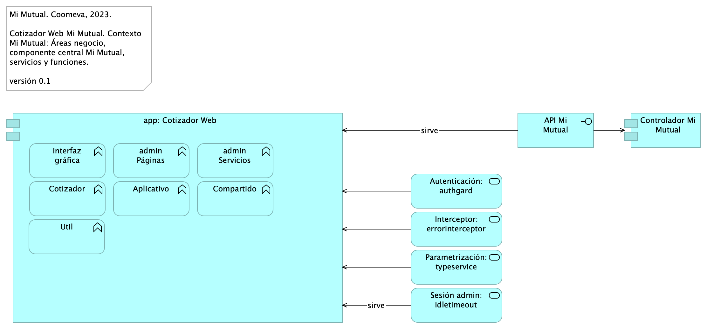
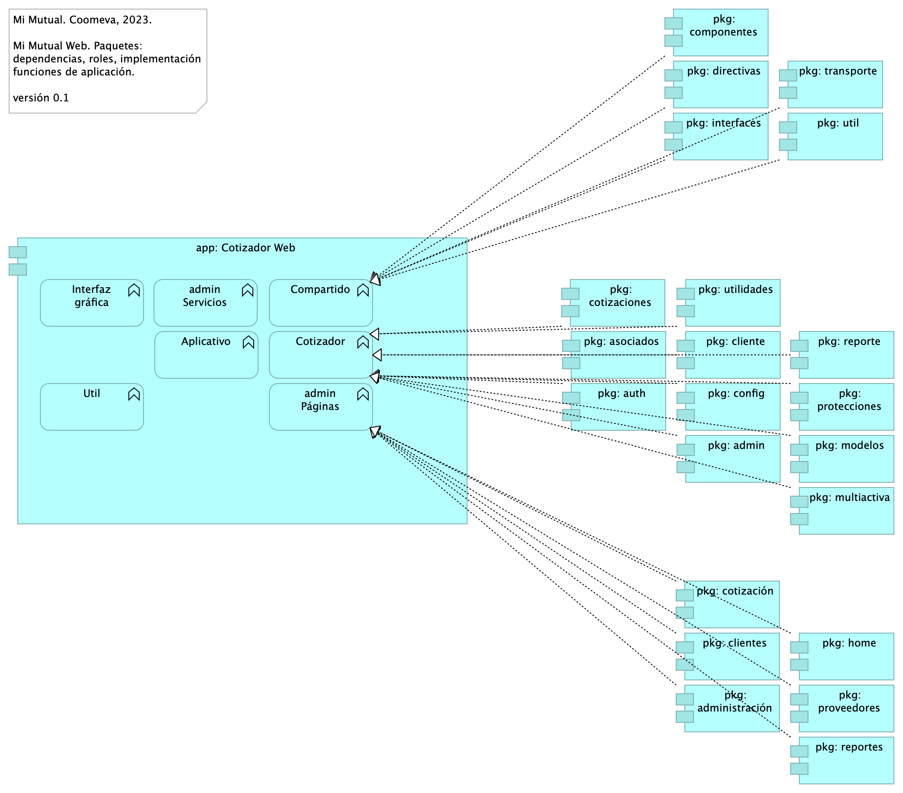

# Vistas de Arquitectura Cotizador 
* [Cotizador Web](#cotizador-web)
	* [ArqCotizador. 1. Contexto](#arqcotizador.-1.-contexto)
	* [ArqCotizador. 2. Contenedores](#arqcotizador.-2.-contenedores)
	* [ArqCotizador. 4. Aplicación](#arqcotizador.-4.-aplicación)
	* [ArqCotizador. 4a. Aplicación. Servicios](#arqcotizador.-4a.-aplicación.-servicios)
	* [ArqCotizador. 4a. Dependencias](#arqcotizador.-4a.-dependencias)
	* [ArqCotizador. 5. Físico (despliegue)](#arqcotizador.-5.-físico-despliegue)
	* [ArqCotizador. 7. Datos. Negocio](#arqcotizador.-7.-datos.-negocio)

\newpage

# Cotizador Web
## ArqCotizador. 1. Contexto
{#fig:ArqCotizador.1.Contexto width=}

### Contexto Mi Mutual Web
La aplicación Cotizador Web hace parte de los módulos de interfaz web de Mi Mutual Central, representado por API Mi Mutual en el diagrama. Realizar cotizaciones de los planes de protección luego de la vinculación del asociado.

La estructura por módulos permite realizar aplicaciones escalables y robustas ya que permite organizar las partes de la aplicación, la organización en bloques, extender la aplicación con funcionalidades de libreras externas, proporcionar un entorno de resolución de plantillas y además permite especificar la forma de la carga de cada uno de los componentes y servicios que conforman un módulo.

### Módulos Externos
Los módulos externos son todas y cada uno de las herramientas que se utilizan para complementar con funcionalidades ya desarrolladas y tomadas desde un repositorio externo (NPM).

* TranslateModule: Manejo de internacionalización. Documentación: https://github.com/ngx-translate/core
* NgxMaskModule: Manejo de máscaras de input text. Documentación: https://github.com/JsDaddy/ngx-mask
* JwtModule: Manejo de token. Documentación: https://github.com/auth0/angular2-jwt
* sweetalert2: Manejo de alertas de mensajes. Documentación: https://sweetalert2.github.io/
* ngx-ui-loader: Manejo de Spinner para control de peticiones asíncronas. Documentación: https://github.com/t-ho/ngx-ui-loader
* Ngprime: Manejo de componentes visuales Documentación: https://www.primefaces.org/primeng/#/
* chart.js: componente utilizado para el manejo de graficas Documentación: https://www.chartjs.org/docs/latest/
* classlist.js: componete para el manejo de listas de datos en las gráficas Documentación: https://www.chartjs.org/docs/latest/
* cronstrue: componente para traducir una expresión cron a palabras Documentación: https://github.com/bradymholt/cronstrue
* file-saver: componente para descargar un archivo desde los bytes Documentación: https://github.com/eligrey/FileSaver.js#readme
* ngx-tinymce: Editor html para generación de plantillas para cartas Documentación: https://cipchk.github.io/ngx-tinymce/#/
* quill: componente para editor html Documentación: https://quilljs.com/

 

### Servicios Transversales 

* AuthGuard: Validación de existencia de autenticación
* DeaciveGuard: Validación de salida de un componente
* ErrorInterceptor: Interceptor de Errores del back
* JwtInterceptor: Interceptor para inyectar el token
* AutenticationService: Métodos para completar la autenticación
* TypesService: Consumo de servicios de parametrización
* IdleTimeoutService: Verificación de timeout del token

 

### Catálogo de Elementos
| Name| Type| Description| Properties
|:--------|:--------|:--------|:--------|
|**Controlador Mi Mutual**|application-component|Los componentes de este tipo se encargan de controlar los servicios rest de la aplicación, además en estos componentes se define la forma como se reciben y envían los datos de los servicios rest y la seguridad de cada uno de los métodos.|*modulo:* mimutual |
|**app: Cotizador Web**|application-component|pkg: MiMutualWeb |*modulo:* cotizador |
|**Aplicativo**|application-function||*modulo:* cotizador |
|**Compartido**|application-function||*modulo:* cotizador |
|**Cotizador**|application-function||*modulo:* cotizador |
|**Interfaz gráfica**|application-function||*modulo:* cotizador |
|**Util**|application-function|En la Utilidades se especifican las clases que complementan una funcionalidad de un componente o servicio. * FormValidate: Clase que implementa un disparador de validación de todos los campos de un formulario. * CustomValidators: Creación de validaciones de campos.   |*modulo:* cotizador |
|**admin Páginas**|application-function||*modulo:* cotizador |
|**admin Servicios**|application-function||*modulo:* cotizador |
|**API Mi Mutual**|application-interface||*modulo:* mimutual |
|**Autenticación: authgard**|application-service|||
|**Interceptor: errorinterceptor**|application-service|||
|**Parametrización: typeservice**|application-service|||
|**Sesión admin: idletimeout**|application-service|||

## ArqCotizador. 2. Contenedores
{#fig:ArqCotizador.2.Contenedores width=}

### Catálogo de Elementos
| Name| Type| Description| Properties
|:--------|:--------|:--------|:--------|
|**Repositorio Mi Mutual**|application-component|Antes SIPAS, Mi Mutual es una aplicación web compuesta por distintos módulos de software con arreglo a todas las actividades necesarias que soportan la operación de los productos y servicios que ofrece la Unidad de Solidaridad y Seguros de la Cooperativa. Para el manejo de la persistencia de datos se utilizará Spring Data el cual se apoya en la especificación de JPA y en la implementación de HIBERNATE además de complementar esta capa de persistencia con nuevas funcionalidades que facilitan el acceso a datos. |*modulo:* mimutual |
|**app: Cotizador Web**|application-component|pkg: MiMutualWeb |*modulo:* cotizador |
|**Control**|application-function|||
|**Ruteos**|application-function|||
|**Servicios**|application-function|||
|**API Mi Mutual**|application-interface||*modulo:* mimutual |
|**Cliente HTTP / HTTPS**|application-interface|||

## ArqCotizador. 4. Aplicación
{#fig:ArqCotizador.4.Aplicación width=}

La organización de la aplicación Cotizador Web Mi Mutual, como capa de presentación y servicios, plantea una estructura basada en la referencia de aplicaciones Angular 12. Las características de esta estructura (referida por Angular) está orientada al crecimiento (tamaño) de la aplicación, la escalabilidad y al rendimiento. La aplicación web Cotizador está diseñada (modulos) para manejar la carga por demanda del contenido.

### Catálogo de Elementos
| Name| Type| Description| Properties
|:--------|:--------|:--------|:--------|
|**Controlador Mi Mutual**|application-component|Los componentes de este tipo se encargan de controlar los servicios rest de la aplicación, además en estos componentes se define la forma como se reciben y envían los datos de los servicios rest y la seguridad de cada uno de los métodos.|*modulo:* mimutual |
|**MOD0.JwtModule**|application-component| Manejo de token. Documentación: https://github.com/auth0/angular2-jwt||
|**MOD0.Ngprime**|application-component| Manejo de componentes visuales Documentación: https://www.primefaces.org/primeng/#/||
|**MOD0.NgxMaskModule**|application-component| Manejo de máscaras de input text. Documentación: https://github.com/JsDaddy/ngx-mask||
|**MOD0.TranslateModule**|application-component| Manejo de internacionalización. Documentación: https://github.com/ngx-translate/core||
|**MOD0.chart.js**|application-component| Componente utilizado para el manejo de graficas Documentación: https://www.chartjs.org/docs/latest/||
|**MOD0.classlist.js**|application-component|Componete para el manejo de listas de datos en las gráficas Documentación: https://www.chartjs.org/docs/latest/||
|**MOD0.cronstrue**|application-component| Componente para traducir una expresión cron a palabras Documentación: https://github.com/bradymholt/cronstrue||
|**MOD0.file-saver**|application-component| Componente para descargar un archivo desde los bytes Documentación: https://github.com/eligrey/FileSaver.js#readme||
|**MOD0.ngx-tinymce**|application-component|Editor html para generación de plantillas para cartas Documentación: https://cipchk.github.io/ngx-tinymce/#/||
|**MOD0.ngx-ui-loader**|application-component|Manejo de Spinner para control de peticiones asíncronas. Documentación: https://github.com/t-ho/ngx-ui-loader||
|**MOD0.quill**|application-component|Ccomponente para editor html Documentación: https://quilljs.com/||
|**MOD0.sweetalert2**|application-component|Manejo de alertas de mensajes. Documentación: https://sweetalert2.github.io/||
|**Repositorio Mi Mutual**|application-component|Antes SIPAS, Mi Mutual es una aplicación web compuesta por distintos módulos de software con arreglo a todas las actividades necesarias que soportan la operación de los productos y servicios que ofrece la Unidad de Solidaridad y Seguros de la Cooperativa. Para el manejo de la persistencia de datos se utilizará Spring Data el cual se apoya en la especificación de JPA y en la implementación de HIBERNATE además de complementar esta capa de persistencia con nuevas funcionalidades que facilitan el acceso a datos. |*modulo:* mimutual |
|**app: Cotizador Web**|application-component|pkg: MiMutualWeb |*modulo:* cotizador |
|**app: Implementación de Servicios**|application-component|Los componentes de este tipo se encargan de controlar y almacenar toda la lógica del negocio, validaciones y todo lo referente a procesamiento de datos. |*modulo:* mimutual |
|**app: Mi Mutual Central**|application-component|Antes SIPAS, Mi Mutual es una aplicación web compuesta por distintos módulos de software con arreglo a todas las actividades necesarias que soportan la operación de los productos y servicios que ofrece la Unidad de Solidaridad y Seguros de la Cooperativa.|*modulo:* mimutual |
|**Interfaz transporte**|application-interface|Feign Client. Integración con otros sistemas para facilitar los procesos de vinculación, retiro, reactivación o fallecimiento de asociados.||
|**Application Service**|application-service|Otros servicios del contexto de Mi Mutual Central. ||
|**Autorizaciones**|application-service|Autorizaciones: Administración de peticiones de autorización y sus correspondientes aprobaciones usando el servicio del flujo de procesos.||
|**Certificados**|application-service|Certificados: Permite la generación de los certificados de valores de protección y contribuciones pagadas, de retención en la fuente, de pagos de perseverancia y de cobertura de auxilio funerario.||
|**Configuración**|application-service|Configuración o parametrización de factores para realizar los cálculos de las contribuciones de los asociados a la Cooperativa para cada uno de los productos adquiridos.||
|**Facturación y Recaudo**|application-service|Administración de la facturación y recaudo diario de los productos||
|**Gestión de Beneficiarios**|application-service|Gestión de Beneficiarios: Permite administrar la información relacionada con los beneficiarios del Asociado, permitiendo ejecutar operaciones de consulta, inserción y modificación ||
|**Gestión de Productos**|application-service|Gestión de productos del fondo mutual y auxilio funerario que involucran lo relacionado a las siguientes coberturas: * Fondo de Solidaridad: Incapacidades temporales, Incapacidades Permanentes (total, parcial), Perseverancia 60, 62, 65, 70 años, Perseverancias Anticipadas, Fallecimiento Asociado (Auxilio por muerte), Desempleo, Disminución de ingresos y enfermedades graves; Rentas por hospitalización, Enfermedades de Alto Costo, Pólizas de seguros personales y patrimoniales, Planes educativos, Segunda opinión médica, Asistencias. * Auxilio Funerario: Fallecimiento de familiares directos (inscritos) del Asociado.||
|**Gestión de Usuarios**|application-service|Gestión de Usuarios: Administración de la información relacionada con los usuarios del sistema. Este componente se comunica con el servicio unificado de autenticación y autorización que devuelve los permisos que un usuario posee sobre las opciones que proporciona el sistema.||
|**SS02.reporte - cotizacion**|application-service|||
|**SS02.reporte - estado - cotizacion**|application-service|||
|**Simuladores**|application-service|Simuladores: Funcionalidades que permiten generar las simulaciones de los diferentes planes o modificaciones (incrementos y disminuciones) a los productos del Asociado.||
|**Analistas**|business-role|Analistas y auxiliares de servicio regional y nacional, agentes del centro de contacto, auditores médicos, analistas de operaciones (aseguramiento y facturación) y jefes.||
|**Asesores**|business-role|Asesores integrales||
|**Auxiliares servicio**|business-role|Analistas y auxiliares de servicio regional y nacional, agentes del centro de contacto, auditores médicos, analistas de operaciones (aseguramiento y facturación) y jefes.||
|**Módulos Externos**|grouping|||
|**Unidad de Solidaridad y Seguros**|grouping|La Unidad de Solidaridad y Seguros cuenta con un software integrado para su core de negocio denominado SIPAS (Sistema de Previsión, Asistencia y Solidaridad)||
|**Servicio de Almacenamiento de Datos**|technology-service|||
|**Servicio de Red**|technology-service|||
|**Servicio de archivos**|technology-service|||

## ArqCotizador. 4a. Aplicación. Servicios
{#fig:ArqCotizador.4a.Aplicación.Servicios width=}

Composición interna de los servivios de Mi Mutual Central, Mi Mutual Web, Cotizador Web. 

### Catálogo de Elementos
| Name| Type| Description| Properties
|:--------|:--------|:--------|:--------|
|**Controlador**|application-component|Controlador interno del servicio. Punto de entrada a la lógica de expuesta.||
|**Interfaz**|application-component|Interfaz de inversión de dependencia a las clases del servicio. ||
|**Interfaz datos**|application-component|Acceso a datos del modelo del contexto de Mi Mutual Central. ||
|**Operación**|application-component|||
|**Servicio**|application-component|Exposición de componentes de negocio. ||
|**Interfaz transporte**|application-interface|Feign Client. Integración con otros sistemas para facilitar los procesos de vinculación, retiro, reactivación o fallecimiento de asociados.||
|**Application Service**|application-service|Otros servicios del contexto de Mi Mutual Central. ||
|**Gestión de Productos**|application-service|Gestión de productos del fondo mutual y auxilio funerario que involucran lo relacionado a las siguientes coberturas: * Fondo de Solidaridad: Incapacidades temporales, Incapacidades Permanentes (total, parcial), Perseverancia 60, 62, 65, 70 años, Perseverancias Anticipadas, Fallecimiento Asociado (Auxilio por muerte), Desempleo, Disminución de ingresos y enfermedades graves; Rentas por hospitalización, Enfermedades de Alto Costo, Pólizas de seguros personales y patrimoniales, Planes educativos, Segunda opinión médica, Asistencias. * Auxilio Funerario: Fallecimiento de familiares directos (inscritos) del Asociado.||
|**Integración**|application-service|||

## ArqCotizador. 4a. Dependencias
{#fig:ArqCotizador.4a.Dependencias width=}

### Paquetes y Dependencias Cotizador Web
Módulos y componentes que hacen parte de la estructura de la aplicación Cotizador Web (basado en Angular 12 [^1]).

[^1]: Angular 2 tiene una arquitectura Modelo Vista Controlador (MVC) con el fin de hacer el desarrollo gestionado.

### Módulos Cotizador Web
La estructura por módulos actual apunta a la escalabilidad y mantenimiento del Cotizador en términos de: organizar las partes de la aplicación, organización los bloques, extender la aplicación con libreras externas, proporcionar un entorno de resolución de plantillas y además, distribuir las cargas de los componentes y servicios que usa la aplicación.

### Catálogo de Elementos
| Name| Type| Description| Properties
|:--------|:--------|:--------|:--------|
|**app: Cotizador Web**|application-component|pkg: MiMutualWeb |*modulo:* cotizador |
|**pkg: admin**|application-component|controller: Almacenan todas las clases que constituyen los servicios rest de la aplicación.|*modulo:* cotizador |
|**pkg: administración**|application-component|controller: Almacenan todas las clases que constituyen los servicios rest de la aplicación.|*modulo:* cotizador |
|**pkg: asociados**|application-component|controller: Almacenan todas las clases que constituyen los servicios rest de la aplicación.|*modulo:* cotizador |
|**pkg: auth**|application-component|controller: Almacenan todas las clases que constituyen los servicios rest de la aplicación.|*modulo:* cotizador |
|**pkg: cliente**|application-component|controller: Almacenan todas las clases que constituyen los servicios rest de la aplicación.|*modulo:* cotizador |
|**pkg: clientes**|application-component|controller: Almacenan todas las clases que constituyen los servicios rest de la aplicación.|*modulo:* cotizador |
|**pkg: componentes**|application-component|controller: Almacenan todas las clases que constituyen los servicios rest de la aplicación.|*modulo:* cotizador |
|**pkg: config**|application-component|controller: Almacenan todas las clases que constituyen los servicios rest de la aplicación.|*modulo:* cotizador |
|**pkg: cotizaciones**|application-component|controller: Almacenan todas las clases que constituyen los servicios rest de la aplicación.|*modulo:* cotizador |
|**pkg: cotización**|application-component|controller: Almacenan todas las clases que constituyen los servicios rest de la aplicación.|*modulo:* cotizador |
|**pkg: directivas**|application-component|controller: Almacenan todas las clases que constituyen los servicios rest de la aplicación.|*modulo:* cotizador |
|**pkg: home**|application-component|controller: Almacenan todas las clases que constituyen los servicios rest de la aplicación.|*modulo:* cotizador |
|**pkg: interfaces**|application-component|controller: Almacenan todas las clases que constituyen los servicios rest de la aplicación.|*modulo:* cotizador |
|**pkg: modelos**|application-component|controller: Almacenan todas las clases que constituyen los servicios rest de la aplicación.|*modulo:* cotizador |
|**pkg: multiactiva**|application-component|controller: Almacenan todas las clases que constituyen los servicios rest de la aplicación.|*modulo:* cotizador |
|**pkg: protecciones**|application-component|controller: Almacenan todas las clases que constituyen los servicios rest de la aplicación.|*modulo:* cotizador |
|**pkg: proveedores**|application-component|controller: Almacenan todas las clases que constituyen los servicios rest de la aplicación.|*modulo:* cotizador |
|**pkg: reporte**|application-component|controller: Almacenan todas las clases que constituyen los servicios rest de la aplicación.|*modulo:* cotizador |
|**pkg: reportes**|application-component|controller: Almacenan todas las clases que constituyen los servicios rest de la aplicación.|*modulo:* cotizador |
|**pkg: transporte**|application-component|controller: Almacenan todas las clases que constituyen los servicios rest de la aplicación.|*modulo:* cotizador |
|**pkg: util**|application-component|controller: Almacenan todas las clases que constituyen los servicios rest de la aplicación.|*modulo:* cotizador |
|**pkg: utilidades**|application-component|controller: Almacenan todas las clases que constituyen los servicios rest de la aplicación.|*modulo:* cotizador |
|**Aplicativo**|application-function||*modulo:* cotizador |
|**Compartido**|application-function||*modulo:* cotizador |
|**Cotizador**|application-function||*modulo:* cotizador |
|**Interfaz gráfica**|application-function||*modulo:* cotizador |
|**Util**|application-function|En la Utilidades se especifican las clases que complementan una funcionalidad de un componente o servicio. * FormValidate: Clase que implementa un disparador de validación de todos los campos de un formulario. * CustomValidators: Creación de validaciones de campos.   |*modulo:* cotizador |
|**admin Páginas**|application-function||*modulo:* cotizador |
|**admin Servicios**|application-function||*modulo:* cotizador |

## ArqCotizador. 5. Físico (despliegue)
.png){#fig:ArqCotizador.5.Físico(despliegue) width=}

### Especificaciones de Despliegue Cotizador Web
Detalles de configuración del proyecto Mi Mutual en el espacio de trabajo local (2022).

#### Recursos Requeridos
* Git. Se debe instalar git para poder realizar la clonación de cada uno de los proyectos mas adelante.
* Instalación SmartGit. Se debe instalar Smartgit para poder realizar la clonación de cada uno de los proyectos mas adelante, este es opcional ya que es una interfaz gráfica de git mas amigable para el usuario en caso que no desee trabajar con la consola.
* DBeaver. Se debe instalar DBeaver para poder acceder a la base de datos. 
* Instalación Maven. Se debe instalar maven para poder compilar los proyectos, nos debemos asegurar de instalar la versión 3.6.3, en caso que no se encuentra en la página oficial copiar la carpeta que esta en el repositorio a archivo de programas. 
* Java 8. Se debe instalar Java para poder desplegar los proyectos mas adelante, nos debemos asegurar de instalar la versión 8. 
* STS. Se debe instalar el IDE para realizar modificaciones a los proyectos back mas adelante en este caso Spring Tools 4 for Eclipse. La carpeta que genera el instalador la copiamos a archivos de programa. 
* Instalación Lombok. Se debe instalar el lombok seleccionando el IDE que acabamos de instarlar en este caso el STS.
* Postman. Se debe instalar el postman para poder consumir los servicios del backend mas adelante cuando ya se hayan desplegado.
* Node Js. Se debe instalar Node Js para configurar el proyecto front mas adelante, nos debemos asegurar de instalar la versión v14.2.0.
* Visual Studio Code. Se debe instalar el IDE para realizar modificaciones al proyecto front mas adelante en este caso Visual Studio code. 
* Angular 14.

 

### Catálogo de Elementos
| Name| Type| Description| Properties
|:--------|:--------|:--------|:--------|
|**app: Asociados**|application-component|Contiene todas las funcionalidades relacionadas con consulta y creación de asociados y beneficiarios.|*modulo:* mimutual |
|**app: Cotizador Web**|application-component|pkg: MiMutualWeb |*modulo:* cotizador |
|**app: Implementación de Servicios**|application-component|Los componentes de este tipo se encargan de controlar y almacenar toda la lógica del negocio, validaciones y todo lo referente a procesamiento de datos. |*modulo:* mimutual |
|**app: Protecciones**|application-component|Contiene todas las funcionalidades relacionadas con la gestión y configuración de productos y protecciones.|*modulo:* mimutual |
|**app: Reclamaciones**|application-component|Contiene todas las funcionalidades relacionadas con la gestión de reclamaciones, liquidaciones y pagos.|*modulo:* mimutual |
|**pkg: admin**|application-component|controller: Almacenan todas las clases que constituyen los servicios rest de la aplicación.|*modulo:* cotizador |
|**pkg: administración**|application-component|controller: Almacenan todas las clases que constituyen los servicios rest de la aplicación.|*modulo:* cotizador |
|**pkg: asociados**|application-component|controller: Almacenan todas las clases que constituyen los servicios rest de la aplicación.|*modulo:* cotizador |
|**pkg: auth**|application-component|controller: Almacenan todas las clases que constituyen los servicios rest de la aplicación.|*modulo:* cotizador |
|**pkg: cliente**|application-component|controller: Almacenan todas las clases que constituyen los servicios rest de la aplicación.|*modulo:* cotizador |
|**pkg: clientes**|application-component|controller: Almacenan todas las clases que constituyen los servicios rest de la aplicación.|*modulo:* cotizador |
|**pkg: config**|application-component|controller: Almacenan todas las clases que constituyen los servicios rest de la aplicación.|*modulo:* cotizador |
|**pkg: cotizaciones**|application-component|controller: Almacenan todas las clases que constituyen los servicios rest de la aplicación.|*modulo:* cotizador |
|**pkg: cotización**|application-component|controller: Almacenan todas las clases que constituyen los servicios rest de la aplicación.|*modulo:* cotizador |
|**pkg: home**|application-component|controller: Almacenan todas las clases que constituyen los servicios rest de la aplicación.|*modulo:* cotizador |
|**pkg: modelos**|application-component|controller: Almacenan todas las clases que constituyen los servicios rest de la aplicación.|*modulo:* cotizador |
|**pkg: multiactiva**|application-component|controller: Almacenan todas las clases que constituyen los servicios rest de la aplicación.|*modulo:* cotizador |
|**pkg: protecciones**|application-component|controller: Almacenan todas las clases que constituyen los servicios rest de la aplicación.|*modulo:* cotizador |
|**pkg: proveedores**|application-component|controller: Almacenan todas las clases que constituyen los servicios rest de la aplicación.|*modulo:* cotizador |
|**pkg: reporte**|application-component|controller: Almacenan todas las clases que constituyen los servicios rest de la aplicación.|*modulo:* cotizador |
|**pkg: reportes**|application-component|controller: Almacenan todas las clases que constituyen los servicios rest de la aplicación.|*modulo:* cotizador |
|**pkg: utilidades**|application-component|controller: Almacenan todas las clases que constituyen los servicios rest de la aplicación.|*modulo:* cotizador |
|**Conexión: jdbc**|artifact||*modulo:* cotizador |
|**Entorno Angular: ng 14.0.0**|system-software||*modulo:* cotizador |
|**Entorno JS: node 14.2.0**|system-software||*modulo:* cotizador |
|**Repositorio: db2 iSerie**|system-software||*modulo:* cotizador |
|**Servicios: tomcat**|system-software||*modulo:* mimutual |

## ArqCotizador. 7. Datos. Negocio
{#fig:ArqCotizador.7.Datos.Negocio width=}

### Entidades de Negocio Mi Mutual
Dominios de datos de negocio. Entidades independiente de la plataforma y de la tecnología.

* Configuración (caracterización de productos, plan)
* Plan (producto pólizas seguros)
* Canal (medios del tomador/asociado)
* Parametros globales (catálogos)
* Portafolio de asociado
* Asociado
* Facturación
* Beneficiario

### Catálogo de Elementos
| Name| Type| Description| Properties
|:--------|:--------|:--------|:--------|
|**DAT00.Asegurado**|business-object|||
|**DAT00.Asociado**|business-object|||
|**DAT00.Beneficiario**|business-object|||
|**DAT00.Canal (medios del tomador/asociado)**|business-object|||
|**DAT00.Configuración (caracterización)**|business-object|Caracterización de productos, planes, parámetros ||
|**DAT00.Cotización**|business-object|||
|**DAT00.Plan (producto pólizas seguros)**|business-object|||
|**DAT00.Vinculación**|business-object|||
|**DAT01.PERSONA**|data-object|||
|**DAT01.PERSONA**|data-object|||
|**DAT01.PERSONA**|data-object|||
|**DAT01.PERSONA**|data-object|||

``Generated on: Thu Oct 26 2023 14:29:38 GMT-0500 (COT)``