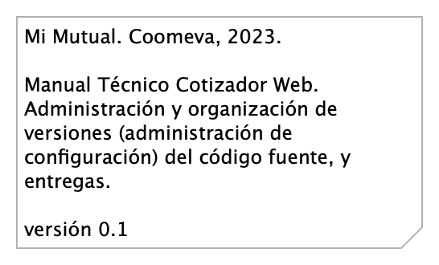

# Vistas de Arquitectura Cotizador . Manual
* [Manual Técnico Cotizador Web (Mi Mutual)](#manual-técnico-cotizador-web-mi-mutual)
	* [Cotizador. 5. Físico (despliegue)](#cotizador.-5.-físico-despliegue)
	* [Cotizador. 8. Instalación](#cotizador.-8.-instalación)
	* [Cotizador. 8a. Instalación 1](#cotizador.-8a.-instalación-1)
	* [Cotizador. 8b. Instalación 2](#cotizador.-8b.-instalación-2)
	* [Cotizador. 8c. Instalación 3](#cotizador.-8c.-instalación-3)
	* [Cotizador. 8d. Instalación 4](#cotizador.-8d.-instalación-4)
	* [Cotizador. 9. Administración Configuración](#cotizador.-9.-administración-configuración)

\newpage

# Manual Técnico Cotizador Web (Mi Mutual)
## Cotizador. 5. Físico (despliegue)
.png){#fig:Cotizador.5.Físico(despliegue) width=}

### Especificaciones de Despliegue Cotizador Web
Detalles de configuración del proyecto Mi Mutual en el espacio de trabajo local (2022).

#### Recursos Requeridos
* Git. Se debe instalar git para poder realizar la clonación de cada uno de los proyectos mas adelante.
* Instalación SmartGit. Se debe instalar Smartgit para poder realizar la clonación de cada uno de los proyectos mas adelante, este es opcional ya que es una interfaz gráfica de git mas amigable para el usuario en caso que no desee trabajar con la consola.
* DBeaver. Se debe instalar DBeaver para poder acceder a la base de datos. 
* Instalación Maven. Se debe instalar maven para poder compilar los proyectos, nos debemos asegurar de instalar la versión 3.6.3, en caso que no se encuentra en la página oficial copiar la carpeta que esta en el repositorio a archivo de programas. 
* Java 8. Se debe instalar Java para poder desplegar los proyectos mas adelante, nos debemos asegurar de instalar la versión 8. 
* STS. Se debe instalar el IDE para realizar modificaciones a los proyectos back mas adelante en este caso Spring Tools 4 for Eclipse. La carpeta que genera el instalador la copiamos a archivos de programa. 
* Instalación Lombok. Se debe instalar el lombok seleccionando el IDE que acabamos de instarlar en este caso el STS.
* Postman. Se debe instalar el postman para poder consumir los servicios del backend mas adelante cuando ya se hayan desplegado.
* Node Js. Se debe instalar Node Js para configurar el proyecto front mas adelante, nos debemos asegurar de instalar la versión v14.2.0.
* Visual Studio Code. Se debe instalar el IDE para realizar modificaciones al proyecto front mas adelante en este caso Visual Studio code. 
* Angular 14.

 

| Nota: los paquetes con el mismo nombre, como pkg: cliente, y pkg: clientes que aparecen arriba en el diagrama corresponden a espacio de nombres distintos. Por ejemplo, para el caso de estos dos paquetes, pkg: cliente pertenece el espacio de nombre (web) Cotizador; en cambio, pkg: clientes pertenece al espacio de nombres (web) admin Páginas.

 

### Catálogo de Elementos
| Name| Type| Description| Properties
|:--------|:--------|:--------|:--------|
|**app: Asociados**|application-component|Contiene todas las funcionalidades relacionadas con consulta y creación de asociados y beneficiarios.|*modulo:* mimutual |
|**app: Cotizador Web**|application-component|pkg: MiMutualWeb |*modulo:* cotizador |
|**app: Implementación de Servicios**|application-component|Los componentes de este tipo se encargan de controlar y almacenar toda la lógica del negocio, validaciones y todo lo referente a procesamiento de datos. |*modulo:* mimutual |
|**app: Protecciones**|application-component|Contiene todas las funcionalidades relacionadas con la gestión y configuración de productos y protecciones.|*modulo:* mimutual |
|**app: Reclamaciones**|application-component|Contiene todas las funcionalidades relacionadas con la gestión de reclamaciones, liquidaciones y pagos.|*modulo:* mimutual |
|**pkg: admin**|application-component|controller: Almacenan todas las clases que constituyen los servicios rest de la aplicación.|*modulo:* cotizador |
|**pkg: administración**|application-component|admin controller: Almacenan todas las clases que constituyen los servicios REST de la administrción de la aplicación.|*modulo:* cotizador |
|**pkg: asociados**|application-component|controller: Almacenan todas las clases que constituyen los servicios rest de la aplicación.|*modulo:* cotizador |
|**pkg: auth**|application-component|controller: Almacenan todas las clases que constituyen los servicios rest de la aplicación.|*modulo:* cotizador |
|**pkg: cliente**|application-component|controladores web de cliente. Reúne las clases que constituyen el modelo de entrada/salida de la interfaz gráfica de Clientes. Distinto al paquete admin controlador Clientes (pkg: web.clientes). |*modulo:* cotizador |
|**pkg: clientes**|application-component|admin controller: Almacenan todas las clases que constituyen los servicios REST de la administrción de la aplicación. Disitnto al paquete web de Cliente (pkg: admin.cliente).|*modulo:* cotizador |
|**pkg: config**|application-component|controller: Almacenan todas las clases que constituyen los servicios rest de la aplicación.|*modulo:* cotizador |
|**pkg: cotizaciones**|application-component|controller: Almacenan todas las clases que constituyen los servicios rest de la aplicación.|*modulo:* cotizador |
|**pkg: cotización**|application-component|admin controller: Almacenan todas las clases que constituyen los servicios REST de la administrción de la aplicación.|*modulo:* cotizador |
|**pkg: home**|application-component|admin controller: Almacenan todas las clases que constituyen los servicios REST de la administrción de la aplicación.|*modulo:* cotizador |
|**pkg: modelos**|application-component|controller: Almacenan todas las clases que constituyen los servicios rest de la aplicación.|*modulo:* cotizador |
|**pkg: multiactiva**|application-component|controller: Almacenan todas las clases que constituyen los servicios rest de la aplicación.|*modulo:* cotizador |
|**pkg: protecciones**|application-component|controller: Almacenan todas las clases que constituyen los servicios rest de la aplicación.|*modulo:* cotizador |
|**pkg: proveedores**|application-component|admin controller: Almacenan todas las clases que constituyen los servicios REST de la administrción de la aplicación.|*modulo:* cotizador |
|**pkg: reporte**|application-component|controller: Almacenan todas las clases que constituyen los servicios rest de la aplicación.|*modulo:* cotizador |
|**pkg: reportes**|application-component|admin controller: Almacenan todas las clases que constituyen los servicios REST de la administrción de la aplicación.|*modulo:* cotizador |
|**pkg: utilidades**|application-component|controller: Almacenan todas las clases que constituyen los servicios rest de la aplicación.|*modulo:* cotizador |
|**Conexión: jdbc**|artifact||*modulo:* cotizador |
|**Entorno Angular: ng 14.0.0**|system-software||*modulo:* cotizador |
|**Entorno JS: node 14.2.0**|system-software||*modulo:* cotizador |
|**Repositorio: db2 iSerie**|system-software||*modulo:* cotizador |
|**Servicios: tomcat**|system-software||*modulo:* mimutual |

 

## Cotizador. 8. Instalación
{#fig:Cotizador.8.Instalación width=}

Modelo de negocio (lógico) de Mi Mutual, extensible a sus demás módulos, como el Cotizador Web y demás. El modelo de negocio Mi Mutual contiene los conceptos de negocio que se encuentran implementados en el sofware, reglas y funciones de negocio, y el modelo(s) de datos del sistema.

### Conceptos Principales

1. Configuración
1. Vinculación
1. Venta
1. Cotización
1. Factura
1. Cobertura
1. Configuración
1. Plan de producto

### Orden Operativo

1. Configuración
1. Vinculación
1. Venta o Cotización
1. Factura

 

### Relación Negocio Datos
La relación entre los conceptos de negocio y el modelo de datos se encuentra en la vista Cotizador. 7. Datos. Negocio.

### Catálogo de Elementos
| Name| Type| Description| Properties
|:--------|:--------|:--------|:--------|

 

## Cotizador. 8a. Instalación 1
{#fig:Cotizador.8a.Instalación1 width=}

Modelo de negocio (lógico) de Mi Mutual, extensible a sus demás módulos, como el Cotizador Web y demás. El modelo de negocio Mi Mutual contiene los conceptos de negocio que se encuentran implementados en el sofware, reglas y funciones de negocio, y el modelo(s) de datos del sistema.

### Conceptos Principales

1. Configuración
1. Vinculación
1. Venta
1. Cotización
1. Factura
1. Cobertura
1. Configuración
1. Plan de producto

### Orden Operativo

1. Configuración
1. Vinculación
1. Venta o Cotización
1. Factura

 

### Relación Negocio Datos
La relación entre los conceptos de negocio y el modelo de datos se encuentra en la vista Cotizador. 7. Datos. Negocio.

### Catálogo de Elementos
| Name| Type| Description| Properties
|:--------|:--------|:--------|:--------|

 

## Cotizador. 8b. Instalación 2
{#fig:Cotizador.8b.Instalación2 width=}

Modelo de negocio (lógico) de Mi Mutual, extensible a sus demás módulos, como el Cotizador Web y demás. El modelo de negocio Mi Mutual contiene los conceptos de negocio que se encuentran implementados en el sofware, reglas y funciones de negocio, y el modelo(s) de datos del sistema.

### Conceptos Principales

1. Configuración
1. Vinculación
1. Venta
1. Cotización
1. Factura
1. Cobertura
1. Configuración
1. Plan de producto

### Orden Operativo

1. Configuración
1. Vinculación
1. Venta o Cotización
1. Factura

 

### Relación Negocio Datos
La relación entre los conceptos de negocio y el modelo de datos se encuentra en la vista Cotizador. 7. Datos. Negocio.

### Catálogo de Elementos
| Name| Type| Description| Properties
|:--------|:--------|:--------|:--------|

 

## Cotizador. 8c. Instalación 3
{#fig:Cotizador.8c.Instalación3 width=}

Modelo de negocio (lógico) de Mi Mutual, extensible a sus demás módulos, como el Cotizador Web y demás. El modelo de negocio Mi Mutual contiene los conceptos de negocio que se encuentran implementados en el sofware, reglas y funciones de negocio, y el modelo(s) de datos del sistema.

### Conceptos Principales

1. Configuración
1. Vinculación
1. Venta
1. Cotización
1. Factura
1. Cobertura
1. Configuración
1. Plan de producto

### Orden Operativo

1. Configuración
1. Vinculación
1. Venta o Cotización
1. Factura

 

### Relación Negocio Datos
La relación entre los conceptos de negocio y el modelo de datos se encuentra en la vista Cotizador. 7. Datos. Negocio.

### Catálogo de Elementos
| Name| Type| Description| Properties
|:--------|:--------|:--------|:--------|

 

## Cotizador. 8d. Instalación 4
{#fig:Cotizador.8d.Instalación4 width=}

Modelo de negocio (lógico) de Mi Mutual, extensible a sus demás módulos, como el Cotizador Web y demás. El modelo de negocio Mi Mutual contiene los conceptos de negocio que se encuentran implementados en el sofware, reglas y funciones de negocio, y el modelo(s) de datos del sistema.

### Conceptos Principales

1. Configuración
1. Vinculación
1. Venta
1. Cotización
1. Factura
1. Cobertura
1. Configuración
1. Plan de producto

### Orden Operativo

1. Configuración
1. Vinculación
1. Venta o Cotización
1. Factura

 

### Relación Negocio Datos
La relación entre los conceptos de negocio y el modelo de datos se encuentra en la vista Cotizador. 7. Datos. Negocio.

### Catálogo de Elementos
| Name| Type| Description| Properties
|:--------|:--------|:--------|:--------|

 

## Cotizador. 9. Administración Configuración
{#fig:Cotizador.9.AdministraciónConfiguración width=}

Modelo de negocio (lógico) de Mi Mutual, extensible a sus demás módulos, como el Cotizador Web y demás. El modelo de negocio Mi Mutual contiene los conceptos de negocio que se encuentran implementados en el sofware, reglas y funciones de negocio, y el modelo(s) de datos del sistema.

### Conceptos Principales

1. Configuración
1. Vinculación
1. Venta
1. Cotización
1. Factura
1. Cobertura
1. Configuración
1. Plan de producto

### Orden Operativo

1. Configuración
1. Vinculación
1. Venta o Cotización
1. Factura

 

### Relación Negocio Datos
La relación entre los conceptos de negocio y el modelo de datos se encuentra en la vista Cotizador. 7. Datos. Negocio.

### Catálogo de Elementos
| Name| Type| Description| Properties
|:--------|:--------|:--------|:--------|

 

``Generated on: Tue Nov 07 2023 12:53:50 GMT-0500 (COT)``