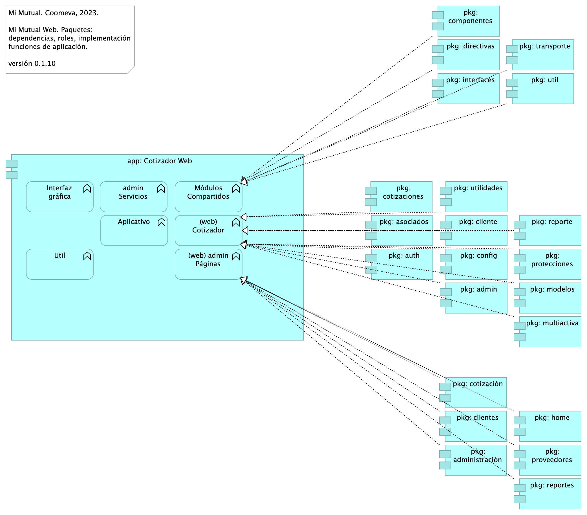

# Doc. 3 Vistas de Arquitectura Cotizador. Manual
* [Manual Técnico Cotizador Web (Mi Mutual)](#manual-técnico-cotizador-web-mi-mutual)
	* [Cotizador. 5. Físico. Despliegue](#cotizador.-5.-físico.-despliegue)
	* [Cotizador. 4a. Dependencias](#cotizador.-4a.-dependencias)
	* [Cotizador. 7. Datos. Negocio](#cotizador.-7.-datos.-negocio)
	* [Cotizador. 7a. Modelo Negocio](#cotizador.-7a.-modelo-negocio)
	* [Cotizador. 8. Instalación](#cotizador.-8.-instalación)

\newpage

# Manual Técnico Cotizador Web (Mi Mutual)
## Cotizador. 5. Físico. Despliegue
{#fig:Cotizador.5.Físico.Despliegue width=}

### Especificaciones de Despliegue Cotizador Web
Detalles de configuración del proyecto Mi Mutual en el espacio de trabajo servidor y local (2022), librerías de desarrollo (frameworks), lenguajes, instalaciones y sus versiones.

Especificaciones de despliegue Mi Mutual, 2023, Componente Central y Cotizador Web.

* Estándares para el manejo de servicios REST sobre HTTP 1.1
* Tecnologías para el backend: Java 8 con Spring Boot 2.1.4
* Acceso a Datos: Spring Data 2.1.4
* Seguridad de las API: Spring Security + Oauth2.0
* Plataforma de despliegue Backend: Tomcat Spring Boot
* Tecnologías para el frontend Mi Mutual Central: Angular 9
* Tecnologías para el frontend Cotizador Web: Angular 14
* Entorno de ejecución Javascript: nodejs 14.2.0
* Librería de Estilos Bootstrap 4.x
* Servidor web (HTTP 1.1): Apache 2.x
* Servidor BPM, Flowable, versión 6.5.0 con JRE 8
* Spring Cloud, versión Greenwich SR2
* Querydsl, version 4.2.1
* Bases de datos IBM DB2, AS400

 

#### Recursos y Herramientas Requeridas
* Git. Se debe instalar git para poder realizar la clonación de cada uno de los proyectos mas adelante.
* SmartGit. Se debe instalar Smartgit para poder realizar la clonación de cada uno de los proyectos mas adelante, este es opcional ya que es una interfaz gráfica de git mas amigable para el usuario en caso que no desee trabajar con la consola.
* DBeaver. Se debe instalar DBeaver para poder acceder a la base de datos. 
* Instalación Maven. Se debe instalar maven para poder compilar los proyectos, nos debemos asegurar de instalar la versión 3.6.3, en caso que no se encuentra en la página oficial copiar la carpeta que esta en el repositorio a archivo de programas. 
* Java 8. Se debe instalar Java para poder desplegar los proyectos mas adelante, nos debemos asegurar de instalar la versión 8. 
* STS. Se debe instalar el IDE para realizar modificaciones a los proyectos back mas adelante en este caso Spring Tools 4 for Eclipse. La carpeta que genera el instalador la copiamos a archivos de programa. 
* Instalación Lombok. Se debe instalar el lombok seleccionando el IDE que acabamos de instarlar en este caso el STS.
* Postman. Se debe instalar el postman para poder consumir los servicios del backend mas adelante cuando ya se hayan desplegado.
* Node Js. Se debe instalar Node Js para configurar el proyecto front mas adelante, nos debemos asegurar de instalar la versión v14.2.0.
* Visual Studio Code. Se debe instalar el IDE para realizar modificaciones al proyecto front mas adelante en este caso Visual Studio code. 
* Librería para desarrollo frontend Cotizador Web: Angular 14

 

| Nota: los paquetes con el mismo nombre, como pkg: cliente, y pkg: clientes que aparecen arriba en el diagrama corresponden a espacio de nombres distintos. Por ejemplo, para el caso de estos dos paquetes, pkg: cliente pertenece el espacio de nombre (web) Cotizador; en cambio, pkg: clientes pertenece al espacio de nombres (web) admin Páginas.

 

### Catálogo de Elementos
| Nombre| Tipo| Descripción| Prop.
|:--------|:--------|:--------|:--------|
|**app: Asociados**|application-component|Contiene todas las funcionalidades relacionadas con consulta y creación de asociados y beneficiarios.|*modulo:* mimutual |
|**app: Cotizador Web**|application-component|pkg: MiMutualWeb |*modulo:* cotizador |
|**app: Implementación de Servicios**|application-component|Los componentes de este tipo se encargan de controlar y almacenar toda la lógica del negocio, validaciones y todo lo referente a procesamiento de datos. |*modulo:* mimutual |
|**app: Protecciones**|application-component|Contiene todas las funcionalidades relacionadas con la gestión y configuración de productos y protecciones.|*modulo:* mimutual |
|**app: Reclamaciones**|application-component|Contiene todas las funcionalidades relacionadas con la gestión de reclamaciones, liquidaciones y pagos.|*modulo:* mimutual |
|**pkg: admin**|application-component|controller: Almacenan todas las clases que constituyen los servicios rest de la aplicación.|*modulo:* cotizador |
|**pkg: administración**|application-component|admin controller: Almacenan todas las clases que constituyen los servicios REST de la administrción de la aplicación.|*modulo:* cotizador |
|**pkg: asociados**|application-component|controller: Almacenan todas las clases que constituyen los servicios rest de la aplicación.|*modulo:* cotizador |
|**pkg: auth**|application-component|controller: Almacenan todas las clases que constituyen los servicios rest de la aplicación.|*modulo:* cotizador |
|**pkg: cliente**|application-component|controladores web de cliente. Reúne las clases que constituyen el modelo de entrada/salida de la interfaz gráfica de Clientes. Distinto al paquete admin controlador Clientes (pkg: web.clientes). |*modulo:* cotizador |
|**pkg: clientes**|application-component|admin controller: Almacenan todas las clases que constituyen los servicios REST de la administrción de la aplicación. Disitnto al paquete web de Cliente (pkg: admin.cliente).|*modulo:* cotizador |
|**pkg: config**|application-component|controller: Almacenan todas las clases que constituyen los servicios rest de la aplicación.|*modulo:* cotizador |
|**pkg: cotizaciones**|application-component|controller: Almacenan todas las clases que constituyen los servicios rest de la aplicación.|*modulo:* cotizador |
|**pkg: cotización**|application-component|admin controller: Almacenan todas las clases que constituyen los servicios REST de la administrción de la aplicación.|*modulo:* cotizador |
|**pkg: home**|application-component|admin controller: Almacenan todas las clases que constituyen los servicios REST de la administrción de la aplicación.|*modulo:* cotizador |
|**pkg: modelos**|application-component|controller: Almacenan todas las clases que constituyen los servicios rest de la aplicación.|*modulo:* cotizador |
|**pkg: multiactiva**|application-component|controller: Almacenan todas las clases que constituyen los servicios rest de la aplicación.|*modulo:* cotizador |
|**pkg: protecciones**|application-component|controller: Almacenan todas las clases que constituyen los servicios rest de la aplicación.|*modulo:* cotizador |
|**pkg: proveedores**|application-component|admin controller: Almacenan todas las clases que constituyen los servicios REST de la administrción de la aplicación.|*modulo:* cotizador |
|**pkg: reporte**|application-component|controller: Almacenan todas las clases que constituyen los servicios rest de la aplicación.|*modulo:* cotizador |
|**pkg: reportes**|application-component|admin controller: Almacenan todas las clases que constituyen los servicios REST de la administrción de la aplicación.|*modulo:* cotizador |
|**pkg: utilidades**|application-component|controller: Almacenan todas las clases que constituyen los servicios rest de la aplicación.|*modulo:* cotizador |
|**Conexión: jdbc**|artifact||*modulo:* cotizador |
|**Spring Boot 2.1.4**|artifact|Librerías backend Spring Boot 2.1.4 para Java 8. |*brecha:* 30 |
|**Spring Data 2.1.4**|artifact|Librerías backend Spring Boot 2.1.4 para Java 8. |*brecha:* 30 |
|**Entorno Angular: ng 14.0.0**|system-software||*modulo:* cotizador |
|**Entorno Java: JRE 1.8**|system-software||*brecha:* 30 *:*  |
|**Repositorio: db2 iSerie**|system-software||*modulo:* cotizador |
|**cotizador Entorno JS: node 14.2.0**|system-software||*modulo:* cotizador |
|**mimutual Servicios: tomcat**|system-software||*modulo:* mimutual |

 

## Cotizador. 4a. Dependencias
{#fig:Cotizador.4a.Dependencias width=}

### Paquetes y Dependencias Cotizador Web
Módulos y componentes que hacen parte de la estructura de la aplicación Cotizador Web (basado en Angular 12 [^1]).

[^1]: Angular 2 tiene una arquitectura Modelo Vista Controlador (MVC) con el fin de facilitar el desarrollo gestionado.

### Módulos Cotizador Web
La estructura por módulos actual apunta a la escalabilidad y mantenimiento del Cotizador en términos de: organizar las partes de la aplicación, organización los bloques, extender la aplicación con libreras externas, proporcionar un entorno de resolución de plantillas y además, distribuir las cargas de los componentes y servicios que usa la aplicación.

### Catálogo de Elementos
| Nombre| Tipo| Descripción| Prop.
|:--------|:--------|:--------|:--------|
|**app: Cotizador Web**|application-component|pkg: MiMutualWeb |*modulo:* cotizador |
|**pkg: admin**|application-component|controller: Almacenan todas las clases que constituyen los servicios rest de la aplicación.|*modulo:* cotizador |
|**pkg: administración**|application-component|admin controller: Almacenan todas las clases que constituyen los servicios REST de la administrción de la aplicación.|*modulo:* cotizador |
|**pkg: asociados**|application-component|controller: Almacenan todas las clases que constituyen los servicios rest de la aplicación.|*modulo:* cotizador |
|**pkg: auth**|application-component|controller: Almacenan todas las clases que constituyen los servicios rest de la aplicación.|*modulo:* cotizador |
|**pkg: cliente**|application-component|controladores web de cliente. Reúne las clases que constituyen el modelo de entrada/salida de la interfaz gráfica de Clientes. Distinto al paquete admin controlador Clientes (pkg: web.clientes). |*modulo:* cotizador |
|**pkg: clientes**|application-component|admin controller: Almacenan todas las clases que constituyen los servicios REST de la administrción de la aplicación. Disitnto al paquete web de Cliente (pkg: admin.cliente).|*modulo:* cotizador |
|**pkg: componentes**|application-component|controller: contiene las clases que constituyen los llamados a librerías compartidas de la aplicación.|*modulo:* cotizador |
|**pkg: config**|application-component|controller: Almacenan todas las clases que constituyen los servicios rest de la aplicación.|*modulo:* cotizador |
|**pkg: cotizaciones**|application-component|controller: Almacenan todas las clases que constituyen los servicios rest de la aplicación.|*modulo:* cotizador |
|**pkg: cotización**|application-component|admin controller: Almacenan todas las clases que constituyen los servicios REST de la administrción de la aplicación.|*modulo:* cotizador |
|**pkg: directivas**|application-component|controller: contiene las clases que constituyen los llamados a librerías compartidas de la aplicación.|*modulo:* cotizador |
|**pkg: home**|application-component|admin controller: Almacenan todas las clases que constituyen los servicios REST de la administrción de la aplicación.|*modulo:* cotizador |
|**pkg: interfaces**|application-component|controller: contiene las clases que constituyen los llamados a librerías compartidas de la aplicación.|*modulo:* cotizador |
|**pkg: modelos**|application-component|controller: Almacenan todas las clases que constituyen los servicios rest de la aplicación.|*modulo:* cotizador |
|**pkg: multiactiva**|application-component|controller: Almacenan todas las clases que constituyen los servicios rest de la aplicación.|*modulo:* cotizador |
|**pkg: protecciones**|application-component|controller: Almacenan todas las clases que constituyen los servicios rest de la aplicación.|*modulo:* cotizador |
|**pkg: proveedores**|application-component|admin controller: Almacenan todas las clases que constituyen los servicios REST de la administrción de la aplicación.|*modulo:* cotizador |
|**pkg: reporte**|application-component|controller: Almacenan todas las clases que constituyen los servicios rest de la aplicación.|*modulo:* cotizador |
|**pkg: reportes**|application-component|admin controller: Almacenan todas las clases que constituyen los servicios REST de la administrción de la aplicación.|*modulo:* cotizador |
|**pkg: transporte**|application-component|controller: contiene las clases que constituyen los llamados a librerías compartidas de la aplicación.|*modulo:* cotizador |
|**pkg: util**|application-component|controller: contiene las clases que constituyen los llamados a librerías compartidas de la aplicación.|*modulo:* cotizador |
|**pkg: utilidades**|application-component|controller: Almacenan todas las clases que constituyen los servicios rest de la aplicación.|*modulo:* cotizador |
|**(web) Cotizador**|application-function|Grupo de páginas web del cotizador. |*modulo:* cotizador |
|**(web) admin Páginas**|application-function|Grupo de páginas web del cotizador. |*modulo:* cotizador |
|**Aplicativo**|application-function|Grupo de funcionalidades y entidades (datos) específicas del Cotizador Web. |*modulo:* cotizador |
|**Interfaz gráfica**|application-function|Módulo interno (carpeta de proyecto) contenedor de las plantiilas de páginas web del Cotizador. |*modulo:* cotizador |
|**Módulos Compartidos**|application-function|Librerías de software base que el Cotizador Web requiere. Dependencias a paquetes de software de base, distintas a los módulos de negocio, necesarios para la ejecución de tareas utilitarias del Cotizador, tales como comunicación, políticas de seguridad, especificación de objetos globales de interfaz, transporte, transformación, entre otras. |*modulo:* cotizador |
|**Util**|application-function|En la Utilidades se especifican las clases que complementan una funcionalidad de un componente o servicio. * FormValidate: Clase que implementa un disparador de validación de todos los campos de un formulario. * CustomValidators: Creación de validaciones de campos.   |*modulo:* cotizador |
|**admin Servicios**|application-function||*modulo:* cotizador |

 

## Cotizador. 7. Datos. Negocio
{#fig:Cotizador.7.Datos.Negocio width=}

La relación del modelo de negocio Mi Mutual con el modelo de datos del Cotizador Web orienta la navegación en el modelo de datos en aquellas historias de usuario que impliquen a alguna de estas entidades.

Este modelo de relación negocio-datos es evolutivo: irá cambiando en la medida de que el negocio o el modelo de datos cambien.

### Entidades de Negocio Mi Mutual
Dominios de datos de negocio. Entidades independiente de la plataforma y de la tecnología.

* Configuración (caracterización de productos, plan)
* Plan (producto pólizas seguros)
* Canal (medios del tomador/asociado)
* Parametros globales (catálogos)
* Portafolio de asociado
* Asociado
* Facturación
* Beneficiario

 

### Catálogo de Elementos
| Nombre| Tipo| Descripción| Prop.
|:--------|:--------|:--------|:--------|
|**DAT00. Cobertura**|business-object|||
|**DAT00.Asegurado**|business-object|||
|**DAT00.Asociado**|business-object|||
|**DAT00.Beneficiario**|business-object|||
|**DAT00.Canal (medios del tomador/asociado)**|business-object|||
|**DAT00.Configuración (caracterización)**|business-object|Caracterización de productos, planes, parámetros ||
|**DAT00.Cotización**|business-object|||
|**DAT00.Facturación**|business-object|Factura la genera COOMEVA. ||
|**DAT00.Plan - Cobertura**|business-object|||
|**DAT00.Plan configuración**|business-object|Plan de configuración: producto pólizas seguros. ||
|**DAT00.Plan de Pagos**|business-object|||
|**DAT00.Planes**|business-object|||
|**DAT00.Producto**|business-object|||
|**DAT00.Venta**|business-object|||
|**DAT00.Vinculación**|business-object|||
|**DAT01.CANAL_CONFIG_MOV**|data-object|||
|**DAT01.CANAL_EVENTO**|data-object|||
|**DAT01.CANAL_VENTA_EXCLUSION**|data-object|||
|**DAT01.CANAL_VENTA_EXCLUSION_COBERTURA**|data-object|||
|**DAT01.CICLO_FACTURACION**|data-object|||
|**DAT01.COBERTURA**|data-object|||
|**DAT01.COTIZACION_APORTE_ESTATUTARIO_ASEGURADO**|data-object|||
|**DAT01.COTIZACION_ASEGURADO_TEMP**|data-object|||
|**DAT01.COTIZACION_ASEGURADO_TEMP**|data-object|||
|**DAT01.COTIZACION_DETALLE_TEMP**|data-object|||
|**DAT01.COTIZACION_DETALLE_TEMP**|data-object|||
|**DAT01.COTIZACION_PLAN_TEMP**|data-object|||
|**DAT01.COTIZACION_PLAN_TEMP**|data-object|||
|**DAT01.COTIZACION_TEMP**|data-object|||
|**DAT01.COTIZACION_TEMP**|data-object|||
|**DAT01.ESTADO_COTIZACION**|data-object|||
|**DAT01.ESTADO_VENTA**|data-object|||
|**DAT01.FRECUENCIA_FACTURACION**|data-object|||
|**DAT01.FRECUENCIA_FACTURACION**|data-object|||
|**DAT01.MEDIO_FACTURACION**|data-object|||
|**DAT01.MEDIO_FACTURACION**|data-object|||
|**DAT01.MIM_COTIZACION_APORTE_ESTATUTARIO_ASEGURADO**|data-object|||
|**DAT01.MOVIMIENTO_PLAN_CANAL**|data-object|||
|**DAT01.PERSONA**|data-object|||
|**DAT01.PERSONA**|data-object|||
|**DAT01.PERSONA**|data-object|||
|**DAT01.PERSONA**|data-object|||
|**DAT01.PLAN**|data-object|||
|**DAT01.PLAN_CANAL_VENTA**|data-object|||
|**DAT01.PLAN_CANAL_VENTA**|data-object|||
|**DAT01.PLAN_COBERTURA**|data-object|||
|**DAT01.PLAN_COBERTURA_DEPENDIENTE**|data-object|||
|**DAT01.PLAN_COBERTURA_EDAD**|data-object|||
|**DAT01.PLAN_COBERTURA_TIPO_COBERTURA**|data-object|||
|**DAT01.PLAN_FRECUENCIA_FACTURACION**|data-object|||
|**DAT01.PLAN_FRECUENCIA_FACTURACION**|data-object|||
|**DAT01.PLAN_MEDIO_FACTURACION**|data-object|||
|**DAT01.PLAN_MEDIO_FACTURACION**|data-object|||
|**DAT01.PLAN_NIVEL_RIESGO**|data-object|||
|**DAT01.PLAN_OBLIGATORIO**|data-object|||
|**DAT01.PLAN_PARENTESCO**|data-object|||
|**DAT01.PLAN_PERSEVERANTE**|data-object|||
|**DAT01.PRE_VENTA**|data-object|||
|**DAT01.PRODUCTO_COBERTURA**|data-object|||
|**DAT01.PROMOTOR_CANAL**|data-object|||
|**DAT01.PROSPECTO_ASOCIADO_COTIZACION**|data-object|||
|**DAT01.RESPONSABLE_PERSONA**|data-object|||
|**DAT01.RESPONSABLE_PERSONA**|data-object|||
|**DAT01.SIP_PRODUCTOS**|data-object|||
|**DAT01.SIP_PRODUCTOS_TIPO**|data-object|||
|**DAT01.TIPO_COTIZACION**|data-object|||
|**DAT01.TIPO_VENTA**|data-object|||
|**DAT01.VENTA**|data-object|||
|**DAT01.VENTAS_PREGUNTAS**|data-object|||
|**DAT01.VENTA_ASEGURADO**|data-object|||
|**DAT01.VENTA_DETALLE**|data-object|||
|**DAT01.VENTA_PLAN**|data-object|||
|**DAT10.COBERTURA_BENEFICIARIO**|data-object|||

 

## Cotizador. 7a. Modelo Negocio
{#fig:Cotizador.7a.ModeloNegocio width=}

Modelo de negocio (lógico) de Mi Mutual, Mi Mutual Web, extensible a sus demás módulos, como el Cotizador Web y otros. El modelo de negocio Mi Mutual contiene los conceptos de negocio que se encuentran implementados en el sofware, reglas y funciones de negocio, y el modelo(s) de datos del sistema.

### Conceptos Principales

1. Venta
1. Cotización
1. Configuración
1. Vinculación
1. Factura
1. Cobertura
1. Configuración
1. Plan de producto

### Orden Operativo

1. Configuración
1. Vinculación
1. Venta o Cotización
1. Factura

 

### Relación Negocio Datos
La relación entre los conceptos de negocio y el modelo de datos se encuentra en la vista Cotizador. 7. Datos. Negocio.

### Catálogo de Elementos
| Nombre| Tipo| Descripción| Prop.
|:--------|:--------|:--------|:--------|
|**Auditoría Médica**|business-object|Cuando se glosa una solicitus es porque el auditor medico necesita mas informacion y la reasigna. ||
|**DAT00. Cobertura**|business-object|||
|**DAT00. Glosa**|business-object|Cuando se glosa una solicitus es porque el auditor medico necesita mas informacion y la reasigna. ||
|**DAT00.Asociado**|business-object|||
|**DAT00.Auxilio Funerario**|business-object|||
|**DAT00.Beneficiario**|business-object|||
|**DAT00.Canal (medios del tomador/asociado)**|business-object|||
|**DAT00.Configuración (caracterización)**|business-object|Caracterización de productos, planes, parámetros ||
|**DAT00.Cotización**|business-object|||
|**DAT00.Facturación**|business-object|Factura la genera COOMEVA. ||
|**DAT00.Plan - Cobertura**|business-object|||
|**DAT00.Plan configuración**|business-object|Plan de configuración: producto pólizas seguros. ||
|**DAT00.Plan de Pagos**|business-object|||
|**DAT00.Planes**|business-object|||
|**DAT00.Producto**|business-object|||
|**DAT00.Solicitud**|business-object|Caracterización de productos, planes, parámetros ||
|**DAT00.Venta**|business-object|||
|**DAT00.Vinculación**|business-object|||
|**Fondo Solidaridad**|business-object|||

 

## Cotizador. 8. Instalación
{#fig:Cotizador.8.Instalación width=}

## Copia e instalación de recursos necesarios
El proceso inicia ingresando a la siguiente ruta para descargar los instaladores:
https://stefaninilatam.sharepoint.com/sites/mimutualscrumteam/Shared%20Documents/Forms/AllIte ms.aspx?RootFolder=%2Fsites%2Fmimutualscrumteam%2FShared%20Documents%2FFuentes%20Mi%2 0Mutual&FolderCTID=0x012000DE4DD055775DC94181E3B9081D8D552A

{#fig:Picture1 width=}

 

### Catálogo de Elementos
| Nombre| Tipo| Descripción| Prop.
|:--------|:--------|:--------|:--------|

 

``Generated on: Wed Nov 22 2023 06:47:59 GMT-0500 (COT)``