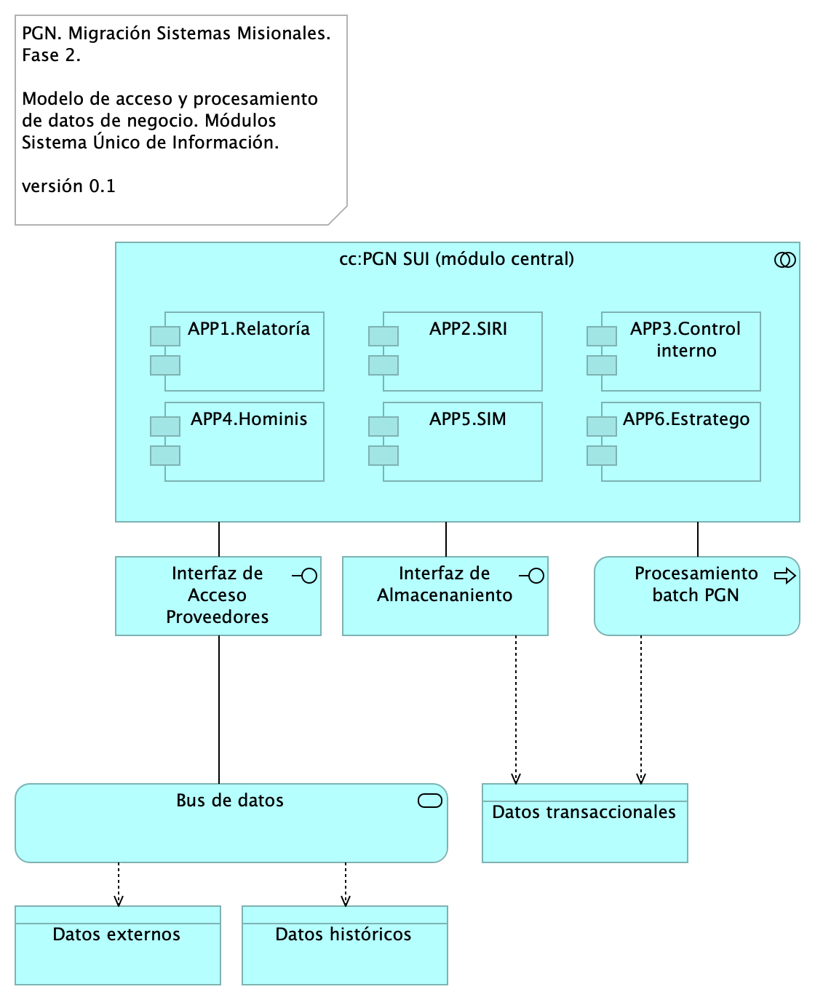
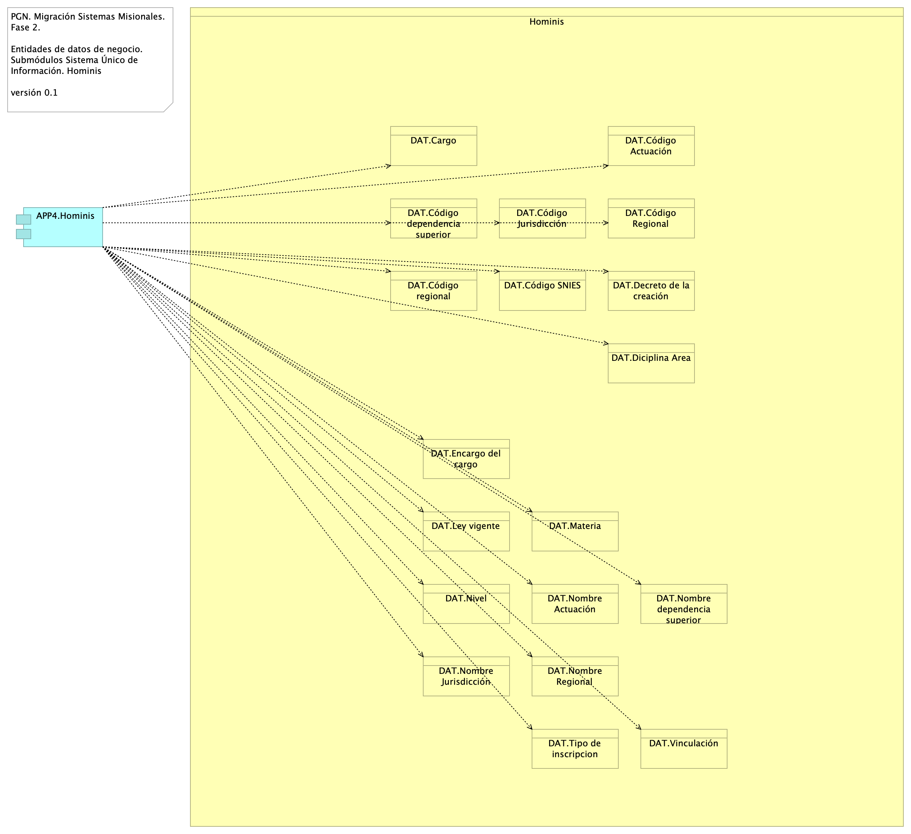

# Documento de Arquitectura Datos $APLICATIVO
* [Descripción de Entidades de Datos Migración $APLICATIVO Coomeva](#descripción-de-entidades-de-datos-migración-$APLICATIVO-Coomeva)
	* [Migracion.2. datos](#migracion.2.-datos)
	* [Migracion.2a. datos Hominis](#migracion.2a.-datos-hominis)
	* [Migracion.2c. datos Control interno](#migracion.2c.-datos-control-interno)
	* [Migracion.2d. datos SIRI](#migracion.2d.-datos-siri)
	* [Migracion.2b. datos SIM](#migracion.2b.-datos-sim)

\newpage

# Descripción de Entidades de Datos Migración $APLICATIVO Coomeva
## Migracion.2. datos
{#fig:Migracion.2.datos width=5.32in}

Modelo de acceso y procesamiento a datos de negocio del $APLICATIVO. Presentamos la organización de los ítems de datos de negocio necesarios para que los módulos del $APLICATIVO puedan recolectar, procesar, integrar y almacenarlos de forma organizada y escalable.

Mediante esta organización, los datos de negocio son transportados desde sus respectivas fuentes mediante interfaces (por principio de extensión y mantenibilidad). Los datos externos, entendidos como los de otros proveedores, son obtenidos mediante un intermediario: el bus de datos del $APLICATIVO.

Consideramos tres tipos datos: datos transaccionales, históricos y externos, y presentamos una manera distinta de tratarlos y transportarlos.

### Catálogo de Elementos
| Name| Type| Description| Properties
|:--------|:--------|:--------|:--------|
|**cc:Coomeva $APLICATIVO (misional)**|application-collaboration|||
|**APP1.Relatoría**|application-component|Módulo del $APLICATIVO. Relatoría pública. Publicación de información de referencia para funcionarios y personas naturales, cientes de la Coomeva.  ||
|**APP2.SIRI**|application-component|||
|**APP3.Control interno**|application-component|||
|**APP4.Hominis**|application-component|Módulo del $APLICATIVO. Gestión de capital humano, funcionarios y cargos de representación y libre remoción de la Coomeva. ||
|**APP5.SIM**|application-component|||
|**APP6.Estratego**|application-component|||
|**Interfaz de Acceso Proveedores**|application-interface|Interfaz de acceso a los tipos de datos externos al $APLICATIVO. ||
|**Interfaz de Almacenaniento**|application-interface|Interfaz de acceso a los repositorio, base de datos relacionales y no jerárquicas. Tipos de datos transaccionales, internos, del $APLICATIVO. ||
|**Procesamiento batch Coomeva**|application-process|Los procesos de lotes, que requieren volumenes de datos altos, deben hacer parte de la arquitectura de datos del $APLICATIVO. ||
|**Bus de datos**|application-service|El patrón de bus de datos tiene el rol de unir y referir a los datos externos al $APLICATIVO de tal manera que hace transparente la localización y el formato de este tipo de datos. ||
|**Datos externos**|data-object|||
|**Datos históricos**|data-object|||
|**Datos transaccionales**|data-object|||

## Migracion.2a. datos Hominis
{#fig:Migracion.2a.datosHominis width=5.32in}

Identificación de entidades de datos de negocio relacionadas al módulo de gestión de capital del $APLICATIVO, Hominis.

Estas entidades de datos de negocio son los que llamamos los tipos de datos internos del $APLICATIVO y deben ser consideradas para la creación de las API de manejo del ciclo de vida de los datos de este módulo.

### Catálogo de Elementos
| Name| Type| Description| Properties
|:--------|:--------|:--------|:--------|
|**APP4.Hominis**|application-component|Módulo del $APLICATIVO. Gestión de capital humano, funcionarios y cargos de representación y libre remoción de la Coomeva. ||
|**DAT.Cargo**|business-object|||
|**DAT.Código Actuación**|business-object|||
|**DAT.Código Jurisdicción**|business-object|||
|**DAT.Código Regional**|business-object|||
|**DAT.Código SNIES**|business-object|||
|**DAT.Código dependencia superior**|business-object|||
|**DAT.Código regional**|business-object|||
|**DAT.Decreto de la creación**|business-object|||
|**DAT.Diciplina Area**|business-object|||
|**DAT.Encargo del cargo**|business-object|||
|**DAT.Ley vigente**|business-object|||
|**DAT.Materia**|business-object|||
|**DAT.Nivel**|business-object|||
|**DAT.Nombre Actuación**|business-object|||
|**DAT.Nombre Jurisdicción**|business-object|||
|**DAT.Nombre Regional**|business-object|||
|**DAT.Nombre dependencia superior**|business-object|||
|**DAT.Tipo de inscripcion**|business-object|||
|**DAT.Vinculación**|business-object|||

## Migracion.2c. datos Control interno
{#fig:Migracion.2c.datosControlinterno width=}

Identificación de entidades de datos de negocio relacionadas al módulo de seguimiento del desempeño de la Coomeva del $APLICATIVO, Control Interno.

Estas entidades de datos de negocio son los que llamamos los tipos de datos internos del $APLICATIVO y deben ser consideradas para la creación de las API de manejo del ciclo de vida de los datos de este módulo. 

### Catálogo de Elementos
| Name| Type| Description| Properties
|:--------|:--------|:--------|:--------|
|**APP3.Control interno**|application-component|||
|**DAT.Dependencia**|business-object|||
|**DAT.Funcionario**|business-object|||
|**DAT.Proceso**|business-object|||
|**DAT.Tipo de proceso**|business-object|||

## Migracion.2d. datos SIRI
{#fig:Migracion.2d.datosSIRI width=}

Identificación de entidades de datos de negocio relacionadas al módulo del $APLICATIVO, SIRI.

Estas entidades de datos de negocio son los que llamamos los tipos de datos internos del $APLICATIVO y deben ser consideradas para la creación de las API de manejo del ciclo de vida de los datos de este módulo. 

### Catálogo de Elementos
| Name| Type| Description| Properties
|:--------|:--------|:--------|:--------|
|**APP2.SIRI**|application-component|||
|**DAT.Entidad**|business-object|||

## Migracion.2b. datos SIM
{#fig:Migracion.2b.datosSIM width=}

Identificación de entidades de datos de negocio relacionadas al módulo de $APLICATIVO, SIM.

Estas entidades de datos de negocio son los que llamamos los tipos de datos internos del $APLICATIVO y deben ser consideradas para la creación de las API de manejo del ciclo de vida de los datos de este módulo. 

### Catálogo de Elementos
| Name| Type| Description| Properties
|:--------|:--------|:--------|:--------|
|**APP5.SIM**|application-component|||
|**DAT.Corregimiento**|business-object|||
|**DAT.Departamento**|business-object|||
|**DAT.Municipio**|business-object|||
|**DAT.País**|business-object|||

``Generated on: Wed Sep 13 2023 12:45:59 GMT-0500 (COT)``